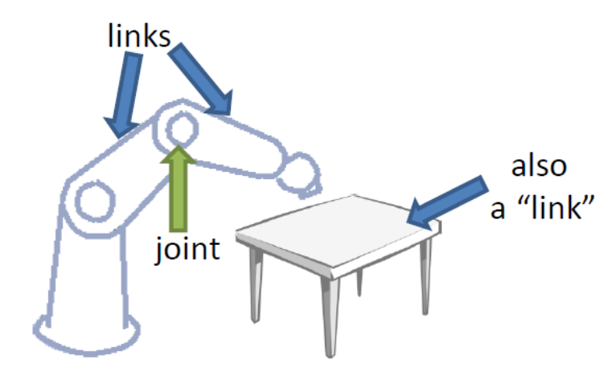
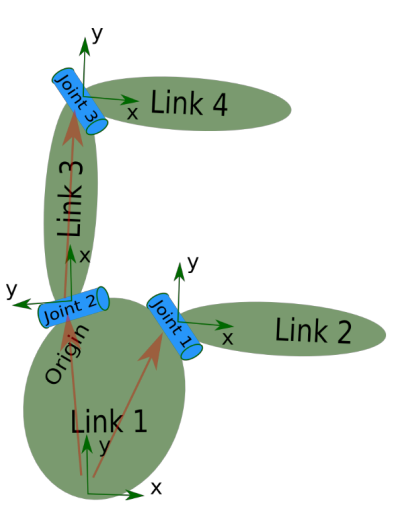
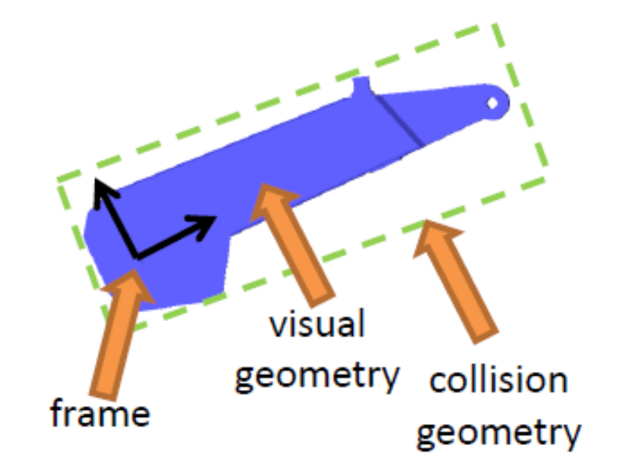

# 在Gazebo中使用URDF


## SDF和URDF的选择

URDF优势:

- 利用宏定义，编写速度快
- 支持rviz，可以可视化
- Solidworks建模导出可以urdf

SDF优势:

- 研究多个机器人
- 仿真的动力学特性可以更为真实
- 可以定义world。


在上一节中，我们使用了一个SDF文件简单的实现了一个机器人在Gazebo的展示，但是我们会发现，似乎很多内容都是及其相似的，比如左轮和右轮仅仅是相差了一个 参数，但是我们依然还是`link, collision`这样子又来了一遍，如果我们去建立一个复杂的机器人，那么SDF文件将会比较复杂。

## 什么是URDF

- Unified Robot Description Format(URDF)，统一机器人描述格式

- 用于解析xml格式的机器人模型

  

  

   

统一机器人描述格式(URDF)是ROS中用于描述机器人所有元素的XML文件格式，他的语法和SDF文件十分相似


## 标签属性

### robot

- 完整机器人模型的最顶层标签
- link 和 joint 标签都必须包含在robot 标签内

```xml
<robot name="your_robot_name"/>
	<link>...</link>
	<joint>...</joint>
	<link>...</link>
	<joint>...</joint>
	<link>...</link>
	<joint>...</joint>
	...
</robot>
```




###  link

- 描述机器人某一个刚体部分的外观和物理属性
- 描述尺寸、颜色、形状、惯性矩阵、碰撞等
- 每一个link都会是一个坐标系



example1.urdf

```xml
     <link name="base_link">
        <visual>
            <origin xyz="0 0 0.08" rpy="0 0 0"/>
            <geometry>
                <cylinder length="0.1" radius="0.20"/>
            </geometry>
        </visual>
        <collision>
            <origin xyz="0 0 0.08" rpy="0 0 0"/>
            <geometry>
                <cylinder length="0.1" radius="0.20"/>
            </geometry>
        </collision>
        <inertial>
            <mass value="20" />                                                                                                                                                      
            <inertia ixx="0.24" ixy = "0" ixz = "0"
                     iyy="0.24" iyz = "0"
                     izz="0.4" />
        </inertial>
    </link>
```

说明：

- visual: 外观上的，利用gazebo呈现的结果
  - origin: 距离原点的偏移，注意坐标系在此不动，单位米，弧度
  - geometry: 这里可以选择cylinder，box，sphere，和mesh
- collision: 实际碰撞的几何形状和位置
- 惯性：他被用于描述碰撞之后的效果
  - mass：单位kg
  - 转动惯量：由于其对称性，只取上三角，六个元素

$$
\begin{bmatrix}
ixx & ixy & ixz\\
ixy & iyy & iyz\\
ixz & iyz & izz
\end{bmatrix}
$$

​			如果不知道如何获得转动惯量，可以从[维基百科](/https://en.wikipedia.org/wiki/List_of_moments_of_inertia#List_of_3D_inertia_tensors)上做参考，复杂的物体可以从其他三维软件中获得，例如meshlab

如若要仿真一个link，以上三者缺一不可。


### [joint](http://wiki.ros.org/urdf/XML/joint)

- 描述两个link之间的关系，分为六种类型
  - continuous：旋转关节，可以围绕单轴无限旋转
  - revolute：旋转关节，类似于continuous，但是有旋转的角度极限
  - prismatic：滑动关节，沿某一轴线移动的关节带有位置极限
  - planar：平面关节，允许在平面正交方向上平移或者旋转
  - floating：浮动关节，允许进行平移、旋转运动
  - fixed：固定关节，不允许运动的关节


example2.urdf

```xml
    <joint name="base_right" type="revolute">
        <origin xyz="0 0.2 0.06" rpy="0 0 0" />
        <parent link="base_link" />
        <child link="right_wheel_link" />
        <axis xyz="0 1 0" />
        <limit lower="-3.14" upper="3.14" velocity="1.0" />
    </joint>
```

注意limit仅仅只有在revolute和prismatic类型的时候才有效。

说明：

- origin：表示joint链接到的child的位置
- parent：链接的父级
- child：链接的子级
- axis：旋转轴


## 案例分析

下面我们以一个案例来说明如何在gazebo中使用xacro文件，在Gazebo中加载xacro文件，我们需要借助一下ros2中的launch文件

### 建立一个ROS2工作区

```
mkdir -p ~/dev_ws/src
```

### gazebo-ros-package下载

获得`gazebo_ros_pkgs`的包的yaml文件

```
cd ~/dev_ws
wget https://raw.githubusercontent.com/ros-simulation/gazebo_ros_pkgs/ros2/gazebo_ros_pkgs.repos
```

把各个包下载都src文件夹下

```
vcs import src < gazebo_ros_pkgs.repos
```

切换分支到对应的ROS版本(不支持rolling的情况下，先切换到ROS2分支)

```
vcs custom --args checkout rolling
```

安装依赖

```
rosdep install --from-paths src --ignore-src -r -y
```

build 所有的包

```
colcon build --symlink-install
```


### 新建一个robot_description仓库

在这个库中，我们首先需要创建两个文件夹

- launch：放我们的启动文件
- urdf：放入我们的文件描述文件

```
ros2 pkg create --build-type ament_python robot_description
cd robot_description
mkdir launch
mkdir urdf
```

### 配置setup.py

为了让colcon找到启动文件，我们需要使用setup的data_files参数通知Python的安装工具我们的启动文件。

```python
from glob import glob
from setuptools import setup

package_name = 'robot_description'

setup(
    # Other parameters ...
    data_files=[
        # ... Other data files
        # Include all launch files. This is the most important line here!
        ('share/' + package_name, glob('launch/*.launch.py')),
        # Include all xacro files
        ('share/' + package_name, glob('urdf/*.urdf')),
    ]
)
```

### launch 文件

在launch文件夹下建立一个文件：`gazebo_empty_urdf.launch.py`

```python
import os
from ament_index_python.packages import get_package_share_directory
from launch import LaunchDescription
from launch.actions import IncludeLaunchDescription
from launch.launch_description_sources import PythonLaunchDescriptionSource
from launch_ros.actions import Node                                                             
from launch.substitutions import Command, PathJoinSubstitution, LaunchConfiguration
from launch.actions import DeclareLaunchArgument


def generate_launch_description():
    pkg_gazebo_ros = get_package_share_directory("gazebo_ros")
    # "example1"
    urdf_file = os.path.join(get_package_share_directory('robot_description'), 'example1.urdf')
    # urdf_file = os.path.join(get_package_share_directory('robot_description'), 'example2.urdf')
        

    gazebo = IncludeLaunchDescription(
        PythonLaunchDescriptionSource(
            os.path.join(pkg_gazebo_ros, 'launch', 'gazebo.launch.py')
        ),  
    )   

    use_sim_time = LaunchConfiguration('use_sim_time', default='true')
    # GAZEBO_MODEL_PATH has to be correctly set for Gazebo to be able to find the model
    spawn_entity = Node(package='gazebo_ros', executable='spawn_entity.py',
                      arguments=['-entity', 'demo', "-file", urdf_file],
                      output='screen')
                          
    return LaunchDescription([
            
        DeclareLaunchArgument('pause', default_value='true',
                             description="pause the world"),
        gazebo,
        spawn_entity,
    ])  

```

在这里我们启动了两个节点

- gazebo：用于启动gezebo的客户端和服务端
- spawn_entity：通过文件生成一个机器人

### 编写机器人

打开urdf文件夹，新建文件exmaple1.urdf

#### 编写底盘

```xml
<robot name="my_robot"> 
 <link name="base_link">
    <visual>
        <origin xyz="0 0 0.08" rpy="0 0 0"/>
        <geometry>
            <cylinder length="0.1" radius="0.20"/>
        </geometry>
    </visual>
    <collision>
        <origin xyz="0 0 0.08" rpy="0 0 0"/>
        <geometry>
            <cylinder length="0.1" radius="0.20"/>
        </geometry>
    </collision>
    <inertial>
        <mass value="20" />
        <inertia ixx="0.24" ixy = "0" ixz = "0"
                 iyy="0.24" iyz = "0"
                 izz="0.4" />
    </inertial>
  </link>
</robot>
```
#### 编译启动

```
colcon build --packages-select robot_description --symlink-install
ros2 launch robot_description gazebo_empty_urdf.launch.py
```

应该可以在gazebo的界面中显示


#### 添加驱动轮

注意，在每一个文件里，不可以有单独的link，各个link之间必须要有joint 表明关系

```xml
<robot name="example2">
     <link name="base_link">
        <visual>
            <origin xyz="0 0 0.08" rpy="0 0 0"/>
            <geometry>
                <cylinder length="0.1" radius="0.20"/>
            </geometry>
        </visual>
        <collision>
            <origin xyz="0 0 0.08" rpy="0 0 0"/>
            <geometry>
                <cylinder length="0.16" radius="0.20"/>
            </geometry>
        </collision>
        <inertial>
            <mass value="20" />                                                                 
            <inertia ixx="0.24" ixy = "0" ixz = "0" 
                     iyy="0.24" iyz = "0"                                                       
                     izz="0.4" />
        </inertial>
    </link>

    <link name="left_wheel_link">
        <visual>
            <origin xyz="0 0 0" rpy="1.57 0 0"/>
            <geometry>
                <cylinder length="0.025" radius="0.06"/>
            </geometry>
        </visual>
        <collision>
            <origin xyz="0 0 0" rpy="1.57 0 0"/>
            <geometry>
                <cylinder length="0.025" radius="0.06"/>
            </geometry>
        </collision>
        <inertial>
            <mass value="5" />    
            <inertia ixx="0.00228" ixy = "0" ixz = "0" 
                     iyy="0.00228" iyz = "0" 
                     izz="0.0015" />
        </inertial>
    </link>

    <joint name="base_right" type="continuous">
        <origin xyz="0 0.2 0.06" rpy="0 0 0" />
        <parent link="base_link" />
        <child link="left_wheel_link" />
        <axis xyz="0 1 0" />
    </joint>

</robot>
```


在这里，设置origin距离原点为0.2m，为底盘的半径，高度是0.06，为驱动轮的半径。同时定义了旋转轴为y轴。

或者调整为

```xml
<origin xyz="0 0.2 0.06" rpy="1.57 0 0" />
...
<axis xyz="0 0 1"/>
```

若要再添加一个驱动轮，在robot里面再添加一项

```xml
    <link name="right_wheel_link">
        <visual>
            <origin xyz="0 0 0" rpy="1.57 0 0"/>
            <geometry>
                <cylinder length="0.025" radius="0.06"/>
            </geometry>
        </visual>
        <collision>
            <origin xyz="0 0 0" rpy="1.57 0 0"/>
            <geometry>
                <cylinder length="0.025" radius="0.06"/>
            </geometry>
        </collision>
        <inertial>
            <mass value="5" />    
            <inertia ixx="0.00228" ixy = "0" ixz = "0" 
                     iyy="0.00228" iyz = "0" 
                     izz="0.0015" />
        </inertial>
    </link>

    <joint name="base_right" type="continuous">
        <origin xyz="0 -0.2 0.06" rpy="0 0 0" />
        <parent link="base_link" />
        <child link="right_wheel_link" />
        <axis xyz="0 1 0" />
    </joint>
```


#### 添加万向轮

```xml
    <link name="front_caster_link">
        <visual>
            <origin xyz="0 0 0" rpy="1.57 0 0"/>
            <geometry>
                <sphere radius="0.015"/>
            </geometry>
        </visual>
        <collision>
            <origin xyz="0 0 0" rpy="1.57 0 0"/>
            <geometry>
                <sphere radius="0.015"/>
            </geometry>
        </collision>
        <inertial>
            <mass value="0.1" />        
            <inertia ixx="0.000009" ixy = "0" ixz = "0" 
                     iyy="0.000009" iyz = "0" 
                     izz="0.000009" />
        </inertial>
    </link>

    <joint name="front_right_joint" type="continuous">
        <origin xyz="0.18 0 0.015" rpy="0 0 0" />
        <parent link="base_link" />
        <child link="front_caster_link" />
        <axis xyz="0 1 0" />
    </joint>
```

操作和添加驱动轮的操作完全一样


#### [添加颜色](http://wiki.ros.org/simulator_gazebo/Tutorials/ListOfMaterials)

```xml
<gazebo reference="base_link">
	<material>Gazebo/Blue</material>
</gazebo>
<gazebo reference="front_caster_link">
	<material>Gazebo/Blue</material>
</gazebo>
```


#### 添加mesh

在visual -> geometry中的几何形状修改为mesh

```xml
<visual>
	<geometry>
    	<!-- <cylinder length="0.1" radius="0.2" /> -->
        <mesh filename="model://create/meshes/create_body.dae" />
    </geometry>
</visual>
```

注意，此dae需要在model，即gazebo的model路径之下。

记得需要添加`GAZEBO_MODEL_PATH`的值。可以在终端确定也可以在launch文件中加入


我们发现写urdf文件十分的繁琐，修改参数也十分的麻烦，不便于二次开发

针对于URDF文件，产生了一种可以将模型精简化、复用性强的一种描述格式，即xacro文件，Xacro是一种XML宏语言,使用xacro，你可以通过使用扩展为更大的XML表达式的宏来构造更短、更可读的XML文件，其文件尾缀为 .xacro

## xacro 下载

因为`xacro`没有被ros2安装，因此需要手动下载

```
git clone https://github.com/ros/xacro
```

切换到最新的分支`dashing-devel`

```
git checkout -b dashing-devel origin/dashing-devel
```

build构建，安装

```
colcon build --symlink-install --packages-select xacro
```


## xacro文件描述

### xacro头部声明

```xml
<?xml version="1.0"?>
<robot name="robot_name" xmlns:xacro="http://www.ros.org/wiki/xacro>"
```

### 定义常量

```xml
<xacro:property name="base_radius" value="0.20"/>                                   
<xacro:property name="base_length" value="0.16"/>
```

这相当于程序过程中定义的一个常量，可以方便后续调用，增加了建模文件的可读性

### 常量调用

我们可以通过 `${variable}`来调用使用常量，并且在`{}`做简单的数学计算。例如

```xml
<origin xyz=" 0 0 ${base_radius/2}" rpy="0 0 0" />
```


### 定义宏

对于inertial的定义，其实除了数字的不同之外，其余是几乎完全一致的。因此为了URDF代码的简介性，我们可以定义一个宏就像是C里面的宏定义，通过传入一个参数，我们就可以产生一段对应的URDF的代码

```xml
<xacro:macro name="cylinder_inertial_matrix" params="m r h">
    <inertial>
        <mass value="${m}" />
        <inertia ixx="${m*(3*r*r+h*h)/12}" ixy = "0" ixz = "0"
                 iyy="${m*(3*r*r+h*h)/12}" iyz = "0"
                 izz="${m*r*r/2}" /> 
    </inertial>
</xacro:macro>
```

在这里，我们通过`xacro:macro`定义了一个名字为`cylinder_inertial_matrix`的宏，传入的参数为`m, r, h`。

### 宏调用

定义了`cylinder_inertial_matrix`宏，我们就可以简单快速的完成`base_link`中惯性张量的定义，如下

```xml
<!-- inertial part -->
<xacro:cylinder_inertial_matrix  m="${base_mass}" r="${base_radius}" h="${base_length}" />
<!-- inertial part -->
```

并且添加对底座参数的定义

```xml
<xacro:property name="base_mass"   value="20" /> 
```


## launch文件

```python
import os
from ament_index_python.packages import get_package_share_directory
from launch import LaunchDescription
from launch.actions import IncludeLaunchDescription
from launch.launch_description_sources import PythonLaunchDescriptionSource
from launch_ros.actions import Node
from launch.substitutions import Command, PathJoinSubstitution, LaunchConfiguration
from launch_ros.substitutions import FindPackagePrefix

def generate_launch_description():
    pkg_gazebo_ros = get_package_share_directory("gazebo_ros")

    # gazebo launch
    gazebo = IncludeLaunchDescription(
                PythonLaunchDescriptionSource(
                    os.path.join(pkg_gazebo_ros, 'launch', 'gazebo.launch.py')
                )
            )

    # GAZEBO_MODEL_PATH has to be correctly set for Gazebo to be able to find the model
    spawn_entity = Node(package='gazebo_ros', executable='spawn_entity.py',
                      arguments=['-entity', 'demo', "-topic", "robot_description"],
                      output='screen')
    #
    robot_pub = Node(
        package='robot_state_publisher',
        executable='robot_state_publisher',
        name='robot_state_publisher',
        output='screen',
        parameters=[{'robot_description': Command([
                        PathJoinSubstitution([FindPackagePrefix('xacro'), "bin", "xacro"]),
                        ' ',
                        PathJoinSubstitution(
                            [get_package_share_directory('robot_description'), 'my_robot.xacro']),
                    ])
                    }],
    )

    return LaunchDescription([
        gazebo,
        robot_pub,
        spawn_entity,
    ])
```

在这里我们启动了三个节点，

- `gazebo`：用于启动gazebo，他包括了gzserver和gzclient，在gzserver中，默认加载了`gazebo_ros_factory.so`插件，他可以通过ros中的`service`来产生或者删除一个模型

- `robot_pub`：发布机器人状态的节点，在整个节点中，我们使用Command去读取了xacro模型文件，以topic的形式进行发布
- `spawn_entity`：用于在gazebo中产生一个model的节点，数据来源是以一个topic，接收`robot_state_publisher`发来的topic来产生model


## 机器人模型建立

打开urdf文件夹，新建一个`my_robot.xacro`文件，首先输入头部声明

```XML
<?xml version="1.0"?>
<robot name="robot_name" xmlns:xacro="http://www.ros.org/wiki/xacro>"

</robot>
```


输入模型建立之前，我们需要定义一些变量进行统一的管理

```xml
<xacro:property name="PI" value="3.1415926"/> 
<xacro:property name="base_mass"   value="20" />  
<xacro:property name="base_radius" value="0.20"/> 
<xacro:property name="base_length" value="0.10"/> 

<xacro:property name="wheel_mass"   value="5" /> 
<xacro:property name="wheel_radius" value="0.06"/> 
<xacro:property name="wheel_length" value="0.025"/> 
<xacro:property name="wheel_joint_y" value="0.19"/> 
<xacro:property name="wheel_joint_z" value="0.05"/> 

<xacro:property name="caster_mass"    value="1" />  
<xacro:property name="caster_radius"  value="0.015"/> <!-- wheel_radius - ( base_length/2 - wheel_joint_z) --> 
<xacro:property name="caster_joint_x" value="0.18"/>
```


### 定义底座

和SDF文件，定义一个link需要三个部分

- visual：视觉外观看起来的属性
- collision：内容和visual一样，但是表示的是实际判定碰撞时候用到的大小
- inertial：惯性，物理引擎使用惯性信息来计算模型在受力时的行为

```xml
<link name="base_link">
    <visual>
    	<origin xyz=" 0 0 ${base_length/2+wheel_radius/3}" rpy="0 0 0" />  
        <geometry>                                                                  
        	<cylinder length="${base_length}" radius="${base_radius}"/>             
        </geometry>                                                                 
    </visual>                                                                       
    <collision>                                                                     
        <origin xyz=" 0 0 ${base_length/2+wheel_radius/3}" rpy="0 0 0" /> 
        <geometry>                                                                  
            <cylinder length="${base_length}" radius="${base_radius}"/>             
        </geometry>                                                                 
    </collision>                                                                    
	<xacro:cylinder_inertial_matrix  m="${base_mass}" r="${base_radius}" h="${base_length}" />
</link> 
```

​	我们将惯性部分的写法放到后面。注意URDF文件的写法和SDF文件有一些不同，他将一些属性内嵌在标签里面，而不是单独拿出来重新定义。例如对于一个圆柱体的定义：

- SDF：

  ```xml
  <cylinder>
      <radius>0.20</radius>
      <length>0.16</length>
  </cylinder>
  ```

- urdf：

  ```xml
  <cylinder length="${base_length}" radius="${base_radius}"/>   
  ```

除了在定义属性上的区别之外，我们还使用了`${variable}`这种方式去代替了原来的数字，`${base_length}`和`${base_radius}`就是我们之前使用`xacro:property`所定义的。

### 定义宏--驱动轮

```xml
<xacro:macro name="wheel" params="prefix reflect">
<joint name="${prefix}_wheel_joint" type="continuous">
    <origin xyz="0 ${reflect*wheel_joint_y} ${wheel_radius}" rpy="${PI/2} 0 0" />
    <parent link="base_link"/>
    <child link="${prefix}_wheel_link"/>
    <axis xyz="0 0 1"/>
</joint>

<link name="${prefix}_wheel_link">
    <visual>
        <geometry>
        	<cylinder radius="${wheel_radius}" length = "${wheel_length}"/>
        </geometry>
    </visual>
    <collision>
        <origin xyz="0 ${reflect*wheel_joint_y} ${wheel_radius}" rpy="${PI/2} 0 0" />
        <geometry>
        	<cylinder radius="${wheel_radius}" length = "${wheel_length}"/>
        </geometry>
    </collision>
<xacro:cylinder_inertial_matrix  m="${wheel_mass}" r="${wheel_radius}" h="${wheel_length}" />
</link>

</xacro:macro>
```

在整个宏里面，我们定义了一个link，并且对整个link添加了和base_link的joint。传入的参数为`prefix`和`reflect`，`prefix`用于joint和link的name定义，`reflect`来控制左右轮的y轴正负。定义joint的方式和SDF文件的也十分类似，定义父节点子节点以及旋转轴.

但是在URDF文件中，没有pose来直接改变物体坐标系的位置。因此我们设置joint的原点位置

在`base_link`同级的下方，直接调用两个轮子

```xml
<xacro:wheel prefix="left" reflect="-1"/>
<xacro:wheel prefix="right" reflect="1"/>
```

现在我们可以打开gazebo进行查看模型情况，别忘记对自己的工作区进行source

首先需要进行编译

```
colcon build --packages-select robot_description
```

然后启动launch文件

```
ros2 launch robot_description gazebo_empty_world.launch.py
```

可以看见如下形式的模型在gazebo中显示


### 定义万向轮

```xml
<xacro:macro name="caster" params="prefix reflect">
    <joint name="${prefix}_caster_joint" type="continuous">
        <origin xyz="${reflect*caster_joint_x} 0 ${caster_radius}" rpy="0 0 0"/>
        <parent link="base_link"/>
        <child link="${prefix}_caster_link"/>
        <axis xyz="0 1 0"/>
    </joint>

    <link name="${prefix}_caster_link">
        <visual>
        <geometry>
        	<sphere radius="${caster_radius}" />
        </geometry>
        </visual>
    <collision>
    <geometry>
    	<sphere radius="${caster_radius}" />
    </geometry>
    </collision>      
    	<xacro:sphere_inertial_matrix  m="${caster_mass}" r="${caster_radius}" />
    </link>
</xacro:macro>
```

在URDF中，joint的类型没有ball，我们使用`continuous`类型来做一个替代

然后进行宏的调用

```xml
<xacro:caster prefix="front" reflect="-1"/>                                                                                                                             
<xacro:caster prefix="back"  reflect="1"/>
```

最后可以看见如下的机器人在模型中


