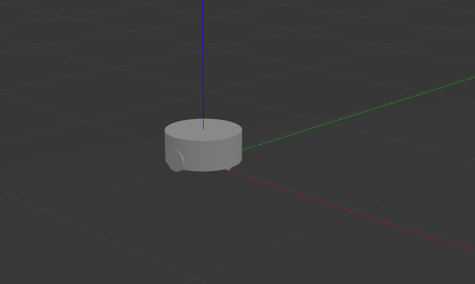
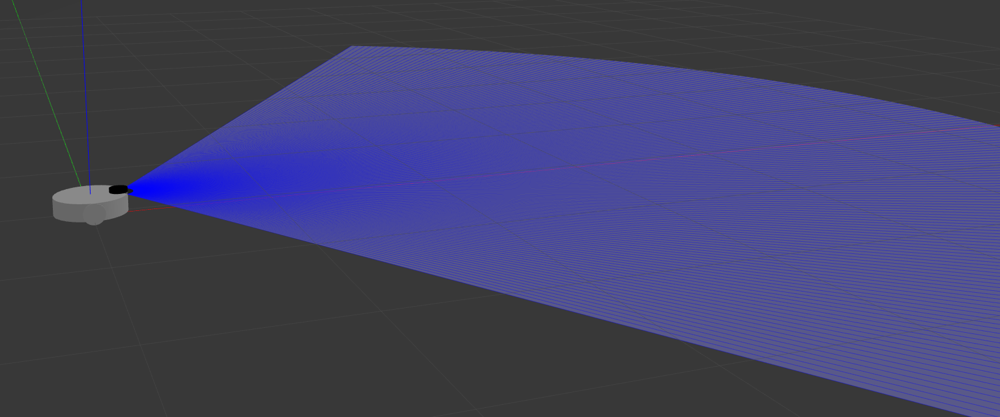
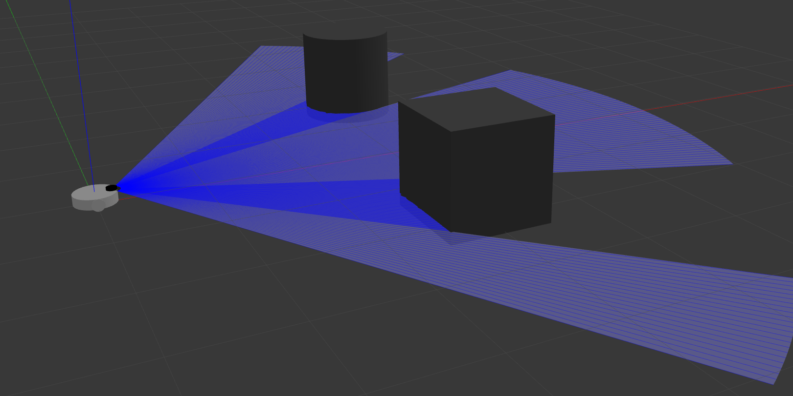
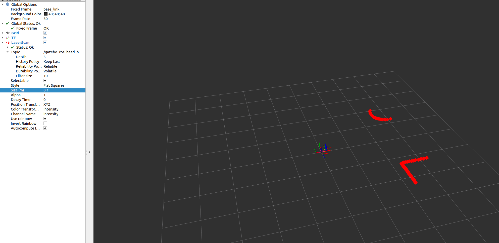
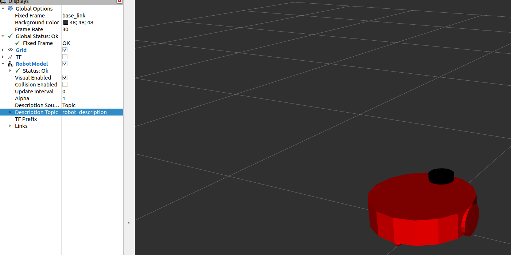
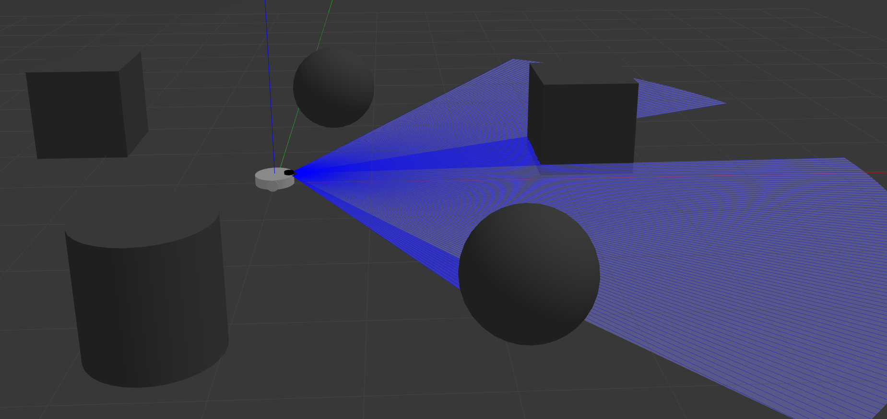

到此，我们可以使用自己写的ros2节点来控制显示在gazebo中，用xacro文件描述的机器人

为了让xacro文件看起来更有结构性，我们考虑把机器人的整个底座当做是一个宏，给别的文件调用，把传感器也可以作为一个宏给他人调用，如此就会有较为清晰的代码结构

## 调整xacro文件结构

### 定义宏

把我们之前的`my_robot.xacro`改名为`my_robot_base.xacro`，并且在我们定义`<link name="base_link">`之前，以及`</plugin></gazbeo>`之后添加宏定义描述，即

```xml
<xacro:macro name="my_robot_base">
	<link name="base_link"> 
		...
	</link>
	<xacro:wheel prefix="left" reflect="-1"/>
	<xacro:wheel prefix="right" reflect="1"/>
	<xacro:caster prefix="front" reflect="-1"/>
	<xacro:caster prefix="back"  reflect="1"/>
	<gazebo>
		<plugin>
			...
		</plugin>
	</gazebo>
</xacro:macro>
```

如此我们便将之前的一整个机器人定义为一个宏文件，名字为`my_robot_base`

### 文件宏调用

新建一个文件名为`my_robot.xacro`，用于导入宏`my_robot_base`，这样我们也可以达到和之前一样的效果

```xml
<?xml version="1.0"?>
<robot name="mbot" xmlns:xacro="http://www.ros.org/wiki/xacro">

    <xacro:include filename="$(find robot_description)/my_robot_base.xacro" />
    <xacro:my_robot_base/>

</robot>
```

我们使用了`<xacro:include filename=...>`来导入一个文件，find后面跟上我们的包名，下面一行表示调用文件中的宏，就是我们所定义的机器人

### 编译运行

```
cd ~/dev_ws
colcon build --packages-select robot_description
ros2 launch robot_description gazebo_empty_world.launch.py
```

可以看见在gazebo的场景中间出现一个和之前一模一样的机器人




## 添加传感器

### 修改my_robot.xacro

根据现在的文件结构模式，我们期望再导入一个xacro，直接调用里面的宏就可以加入一个传感器，即

```xml
<?xml version="1.0"?>
<robot name="mbot" xmlns:xacro="http://www.ros.org/wiki/xacro">
	<!-- 导入机器人 -->
    <xacro:include filename="$(find robot_description)/my_robot_base.xacro" />
    <xacro:my_robot_base/>
    <!-- 导入雷达 -->
    <xacro:include filename="$(find robot_description)/my_robot_lidar.xacro" />
    <xacro:my_robot_lidar/>
    <!-- 添加雷达和机器人的joint -->
    <joint name="lidar_joint" type="fixed">
    	<origin xyz="${base_radius-lidar_radius} 0 ${base_length+wheel_radius/3}" rpy="0 0 0" />
        <parent link="base_link" />
        <child link="lidar_link" />
    </joint>

</robot>
```

因为在文件`my_robot_lidar.xacro`中是不会有机器人的标签属性，因此将雷达和机器人的属性全部导入之后，在这里添加雷达传感器和机器人的一个joint关系，下面开始定义雷达传感器的xacro文件

### 定义传感器

下面定义关于雷达的xacro描述文件, 我们将其放入一个名为sensors的文件夹中

```
cd ~dev_ws/src/robot_description/urdf
mkdir sensors
vi my_robot_lidar.xacro
```

文件内容的结构和之前的xacro文件是一致的，全部内容如下。[参考github ros1 2 ros2](https://github.com/ros-simulation/gazebo_ros_pkgs/wiki/ROS-2-Migration:-Ray-sensors#example-migration-1) 以及 [gazebo介绍](http://gazebosim.org/tutorials?tut=guided_i1)

```xml
 <?xml version="1.0"?>                                                                                                                                                           
<robot xmlns:xacro="http://www.ros.org/wiki/xacro" name="laser">
    <!-- 定义雷达的宏属性 -->
    <xacro:property name="lidar_radius" value="0.05"/>
    <xacro:property name="lidar_length" value="0.05"/>

    
    <xacro:macro name="lidar" params="prefix:=lidar">
        <link name="${prefix}_link">
            <inertial>
                <mass value="0.1" />
                <origin xyz="0 0 0" />
                <inertia ixx="0.01" ixy="0.0" ixz="0.0"
                         iyy="0.01" iyz="0.0"
                         izz="0.01" />
            </inertial>

            <visual>
                <origin xyz=" 0 0 0 " rpy="0 0 0" />
                <geometry>
                    <cylinder length="${lidar_length}" radius="${lidar_radius}"/>
                </geometry>
                <material name="black"/>
            </visual>

            <collision>
                <origin xyz="0.0 0.0 0.0" rpy="0 0 0" />
                <geometry>
                    <cylinder length="${lidar_length}" radius="${lidar_radius}"/>
                </geometry>
            </collision>
        </link>

        <gazebo reference="${prefix}_link">
            <material>Gazebo/Black</material>
        </gazebo>
        
        <gazebo reference="${prefix}_link">
            <!-- 添加雷达属性的参数 -->
            <sensor type="ray" name="head_hokuyo_sensor">
                <visualize>true</visualize>
                <update_rate>10</update_rate>
                <ray>
                    <scan>
                      <horizontal>
                        <samples>180</samples>
                        <resolution>1</resolution>
                        <min_angle>-1.046666667</min_angle>
                        <max_angle>1.04666667</max_angle>
                      </horizontal>
                    </scan>
                    <range>
                      <min>0.08</min>
                      <max>6.0</max>
                      <resolution>0.05</resolution>
                    </range>
                    <!-- 高斯噪声添加 -->
                    <noise>
                      <type>gaussian</type>
                      <mean>0.0</mean>
                      <stddev>0.01</stddev>
                    </noise>
                </ray>
				<!-- 添加雷达插件 -->
                <plugin name="gazebo_ros_head_hokuyo_controlle" filename="libgazebo_ros_ray_sensor.so" >
                    <ros>
                        <namespace>/</namespace>
                        <argument>--ros-args --remap ~/scan:=scan</argument>
                    </ros>
                    <!-- 输出为2D scan的信息 -->
                    <output_type>sensor_msgs/LaserScan</output_type>
                </plugin>
            </sensor>
        </gazebo>


    </xacro:macro>
</robot>
```

激光传感器的类型是`ray`, 采样前方120度检测范围，一共采样180个点，10Hz采样频率，并添加了高斯噪声。

在插件中，我们定义了雷达发布的topic 为 `/scan`。为了提供这插件的不同输出，添加了一个参数来设置插件发布的消息类型。`output_type`可选的参数有

 - `sensor_msgs/PointCloud2`: 3D cloud of points (default)
 - `sensor_msgs/PointCloud`: 3D cloud of points
 - `sensor_msgs/LaserScan`: 2D scan 
 - `sensor_msgs/Range`: 单一的距离值

### 修改setup.py

我们需要把sensors文件夹下的内容，一起加入编译，打开`setup.py`

```
cd ~/dev_ws/src/robot_description
vi setup.py
```

在data_files的列表里添加最后一项

```
    data_files=[
        ('share/ament_index/resource_index/packages',                                                                                                                           
            ['resource/' + package_name]),
        ('share/' + package_name, ['package.xml']),
        ('share/' + package_name, glob('launch/*.launch.py')),
        ('share/' + package_name, glob('urdf/*.xacro')),
        ('share/' + package_name, glob('urdf/sensors/*.xacro')),
    ], 
```

这样，在`colcon build`的时候可以把sensors文件夹加里面的`.xacro`文件编译到`~/dec_ws/install/robot_description/share/robot_description/`中


### 编译运行

编译一下我们刚才添加的传感器，别忘记source 工作空间`dev_wc`的bash

```
cd ~/dev_ws
colcon build --packages-select robot_description --symlink-install
```

运行节点

```
ros2 launch robot_description gazebo_empty_world.launch.py
```

在启动的gazebo场景中，我们应该可以看见




打开另外一个终端，可以查看topic信息

```
ros2 topic list -t
```

返回

```
/clock [rosgraph_msgs/msg/Clock]
/cmd_vel [geometry_msgs/msg/Twist]
/gazebo_ros_head_hokuyo_controlle/out [sensor_msgs/msg/LaserScan]
/joint_states [sensor_msgs/msg/JointState]
/odom [nav_msgs/msg/Odometry]
/parameter_events [rcl_interfaces/msg/ParameterEvent]
/performance_metrics [gazebo_msgs/msg/PerformanceMetrics]
/robot_description [std_msgs/msg/String]
/rosout [rcl_interfaces/msg/Log]
/tf [tf2_msgs/msg/TFMessage]
/tf_static [tf2_msgs/msg/TFMessage]
```

可以看见，会有一个雷达扫描的topic

```
/gazebo_ros_head_hokuyo_controlle/out [sensor_msgs/msg/LaserScan]
```


## rviz数据显示

到目前，我们可以通过gazebo把仿真的数据通过topic的形式进行发布，下面将其发布的雷达数据进行可视化。

### gazebo显示

```
cd ~/dev_ws
source install/local_setup.bash
ros2 launch robot_description gazebo_empty_world.launch.py
```

为了显示雷达的数据信息，我们通过场景中上方的工具栏随意添加几个物体



### rviz显示

打开另外一个终端

```
rviz2
```

在左上方display选项卡中，找到`Global Options`，将里面的`Fix Frame`选择为`base link`


在此选项卡的左下角，点击`Add`按钮，在弹出的新窗口中选择`LaserScan`，点击`OK`


此时在`Displays`下面会出现一个红色的`LaserScan`，点击`LaserScan`，把他订阅的`topic`改为我们之前通过gazebo发布的`/gazebo_ros_head_hokuyo_controlle/out`，为了使雷达数据更为明显，调整`size`为0.1



为了让机器人在`rviz`中显示，点击左下角的Add，点击`RobotModel`， 并设置`RobotModel`下的`Description Topic`为`robot_description`



则应该看到一个机器人显示在Rviz中（无颜色）

### 设置rviz

为了避免每一次进入rviz 都要重新点add键，我们可以在rviz的左上角`file -> save Config as`将其保存在项目的`rviz`文件夹下，名为`rviz.rviz`下一次启动可以直接调用此配置文件，首先进入配置文件夹，然后启动

```
rviz2 rviz.rviz
```


### 移动机器人

我们首先在gazebo中添加一些物体在机器人的周围



在rviz中点击Add按钮添加LaserScan，并调整size

新开一个终端，打开我们之前写的键盘控制节点，让机器人旋转

```
cd ~/dev_ws
source /install/local_setup.bash
```


机器人在gazebo中会原地旋转，同时扫描周围的物体，同时在rviz中，我们也应该看到雷达数据的实时更新


但是我们会发现一个问题，在gazebo中，是我们所预期的，机器人在转动，但是在rviz中，缺是物体在转动。这是因为我们选择了机器人本身的base_link作为固定的坐标系而导致的，这时我们需要修改固定的坐标系为odom。世界坐标系即可


