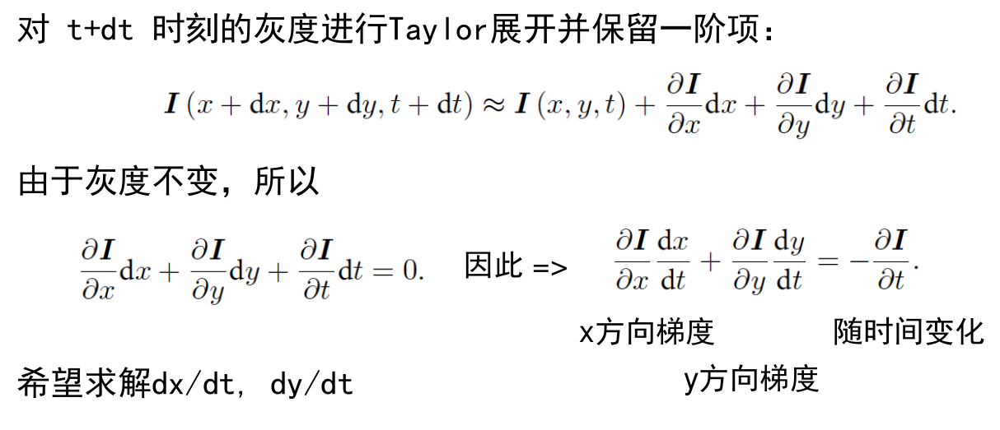

提取特征的话是真的比较慢，换一个方法

可以不通过特征匹配，来拿到匹配点

- 通过其他方式寻找配对点：光流
- 不需要配对点：直接法

# 光流介绍

光流：追踪源图像某一个点在其他图像中的运动

一般分为稀疏光流和稠密光流

- 稀疏以Lucas-Kanade(LK)光流为代表
- 稠密以Horn-Schunck(HS)光流为代表，要GPU才行
- 本质上是估计像素在不同时刻图像中的运动


假设在这个时间点内，像素的亮度或者灰度是不变的！
$$
I(x+dx,y+dy,t+dt)=I(x,y,t)
$$
**我们希望能够求出$dx, dy$**

## 利用最小二乘求解单层光流




这里有两个变量待求解，因此为了求解他们，我们需要引入额外的约束。我们假定在这个点为中心的宽度为W的窗口，假定他们的窗口不变，则，我们可以得到$W^2$个和上述一样的方程


## 利用牛顿高斯法求解单层光流

对于方程(1)，我们可以把他看作是一个求误差最小的最优化问题（注意，这里可以加平方的原因的是因为我们想要他们差值为0，而不是单纯的求最小，）
$$
\mathop{\arg\min}\limits_{dx,dy}\frac{1}{2}||I(x,y,t)-I(x+dx,y+dy,t+dt)||^2
$$

不同的时间，可以看做是不同的图像，我们只需要找到第二幅图中对应与第一幅图中关键点的点即可。
$$
\mathop{\arg\min}\limits_{dx,dy}\frac{1}{2}||I(x,y)_{m2}-I(x+dx,y+dy)_{m1}||^2
$$
令$f(dx,dy) = I(x,y)_{m2}-I(x+dx,y+dy)_{m1}$，

高斯牛顿法的思想为对$f(x)$进行一阶的泰勒展开，然后我们寻找增量$\Delta x$，使得$||f(x+\Delta x)||^2$达到最小。则有
$$
\Delta x^*=\mathop{\arg\min}\limits_{\Delta x}\frac{1}{2}||f(x)+J(x)^T\Delta x||^2
$$
多扯一句，若$x$是一个列向量，那么$J(x)$也为一个列向量，因此在这里需要转置，才可以进行$f(x)$标量加$J(x)^T\Delta x$标量的操作
$$
\frac{1}{2}||f(x)+J(x)^T\Delta x||^2=\frac{1}{2}(f(x)+J(x)^T\Delta x)^T(f(x)+J(x)^T\Delta x)\\
=\frac{1}{2}(||f(x)||^2+f(x)^TJ(x)^T\Delta x+(J(x)^T\Delta x)^Tf(x)+\Delta x^TJ(x)J(x)^T\Delta x)\\
$$
注意，这里$f(x)^TJ(x)^T\Delta x$是一个标量，因此，上式可以写做
$$
=\frac{1}{2}(||f(x)||^2+2f(x)^TJ(x)^T\Delta x+\Delta x^TJ(x)J(x)^T\Delta x)\\
$$
开，然后我们寻找求上面的式子对$\Delta x$求导，并另其等于为零：
$$
J(x)f(x)+J(x)J(x)^T\Delta x=0
$$
则有
$$
H\Delta x=b
$$
其中，$H=J(x)J(x)^T，b=-J(x)f(x)$。

```c++
void OpticalFlowSingleLevel(
        const Mat &img1, //为第一幅图
        const Mat &img2, //为第二幅图
        const vector<KeyPoint> &kp1, //第一幅图关键点
        vector<KeyPoint> &kp2,//第二幅图关键点，待求，输入的时候是一个空的vector
        vector<bool> &success,//返回值，判断是否计算成功
        bool inverse//是否为反向光流
) {

    // parameters
    int half_patch_size = 4;
    int iterations = 10;
    bool have_initial = !kp2.empty();
	// 对每一个关键点进行计算
    for (size_t i = 0; i < kp1.size(); i++) {
        auto kp = kp1[i];
        // 如果是第一次计算，dx=dy=0
        double dx = 0, dy = 0; // dx,dy need to be estimated
        // 若不是第一次计算，则为两幅图对应关键点的差值
        if (have_initial) {
            dx = kp2[i].pt.x - kp.pt.x;
            dy = kp2[i].pt.y - kp.pt.y;
        }

        double cost = 0, lastCost = 0;                        // NOTE this J does not change when dx, dy is updated, so we can store it and only compute error

        bool succ = true; // indicate if this point succeeded

        // 针对每一个点，都通过高斯牛顿法求解和他对应的在第二张图中的点。8x8的框
        for (int iter = 0; iter < iterations; iter++) {
            Eigen::Matrix2d H = Eigen::Matrix2d::Zero();
            Eigen::Vector2d b = Eigen::Vector开，然后我们寻找2d::Zero();
            cost = 0;

            if (kp.pt.x + dx <= half_patch_size || kp.pt.x + dx >= img1.cols - half_patch_size ||
                kp.pt.y + dy <= half_patch_size || kp.pt.y + dy >= img1.rows - half_patch_size) {   // go outside
                succ = false;
                break;
            }

            // 循环8x8的框中的每一个点，其实在这里构造8x8的框，我认为是更好的求Delta x。可以更精确的找到下降的方向。
            // 比如两个点也可以求直线，但是他不可以很好的代表所有点所表示的线，需要考虑求所有点，然后最小二乘，那就可以找到近似的线
            for (int x = -half_patch_size; x < half_patch_size; x++)
                for (int y = -half_patch_size; y < half_patch_size; y++) {

                    // GetPixelValue函数是可以求任何值对应的亮度，通过插值计算得到
                    double error = GetPixelValue(img1, x + kp.pt.x, y + kp.pt.y) - GetPixelValue(img2, x + kp.pt.x + dx, y + kp.pt.y + dy);
                    Eigen::Vector2d J;  // Jacobian
                    if (inverse == false) {
                        // f(x,y)_x = (f(x+1,y) - f(x-1,y))/2
                        J << -0.5 * (GetPixelValue(img2, x+kp.pt.x+dx+1, y+kp.pt.y+dy) - GetPixelValue(img2, x+kp.pt.x+dx - 1, y+kp.pt.y+dy)),
                            -0.5 * (GetPixelValue(img2, x+kp.pt.x+dx, y+kp.pt.y+dy + 1) - GetPixelValue(img2, x+kp.pt.x+dx, y+kp.pt.y+dy - 1));
                    } else {
                        // Inverse Jacobian
                        // NOTE this J does not change when dx, dy is updated, so we can store it and only compute error
                        J << -0.5 * (GetPixelValue(img1, x+kp.pt.x+dx+1, y+kp.pt.y+dy) - GetPixelValue(img1, x+kp.pt.x+dx - 1, y+kp.pt.y+dy)),
                            -0.5 * (GetPixelValue(img1, x+kp.pt.x+dx, y+kp.pt.y+dy + 1) - GetPixelValue(img1, x+kp.pt.x+dx, y+kp.pt.y+dy - 1));
                    }
                    // compute H, b and set cost;
                    H += J * J.transpose();
                    b += -error *J;
                    cost += error * error;
                    // TODO END YOUR CODE HERE
                }
            
            // compute update
            // TODO START YOUR CODE HERE (~1 lines)
            Eigen::Vector2d update = H.ldlt().solve(b);
            // TODO END YOUR CODE HERE

            if (isnan(update[0])) {
                // sometimes occurred when we have a black or white patch and H is irreversible
                cout << "update is nan" << endl;
                succ = false;
                break;
            }
            if (iter > 0 && cost > lastCost) {
                cout << "cost increased: " << cost << ", " << lastCost << endl;
                break;
            }

            // update dx, dy
            dx += update[0];
            dy += update[1];
            lastCost = cost;
            succ = true;
        }

        success.push_back(succ);

        // set kp2
        if (have_initial) {
            kp2[i].pt = kp.pt + Point2f(dx, dy);
        } else {
            KeyPoint tracked = kp;
            tracked.pt += cv::Point2f(dx, dy);
            kp2.push_back(tracked);
        }
    }
}
```

## 逆向光流法

在你实现了上述算法之后,就会发现,在迭代开始时, 高斯牛顿法的计算依赖于 img2 在$ (x_i +\Delta x_i , y_i +
\Delta y_i )$ 处的梯度信息。然而,角点提取算法仅保证了 Imag1 $(x_i , y_i )$ 处是角点(可以认为角度点存在明显梯度)，但对于 imag2 ,我们并没有办法假设 imag2 在 $(x_i , y_i)$ 处亦有梯度,从而 Gauss-Newton 并不一定成立。反向的光流法(inverse)则做了一个巧妙的技巧,即用 imag1$ (x_i , y_i )$ 处的梯度,替换掉原本要计算的 imag2 $
(x_i +\Delta x_i , y_i +\Delta y_i)$。这样做的好处有:

- $I_1 (x_i , y_i )$ 是角点,梯度总有意义;

- $I_1 (x_i , y_i )$处的梯度不随迭代改变,所以只需计算一次,就可以在后续的迭代中一直使用,节省了大量计算时间


在上述代码中我们为 OpticalFlowSingleLevel 函数添加一个 bool inverse 参数,指定要使用正常的算法还是反向的算法。


## 多层光流

**问题：**因为LK光流的结果依赖于图像梯度

- 但梯度不够平滑，可能剧烈变化
- 局部的梯度不能用于预测长期图像走向
- 解决方式：多层光流


假设运动过快，一个在$I_1$上的像素点运动了20个像素点，那么在缩放的金字塔顶端也不过是移动了5个像素，这样一来就相对好算。可以改善掉单层图像光流容易达到一个局部的最小值的问题

```c++
void OpticalFlowMultiLevel(
        const Mat &img1,
        const Mat &img2,
        const vector<KeyPoint> &kp1,
        vector<KeyPoint> &kp2,
        vector<bool> &success,
        bool inverse){

    // parameters
    int pyramids = 4;
    double pyramid_scale = 0.5;
    double scales[] = {1.0, 0.5, 0.25, 0.125};

    // create pyramids
    vector<Mat> pyr1, pyr2; // image pyramids
    for (int i = 0; i < pyramids; i++) {
        if (i == 0) {
            pyr1.push_back(img1);
            pyr2.push_back(img2);
        } else {
            Mat imag1_pyr1, imag2_pyr2;
            cv::resize(pyr1[i - 1], imag1_pyr1, cv::Size(pyr1[i - 1].cols * pyramid_scale, pyr1[i - 1].rows * pyramid_scale));
            cv::resize(pyr2[i - 1], imag2_pyr2, cv::Size(pyr2[i - 1].cols * pyramid_scale, pyr2[i - 1].rows * pyramid_scale));
            pyr1.push_back(imag1_pyr1);
            pyr2.push_back(imag2_pyr2);
        }

    }
    // TODO END YOUR CODE HERE
    // 从小的开始进行寻找对应I1上I2的关键点
    vector<KeyPoint> py1, py2;
    for (auto &p: kp1) {
        KeyPoint kp = p;
        kp.pt *= scales[pyramids - 1];
        py1.push_back(kp);
        py2.push_back(kp);
    }

    // coarse-to-fine LK tracking in pyramids
    // TODO START YOUR CODE HERE
    // 开始匹配
    for (int j = pyramids - 1; j >= 0; --j) {
        // success.clear();
        OpticalFlowSingleLevel(pyr1[j], pyr2[j], py1, py2, success, inverse);

        // 放大关键点到下一层金字塔
        if (j > 0) {
            for (int k = 0; k < py1.size(); ++k) {
                py1[k].pt /= pyramid_scale;
                py2[k].pt /= pyramid_scale;
            }
           
        }
    } 
    kp2 = py2;
}
```

**代码解读：**

设置金字塔为四层，每一层的倍数为0.5

```c++
    // parameters
    int pyramids = 4;
    double pyramid_scale = 0.5;
    double scales[] = {1.0, 0.5, 0.25, 0.125};
```


建立金字塔，就是对两幅图像的对应缩放。第一个位置放原图，第二个是0.5倍图，以此类推

```c++
    vector<Mat> pyr1, pyr2; // image pyramids
    for (int i = 0; i < pyramids; i++) {
        if (i == 0) {
            pyr1.push_back(img1);
            pyr2.push_back(img2);
        } else {
            Mat imag1_pyr1, imag2_pyr2;
            cv::resize(pyr1[i - 1], imag1_pyr1, cv::Size(pyr1[i - 1].cols * pyramid_scale, pyr1[i - 1].rows * pyramid_scale));
            cv::resize(pyr2[i - 1], imag2_pyr2, cv::Size(pyr2[i - 1].cols * pyramid_scale, pyr2[i - 1].rows * pyramid_scale));
            pyr1.push_back(imag1_pyr1);
            pyr2.push_back(imag2_pyr2);
        }

    }
```

注意，金字塔的模型是需要从最糙的图片开始进行计算，然而我们传入的关键点的位置是针对于原图的，因此我们需要把关键点缩放到对应于最小的图片上，注意这里使用的py2

```c++
    // 从小的开始进行寻找对应I1上I2的关键点
    vector<KeyPoint> py1, py2;
    for (auto &p: kp1) {push_back
        KeyPoint kp = p;
        kp.pt *= scales[pyramids - 1];
        py1.push_back(kp);
        py2.push_back(kp);
    }
```

进行单层之间的匹配，本层匹配完了之后，需要把两幅图像的关键点放大到下一层的对应的位置，可以更好的估计下一层的位置。

```c++
	for (int j = pyramids - 1; j >= 0; --j) {
        // success.clear();
        OpticalFlowSingleLevel(pyr1[j], pyr2[j], py1, py2, success, inverse);

        // 放大关键点到下一层金字塔
        if (j > 0) {
            for (int k = 0; k < py1.size(); ++k) {
                py1[k].pt /= pyramid_scale;
                py2[k].pt /= pyramid_scale;
            }
           
        }
    } 
```

## 总结

光流法相对于特征提取来说算是非常快乐，但是如果第一幅图角点的位置提取的不好，那么光流容易跟丢或者给出错误的结果。但是光流法依然有一些不足：

- 没有考虑相机的旋转，只是在平移上做了考虑
- 没有用到相机本身的几何结构
- 边界上的点不好追踪

下面可以参考直接法，进行处理

