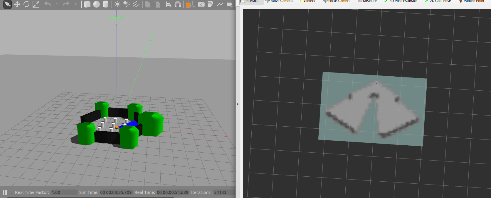
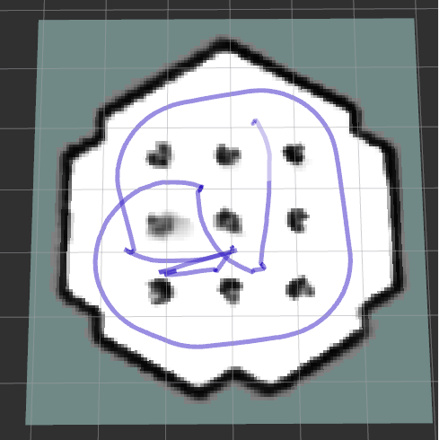

# cartographer 介绍

Cartographer是一个跨多个平台和传感器配置提供2D和3D实时同步定位和绘图(SLAM)的系统。cartographer的应用较为广泛，比如我们平时所见到的送餐机器人大多都是通过cartographer建立的地图

简而言之，SLAM地图构建的过程是通过激光传感器对周围的环境进行检测，从而完成对周边环境的地图情况构建，同时，cartographer还会对环境进行回环检测，检查之前的运动是否已经到达过这个地方，最后完成地图的闭环，完成整个地图

本文介绍cartographer的安装和使用，如要详细学习cartographer的原理可以参考官网的说明https://google-cartographer.readthedocs.io/en/latest/index.html

# cartographer下载和安装

对于cartographer的实现，目前官方还没有支持ROS2，但是ROS2社区对cartographer进行单独的fork并实现了部分的ROS2接口，因此，我们需要从ROS2社区进行cartographer的下载

注意，关于cartographer的包有两个

- cartographer：集合了cartographer本身的算法，不需要ROS环境也可以安装使用
- cartographer_ros：将cartographer应用在ros中的工具，包括消息，服务订阅和发布等等

因此，这两个包我们都需要安装，进入自己的工作空间，输入

```
git clone -b dashing https://github.com/ros2/cartographer_ros
git clone -b ros2 https://github.com/ros2/cartographer
```

进入根目录编译

```
colcon build
```

> 注意：如果报错，则参考此Pull Request的代码修改，再一次编译


# cartographer运行示例

cartographer的可配置的传感器非常多，并且同时支持2d和3d的建图。为了上手更为快捷，针对我们之前利用gazebo做的仿真机器人，我们仅使用激光雷达来建立2d地图，并且说明配置文件的各参数意义。

进入项目更目录，输入以下命令，记得输入之前source以下

```
ros2 launch my_slam cartographer.launch.py 
```

如果一切正常可以看见如下内容，gazebo启动雷达扫描，同时在cartographer进行SLAM建图，并且显示在rviz中。



此时，打开另外一个终端，启动键盘控制

```
ros2 run teleop_key_control teleop_key_control
```

就可以进行整张地图的建立




# 部署代码说明

```python
import os
from ament_index_python.packages import get_package_share_directory
from launch import LaunchDescription
from launch import actions
from launch.actions import IncludeLaunchDescription
from launch.launch_description_sources import PythonLaunchDescriptionSource
from launch_ros.actions import Node

def generate_launch_description():

    pkg_dir = get_package_share_directory('robot_description')
    rviz_config_file= os.path.join(get_package_share_directory('my_slam'), 'rviz2', 'carto_slam.rviz')

    gazebo = IncludeLaunchDescription(
        PythonLaunchDescriptionSource(
            os.path.join(pkg_dir, 'gazebo_lab_world.launch.py')
        ),
    )

    lua_configuration_directory = os.path.join(
        get_package_share_directory('my_slam'), 'lua')
    lua_configuration_name = 'my_slam_indoor_2d.lua'

    cartographer = Node(
        package='cartographer_ros',
        executable='cartographer_node',
        name='cartographer_node',
        arguments=['-configuration_directory', lua_configuration_directory,
                   '-configuration_basename', lua_configuration_name ],
        remappings = [('scan', 'scan')],
        output='screen',
    )

    cartographer_map = Node(
        package='cartographer_ros',
        executable='occupancy_grid_node',
        name='occupancy_grid_node',
        arguments=['-resolution', '0.05'],
        output='screen',
    )

    rviz = Node(
        package='rviz2',
        executable='rviz2',
        name='rviz2',
        arguments=['-d', rviz_config_file],
        output='screen',
    )

    return LaunchDescription([

        gazebo,
        cartographer,
        cartographer_map,
        rviz,
    ])
```

这里我们启动了四个节点，一个是用于仿真的gazebo节点，主要输出/scan 话题。

一个是cartographer_node节点，订阅/scan话题，发布用于生成地图的/submap_list话题，以及轨迹等

一个是occupancy_grid_node节点，主要订阅/submap_list话题来发布/map话题，即ros格式的二维栅格地图

通过rqt来查看我们所用到的node和topic之间的关系


# 配置文件说明

其实，**cartographer可以支持多种传感器的数据融合，包括GPS, IMU,点云等等**。在我们的lua配置文件中，将其配置成只订阅scan话题，应用于2d的配置。这是我们使用的详细配置文件

```lua
-- Copyright 2016 The Cartographer Authors
--
-- Licensed under the Apache License, Version 2.0 (the "License");
-- you may not use this file except in compliance with the License.
-- You may obtain a copy of the License at
--
--      http://www.apache.org/licenses/LICENSE-2.0
--
-- Unless required by applicable law or agreed to in writing, software
-- distributed under the License is distributed on an "AS IS" BASIS,
-- WITHOUT WARRANTIES OR CONDITIONS OF ANY KIND, either express or implied.
-- See the License for the specific language governing permissions and
-- limitations under the License.

include "map_builder.lua"
include "trajectory_builder.lua"

options = {
  map_builder = MAP_BUILDER,                -- map_builder.lua的配置信息
  trajectory_builder = TRAJECTORY_BUILDER,  -- trajectory_builder.lua的配置信息
  
  map_frame = "map",                        -- 地图坐标系的名字
  tracking_frame = "base_footprint",        -- 将所有传感器数据转换到这个坐标系下
  published_frame = "odom",                 -- tf: map -> odom
  odom_frame = "odom",                      -- 里程计的坐标系名字
  provide_odom_frame = false,               -- 是否提供odom的tf, 如果为true,则tf树为map->odom->footprint
                                            -- 如果为false tf树为map->footprint
  publish_frame_projected_to_2d = false,    -- 是否将坐标系投影到平面上

  use_odometry = true,                     -- 是否使用里程计,如果使用要求一定要有odom的tf
  use_nav_sat = false,                      -- 是否使用gps
  use_landmarks = false,                    -- 是否使用landmark
  num_laser_scans = 1,                      -- 是否使用单线激光数据
  num_multi_echo_laser_scans = 0,           -- 是否使用multi_echo_laser_scans数据
  num_subdivisions_per_laser_scan = 1,      -- 1帧数据被分成几次处理,一般为1
  num_point_clouds = 0,                     -- 是否使用点云数据
  
  lookup_transform_timeout_sec = 0.2,       -- 查找tf时的超时时间
  submap_publish_period_sec = 0.3,          -- 发布数据的时间间隔
  pose_publish_period_sec = 5e-3,
  trajectory_publish_period_sec = 30e-3,

  rangefinder_sampling_ratio = 1.,          -- 传感器数据的采样频率
  odometry_sampling_ratio = 1.,
  fixed_frame_pose_sampling_ratio = 1.,
  imu_sampling_ratio = 1.,
  landmarks_sampling_ratio = 1.,
}

MAP_BUILDER.use_trajectory_builder_2d = true

TRAJECTORY_BUILDER_2D.use_imu_data = false
TRAJECTORY_BUILDER_2D.min_range = 0.3
TRAJECTORY_BUILDER_2D.max_range = 6.
--TRAJECTORY_BUILDER_2D.min_z = 0.2
--TRAJECTORY_BUILDER_2D.max_z = 1.4
--TRAJECTORY_BUILDER_2D.voxel_filter_size = 0.02

--TRAJECTORY_BUILDER_2D.adaptive_voxel_filter.max_length = 0.5
--TRAJECTORY_BUILDER_2D.adaptive_voxel_filter.min_num_points = 200.
--TRAJECTORY_BUILDER_2D.adaptive_voxel_filter.max_range = 50.

--TRAJECTORY_BUILDER_2D.loop_closure_adaptive_voxel_filter.max_length = 0.9
--TRAJECTORY_BUILDER_2D.loop_closure_adaptive_voxel_filter.min_num_points = 100
--TRAJECTORY_BUILDER_2D.loop_closure_adaptive_voxel_filter.max_range = 50.

TRAJECTORY_BUILDER_2D.use_online_correlative_scan_matching = false
TRAJECTORY_BUILDER_2D.ceres_scan_matcher.occupied_space_weight = 1.
TRAJECTORY_BUILDER_2D.ceres_scan_matcher.translation_weight = 1.
TRAJECTORY_BUILDER_2D.ceres_scan_matcher.rotation_weight = 1.
--TRAJECTORY_BUILDER_2D.ceres_scan_matcher.ceres_solver_options.max_num_iterations = 12

--TRAJECTORY_BUILDER_2D.motion_filter.max_distance_meters = 0.1
--TRAJECTORY_BUILDER_2D.motion_filter.max_angle_radians = 0.004
--TRAJECTORY_BUILDER_2D.imu_gravity_time_constant = 1.

TRAJECTORY_BUILDER_2D.submaps.num_range_data = 80.
TRAJECTORY_BUILDER_2D.submaps.grid_options_2d.resolution = 0.1

POSE_GRAPH.optimize_every_n_nodes = 160.
POSE_GRAPH.constraint_builder.sampling_ratio = 0.3
POSE_GRAPH.constraint_builder.max_constraint_distance = 15.
POSE_GRAPH.constraint_builder.min_score = 0.48
POSE_GRAPH.constraint_builder.global_localization_min_score = 0.60

return options
```

lua文件的配置一共分为三个部分：

- options：必须要有的，所有的变量参数都要存在，要是有一个不存在就会报错
- 需要引入map_build.lua
- 需要引入trajectory_builder

## map_builder = MAP_BUILDER,  

此为引入地图建立，即map_builder.lua文件的配置信息，不需要更改

## trajectory_builder = TRAJECTORY_BUILDER, 

此为建立轨迹，即trajectory_builder.lua文件的配置信息，不需要更改

## map_frame = "map"

地图坐标系的名字设定

## tracking_frame = "base_footprint"

 将所有传感器数据转换到这个坐标系下，一般将此设定为更新频率较高的坐标系上，比如IMU，但是这里我们没有使用IMU，因此选择了base_footprint

##   published_frame = "odom"

这个参数表示需要把map的tf发布到哪个坐标系上。我们在仿真环境中构建的机器人中的tf树如下所示


因此，我们只需要把map和odom建立tf关系，就可以让map连通到整个frame中

##   odom_frame = "odom"

这里指定的名字表示需要用cartographer发布的里程计坐标系的名字

##  provide_odom_frame = false

表示是否需要让cartographer提供一个里程计坐标系

## use_odometry = true

是否使用里程计,如果使用要求一定要有odom的tf

## use_nav_sat = false

是否使用gps

## use_landmarks = false

是否使用landmark，landmark是cartographer自带的一种数据结构

## num_laser_scans = 1

激光雷达使用的个数。注意，如果使用了激光雷达，需要在launch文件中重设一下cartographer默认订阅激光的topic名字。
- =0，则不用laser_scan
- =1。订阅scan topic的名字默认为 /scan
- =2。订阅scan_1,scan_2两种topic
- =3。订阅scan_1,scan_2，scan_3三种topic
- ...

##  num_multi_echo_laser_scans = 0

是否使用多回声波雷达

## num_subdivisions_per_laser_scan=1

表示1帧数据被分成几次处理,一般为1

## num_point_clouds = 0

是否使用点云数据，这个话题订阅名字和规则和激光雷达的一样

- =0。不使用点云来建图
- =1。订阅points2
- =2。订阅points2_1，points2_2
- ...

## MAP_BUILDER.use_trajectory_builder_2d = true

表示使用的是2d建图

更多的参数说明可以参考官方网站https://google-cartographer-ros.readthedocs.io/en/latest/进行学习

