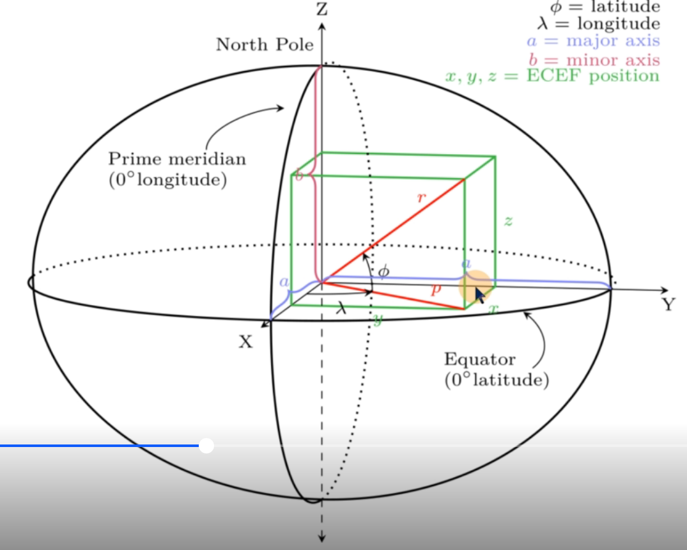

# GPS数据处理

在sensorBridge中，处理GPS数据的函数为HandleNavSatFixMessage。

如果雷达的数据不是STATUS_NO_FIX，则就直接返回不处理

```c++
// 将ros格式的gps数据转换成相对坐标系下的坐标,再调用trajectory_builder_的AddSensorData进行数据的处理
void SensorBridge::HandleNavSatFixMessage(
    const std::string& sensor_id, const sensor_msgs::NavSatFix::ConstPtr& msg) {
  const carto::common::Time time = FromRos(msg->header.stamp);
  // 如果不是固定解,就加入一个固定的空位姿
  if (msg->status.status == sensor_msgs::NavSatStatus::STATUS_NO_FIX) {
    trajectory_builder_->AddSensorData(
        sensor_id,
        carto::sensor::FixedFramePoseData{time, absl::optional<Rigid3d>()});
    return;
  }

  // 确定ecef原点到局部坐标系的坐标变换
  if (!ecef_to_local_frame_.has_value()) {
    ecef_to_local_frame_ =
        ComputeLocalFrameFromLatLong(msg->latitude, msg->longitude);
    LOG(INFO) << "Using NavSatFix. Setting ecef_to_local_frame with lat = "
              << msg->latitude << ", long = " << msg->longitude << ".";
  }

  // 通过这个坐标变换 乘以 之后的gps数据,就相当于减去了一个固定的坐标,从而得到了gps数据间的相对坐标变换
  trajectory_builder_->AddSensorData(
      sensor_id, carto::sensor::FixedFramePoseData{
                     time, absl::optional<Rigid3d>(Rigid3d::Translation(
                               ecef_to_local_frame_.value() *
                               LatLongAltToEcef(msg->latitude, msg->longitude,
                                                msg->altitude)))});
}
```

如果是第一帧雷达数据，则计算一个ecef原点到局部坐标系的坐标变换。

在之后的GPS数据中，可以使用此坐标变换来获得GPS数据间的相对坐标变换

## ecef 坐标系




这里的显示x，y， z就是ecef坐标系的一个示例

