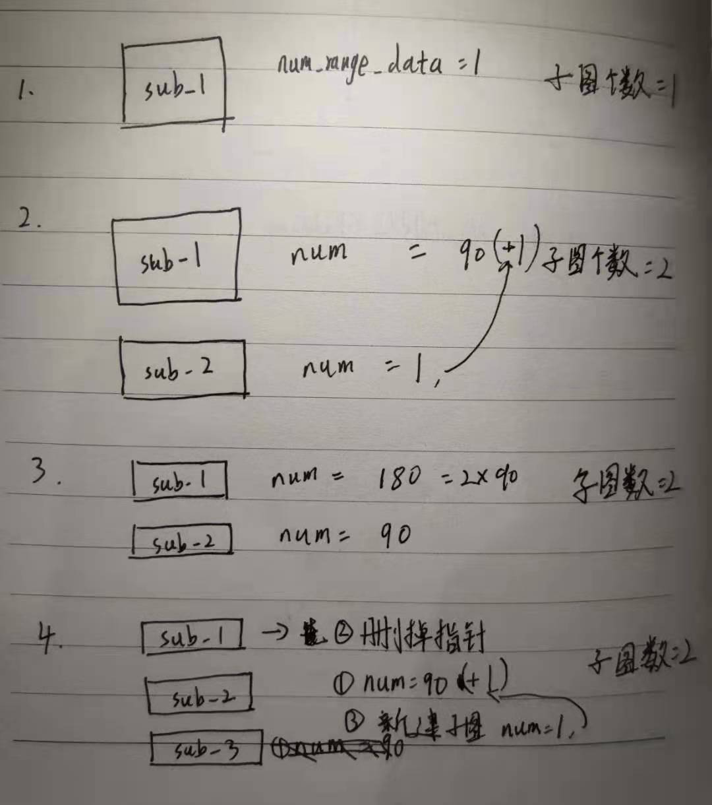

**栅格地图的实现是二维激光SLAM的一个难点**

三维激光SLAM形成的点云地图不需要自己手动实现点云的数据结构, PCL中有写好的数据类型,直接调用就行. 视觉SLAM形成的点云地图也可以用PCL来实现

唯独二维激光SLAM的栅格地图需要自己手动实现, 目前所有的二维激光SLAM的栅格地图都是
SLAM作者自己写的, 没有通用的数据结构

# ActiveSubmaps2D

此类位于`cartographer/cartographer/mapping/2d/submap2d.h`中

此类做活跃的子图管理，一共保存两个子图，保存在`std::vector<std::shared_ptr<Submap2D>> submaps_;`中


每一个子图都会添加雷达数据，最多不高于90，默认值源于配置文件`local_trajectory_2d.lua`中 `submaps: num_range_data=90`

过程：

- 添加子图
- 添加数据，直至90
- 添加子图，两个子图同时添加数据，直到第二个子图到90，第一个子图是2倍的90
- 添加子图，此时就需要删除180数据的子图了，然后继续添加数据
- 回到第三步




## 头文件

```c++
/**
 * @brief 2个活跃的子图,旧的用于匹配,新的用于初始化,当新子图变成旧子图时候再进行匹配
 * 只有初始化时才只有1个子图.
 */
class ActiveSubmaps2D {
 public:
  explicit ActiveSubmaps2D(const proto::SubmapsOptions2D& options);

  ActiveSubmaps2D(const ActiveSubmaps2D&) = delete;
  ActiveSubmaps2D& operator=(const ActiveSubmaps2D&) = delete;

  // Inserts 'range_data' into the Submap collection.
  std::vector<std::shared_ptr<const Submap2D>> InsertRangeData(
      const sensor::RangeData& range_data);

  std::vector<std::shared_ptr<const Submap2D>> submaps() const;

 private:
  std::unique_ptr<RangeDataInserterInterface> CreateRangeDataInserter();
  std::unique_ptr<GridInterface> CreateGrid(const Eigen::Vector2f& origin);
  void FinishSubmap();
  void AddSubmap(const Eigen::Vector2f& origin);

  const proto::SubmapsOptions2D options_;
  std::vector<std::shared_ptr<Submap2D>> submaps_;
  std::unique_ptr<RangeDataInserterInterface> range_data_inserter_;
  
  // 转换表, 第[0-32767]位置, 存的是[0.9, 0.1~0.9]的数据
  ValueConversionTables conversion_tables_; 
};
```

## 成员变量

- options_ ： 保存trajectory_builder_2d.lua文件中，submaps相关配置
- submaps_ ： 保存两个子图的vector
- range_data_inserter_ ： 数据插入器
- conversion_tables_ ： 转换表，第[0-32767]位置, 存的是[0.9, 0.1...0.9]的数据。后面是0.1到0.9缓慢增加的数据

## 成员函数

- InsertRangeData(): 把点云写入到所有的submap中
- submaps(): 返回指向 Submap2D 的 shared_ptr指针 的vector
- CreateRangeDataInserter(): 创建地图数据写入器，类型可以
  - PROBABILITY_GRID_INSERTER_2D
  - TSDF_INSERTER_2D
- CreateGrid(): 以当前雷达原点为地图原点创建地图，可以选择的地图类型为
  - PROBABILITY_GRID
  - TSDF
- FinishSubmap(): 没有实现
- AddSubmap(): 对submaps_ 进行push_back，并且同时检查子图的数量，不能大于2

# Submap2D

他就是保存在Activesubmap2D中 的submap. 这里存有地图的数据和转换表

## 头文件

```c++
class Submap2D : public Submap {
 public:
  Submap2D(const Eigen::Vector2f& origin, std::unique_ptr<Grid2D> grid,
           ValueConversionTables* conversion_tables);
  explicit Submap2D(const proto::Submap2D& proto,
                    ValueConversionTables* conversion_tables);

  proto::Submap ToProto(bool include_grid_data) const override;
  void UpdateFromProto(const proto::Submap& proto) override;

  void ToResponseProto(const transform::Rigid3d& global_submap_pose,
                       proto::SubmapQuery::Response* response) const override;

  const Grid2D* grid() const { return grid_.get(); }

  // Insert 'range_data' into this submap using 'range_data_inserter'. The
  // submap must not be finished yet.
  void InsertRangeData(const sensor::RangeData& range_data,
                       const RangeDataInserterInterface* range_data_inserter);
  void Finish() 
  {
      CHECK(grid_);
      CHECK(!insertion_finished());
      grid_ = grid_->ComputeCroppedGrid();
      // 将子图标记为完成状态
      set_insertion_finished(true);
  }

 private:
  std::unique_ptr<Grid2D> grid_; // 地图栅格数据

  // 转换表, 第[0-32767]位置, 存的是[0.9, 0.1~0.9]的数据
  ValueConversionTables* conversion_tables_;
};
```

## 成员变量

- grid_： 地图栅格数据
- conversion_tables_： 转换表, 第[0-32767]位置, 存的是[0.9, 0.1~0.9]的数据

## 成员函数

- ToProto(): 根据mapping::Submap2D生成proto::Submap格式的数据
- UpdateFromProto(): 根据proto::Submap格式的数据更新地图
- ToResponseProto(): 将地图进行压缩, 放入response
- InsertRangeData(): 将雷达数据写到栅格地图中

# Submap


```c++
/**
 * @brief 独立的子地图, 3个功能
 * 
 * 保存在local坐标系下的子图的坐标
 * 记录插入到子图中雷达数据的个数
 * 标记这个子图是否是完成状态
 */
class Submap {
 public:

  // 构造函数, 将传入的local_submap_pose作为子图的坐标原点
  Submap(const transform::Rigid3d& local_submap_pose)
      : local_pose_(local_submap_pose) {}
  virtual ~Submap() {}

  virtual proto::Submap ToProto(bool include_grid_data) const = 0;
  virtual void UpdateFromProto(const proto::Submap& proto) = 0;

  // Fills data into the 'response'.
  virtual void ToResponseProto(
      const transform::Rigid3d& global_submap_pose,
      proto::SubmapQuery::Response* response) const = 0;

  // Pose of this submap in the local map frame.
  // 在local坐标系的子图的坐标
  transform::Rigid3d local_pose() const { return local_pose_; }

  // Number of RangeData inserted.
  // 插入到子图中雷达数据的个数
  int num_range_data() const { return num_range_data_; }
  void set_num_range_data(const int num_range_data) {
    num_range_data_ = num_range_data;
  }

  bool insertion_finished() const { return insertion_finished_; }
  // 将子图标记为完成状态
  void set_insertion_finished(bool insertion_finished) {
    insertion_finished_ = insertion_finished;
  }

 private:
  const transform::Rigid3d local_pose_; // 子图原点在local坐标系下的坐标
  int num_range_data_ = 0;
  bool insertion_finished_ = false;
};
```


流程总结，

创建activesubmap 需要创建 submap

创建submap 需要先创建 Grid2d