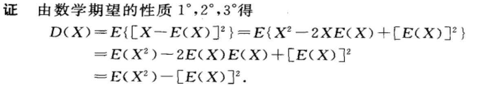
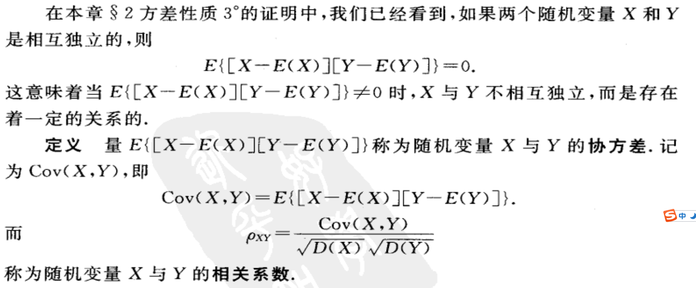
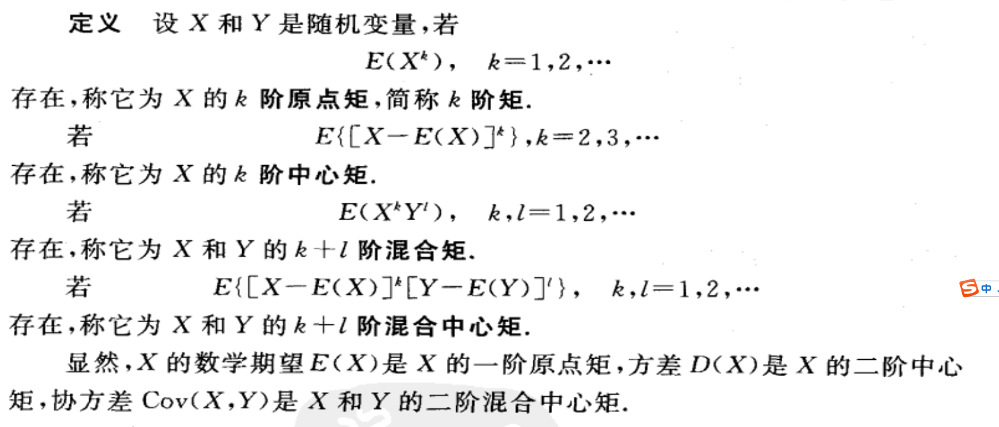
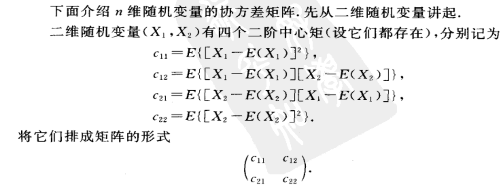
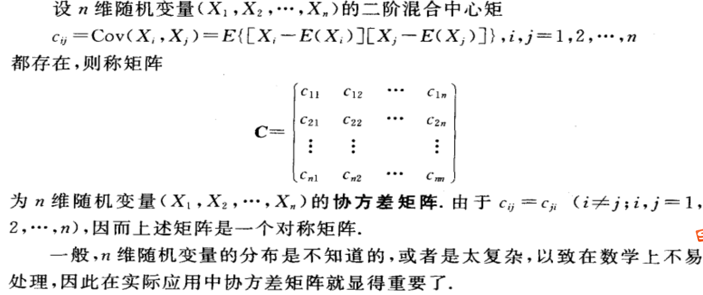
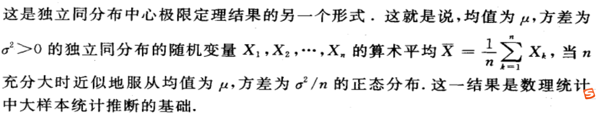
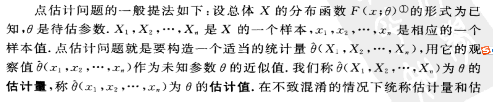
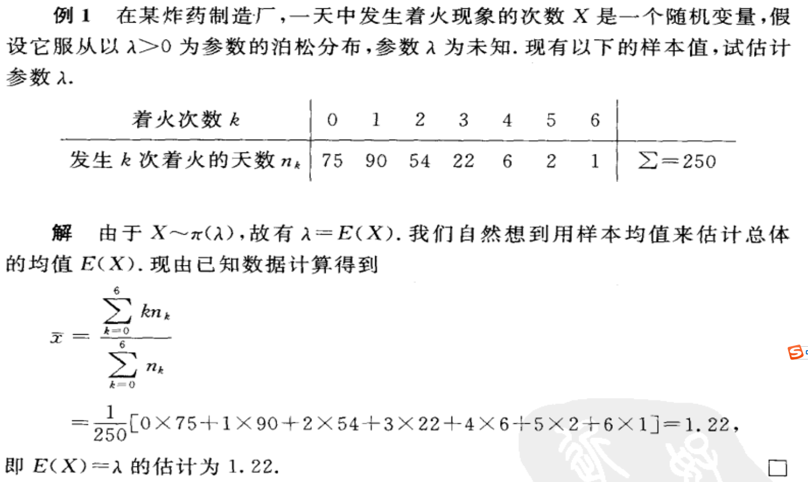

# 分布律

$$
P=\{X=x_k\}=p_k
$$

此为离散型随机变量X的分布律

# 分布函数

离散型
$$
F(x)=P(X<=x)
$$

连续型
$$
F(x)=\int_{-\infin}^x f(t)dt
$$
函数F为X的分布函数，$f(x)$叫概率密度函数

# 方差

方差定义：

- $D(X)=E\{[X-E(X)]^2\}$

  

  

方差即为对函数$g(X)=(X-E(X))^2$的数学期望，即X到均值附近的分布情况

离散型
$$
D(X)=\sum_{k=1}^\infin [x_k-E(X)]^2p_k
$$
  其中$P\{X=x_k\}=p_k$是X的分布律

连续型
$$
D(X)=\int_{-\infin}^\infin[X-E(X)]^2f(x)dx
$$
其中$f(x)$是概率密度

随机变量X的方差可以按照下列公式计算
$$
D(X)=E(X^2)-[E(X)]^2
$$

# 协方差

# 矩、协方差矩阵

## 协方差矩阵

称为随机变量$(X_1, X_2)$的协方差矩阵

# 中心极限定理

# 联合分布率

$P\{X=x_i,Y=y_j\}=p_{ij}$为二维离散随机变量XY的分布律，或者随机变量X和Y的联合分布律

# 样本分位数 p64

常用统计量的分布 p138

# 点估计

估计值为估计。

案例

两个构造估计量的方法

## 最大似然估计

按照事情已经发生的情况去求把似然函数写出来，即发生现在的情况的函数，让他的概率最大！

