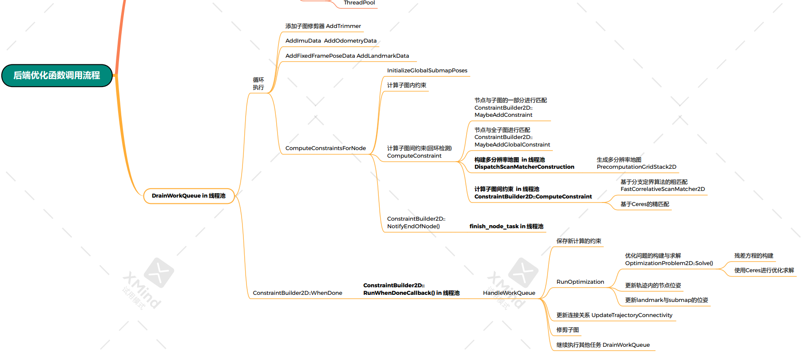

# WorkItem

定义了一个task，他的返回类型是一个Result, 而Result只有两个变量，即，是否优化

```c++
struct WorkItem {
  enum class Result {
    kDoNotRunOptimization, // 执行任务结束后不需要执行优化
    kRunOptimization,      // 执行任务结束后需要执行优化
  };

  std::chrono::steady_clock::time_point time;

  // task为 一个函数的名字, 这个函数返回值类型为Result, 参数列表为(), 为空
  std::function<Result()> task;
};
using WorkQueue = std::deque<WorkItem>;
```

# WorkItem使用位置

在后端最主要的类中 PoseGraph2D 中，定义了一个指向WorkQueue 的一个指针。

任何需要被执行的任务都需要添加到这个队列当中，不会直接执行，会被调度执行

```c++
  // If it exists, further work items must be added to this queue, and will be
  // considered later.
  // 指向 双端队列 的指针
  std::unique_ptr<WorkQueue> work_queue_ GUARDED_BY(work_queue_mutex_);
```


## AddWorkItem

添加任务，等待被执行，如果队列还没有初始化，则初始化。然后把任务添加到work_queue_ 队列中

这里work_queue_和线程池是没有关系的，通过DrainWorkQueue 把他们和线程池进行相连

```c++
// 将任务放入到任务队列中等待被执行
void PoseGraph2D::AddWorkItem(
    const std::function<WorkItem::Result()>& work_item) {
  absl::MutexLock locker(&work_queue_mutex_);

  if (work_queue_ == nullptr) {
    // work_queue_的初始化
    work_queue_ = absl::make_unique<WorkQueue>();
    // 将 执行一次DrainWorkQueue()的任务 放入线程池中等待计算
    auto task = absl::make_unique<common::Task>();
    task->SetWorkItem([this]() { DrainWorkQueue(); });
    // 放到线程池里等待调度
    thread_pool_->Schedule(std::move(task));
  }

  const auto now = std::chrono::steady_clock::now();
  // 将传入的任务放入 work_queue_ 队列中
  work_queue_->push_back({now, work_item});

  kWorkQueueSizeMetric->Set(work_queue_->size());
  kWorkQueueDelayMetric->Set(
      std::chrono::duration_cast<std::chrono::duration<double>>(
          now - work_queue_->front().time)
          .count());
}
```

# DrainWorkQueue

他是在线程池里进行执行的

函数会一直取双端队列work_queue_ 的第一个函数，然后执行，一直执行到函数返回内容是kRunOptimization为止

```c++
// 在调用线程上执行工作队列中的待处理任务, 直到队列为空或需要优化时退出循环
void PoseGraph2D::DrainWorkQueue() {
  bool process_work_queue = true;
  size_t work_queue_size;

  // 循环一直执行, 直到队列为空或需要优化时退出循环
  while (process_work_queue) {
    std::function<WorkItem::Result()> work_item;
    {
      absl::MutexLock locker(&work_queue_mutex_);
      // 退出条件1 如果任务队列空了, 就将work_queue_的指针删除
      if (work_queue_->empty()) {
        work_queue_.reset();
        return;
      }
      // 取出第一个任务
      work_item = work_queue_->front().task;
      // 将取出的任务从任务队列中删掉
      work_queue_->pop_front();
      work_queue_size = work_queue_->size();
      kWorkQueueSizeMetric->Set(work_queue_size);
    }
    // 执行任务
    // 退出条件2 执行任务后的结果是需要优化, process_work_queue为false退出循环
    process_work_queue = work_item() == WorkItem::Result::kDoNotRunOptimization;
  }
  
  LOG(INFO) << "Remaining work items in queue: " << work_queue_size;
  // We have to optimize again.
  // 退出循环后, 首先等待计算约束中的任务执行完, 再执行HandleWorkQueue,进行优化
  constraint_builder_.WhenDone(
      [this](const constraints::ConstraintBuilder2D::Result& result) {
        HandleWorkQueue(result);
      });
}
```

那么，到底有什么函数是要在这里执行的呢，即保存在work_queue_中的 




循环执行的分支的六个函数都是需要在这里被执行的


## 哪里添加workqueue数据

还有在AddWorkItem里面才有

```c++
// 将传入的任务放入work_queue_队列中
  work_queue_->push_back({now, work_item});
```

那么哪里调用了AddworkItem

### AddImuData

注意此函数里添加到WorkItem的返回值是 WorkItem::Result::kDoNotRunOptimization;

#### 被调用处

于global_trajectory_data的AddImuData中，一份是给了前端一份是给了后端

```c++
// 将 把imu数据加入到优化问题中 这个任务放入到任务队列中
void PoseGraph2D::AddImuData(const int trajectory_id,
                             const sensor::ImuData& imu_data) {
  AddWorkItem([=]() LOCKS_EXCLUDED(mutex_) {
    absl::MutexLock locker(&mutex_);
    if (CanAddWorkItemModifying(trajectory_id)) {
      optimization_problem_->AddImuData(trajectory_id, imu_data);
    }
    // 添加数据后不用立刻执行全局优化
    return WorkItem::Result::kDoNotRunOptimization;
  });
```

### AddOdometryData

```c++
// 将 把里程计数据加入到优化问题中 这个任务放入到任务队列中
void PoseGraph2D::AddOdometryData(const int trajectory_id,
                                  const sensor::OdometryData& odometry_data) {
  AddWorkItem([=]() LOCKS_EXCLUDED(mutex_) {
    absl::MutexLock locker(&mutex_);
    if (CanAddWorkItemModifying(trajectory_id)) {
      optimization_problem_->AddOdometryData(trajectory_id, odometry_data);
    }
    return WorkItem::Result::kDoNotRunOptimization;
  });
}
```

### AddFixedFramePoseData

注意，在global_trajectory_builder中，GPS是只传入到后端了

```c++
// 将 把gps数据加入到优化问题中 这个任务放入到任务队列中
void PoseGraph2D::AddFixedFramePoseData(
    const int trajectory_id,
    const sensor::FixedFramePoseData& fixed_frame_pose_data) {
  AddWorkItem([=]() LOCKS_EXCLUDED(mutex_) {
    absl::MutexLock locker(&mutex_);
    if (CanAddWorkItemModifying(trajectory_id)) {
      optimization_problem_->AddFixedFramePoseData(trajectory_id,
                                                   fixed_frame_pose_data);
    }
    return WorkItem::Result::kDoNotRunOptimization;
  });
}
```

等等，形式都一样

