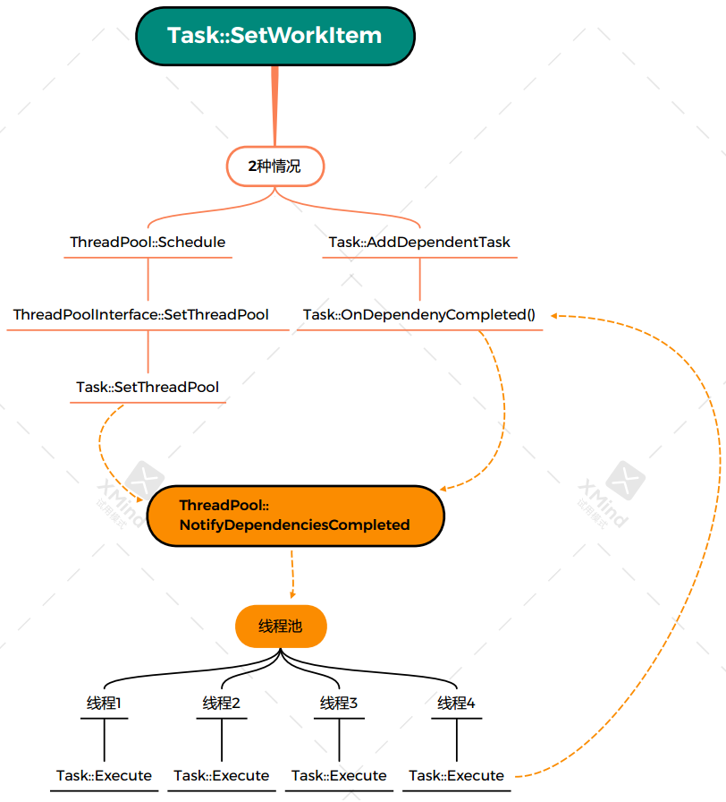

线程池一共有两个类组成，两者的联系于PoseGraph2D::AddWorkItem函数中，初始化双端队列，work_queue_的过程中

```c++
  if (work_queue_ == nullptr) {
    // work_queue_的初始化
    work_queue_ = absl::make_unique<WorkQueue>();
    // 将 执行一次DrainWorkQueue()的任务 放入线程池中等待计算
    auto task = absl::make_unique<common::Task>();
    task->SetWorkItem([this]() { DrainWorkQueue(); });
    thread_pool_->Schedule(std::move(task));
  }
```

# 线程池的初始化

在map_builder的构造函数中，根据配置文件进行初始化

```c++
MapBuilder::MapBuilder(const proto::MapBuilderOptions& options)
    : options_(options), thread_pool_(options.num_background_threads())
```

# Task

Task类位于文件`cartographer/common/task.h`中

## 成员变量

work_item_ 表示需要被执行的任务

```
// 需要执行的任务
  WorkItem work_item_ GUARDED_BY(mutex_);
```

本任务的依赖的任务个数

```c++
  // 本任务依赖的任务的个数
  unsigned int uncompleted_dependencies_ GUARDED_BY(mutex_) = 0;
```

被依赖的个数

```c++
  // 依赖本任务的其他任务
  std::set<Task*> dependent_tasks_ GUARDED_BY(mutex_);
```


# Thread_pool

线程池接口头文件，有一个Schedule的纯虚函数，和两个函数Execute， SetThreadPool

```c++
class ThreadPoolInterface {
 public:
  ThreadPoolInterface() {}
  virtual ~ThreadPoolInterface() {}
  virtual std::weak_ptr<Task> Schedule(std::unique_ptr<Task> task) = 0;

 protected:
  void Execute(Task* task);
  void SetThreadPool(Task* task);

 private:
  // 声明 Task 为友元类,Task类的所有成员函数就都可以访问ThreadPoolInterface类的对象的私有成员.
  friend class Task;

  virtual void NotifyDependenciesCompleted(Task* task) = 0;
};
```

ThreadPool 实现了Schedule函数，还有一些其他的函数。

线程池放在了一个`std::vector<std::thread> pool_ GUARDED_BY(mutex_); `中，这里放了好几个线程

接下来是两个队列，tasks_not_ready_ 这个map存的是Schedule调用完之后不能被直接执行的任务，因为他有可能有依赖的任务还没有执行完，得先要去执行依赖的任务

```c++
  // 准备执行的task
  std::deque<std::shared_ptr<Task>> task_queue_ GUARDED_BY(mutex_);
  // 未准备好的 task, task可能有依赖还未完成
  absl::flat_hash_map<Task*, std::shared_ptr<Task>> tasks_not_ready_
      GUARDED_BY(mutex_);
```

全部头文件代码

```c++
class ThreadPool : public ThreadPoolInterface {
 public:
  explicit ThreadPool(int num_threads);
  ~ThreadPool();

  ThreadPool(const ThreadPool&) = delete;
  ThreadPool& operator=(const ThreadPool&) = delete;

  // When the returned weak pointer is expired, 'task' has certainly completed,
  // so dependants no longer need to add it as a dependency.
  // 当返回的弱指针过期时, 'task'肯定已经完成, 因此依赖者不再需要将其添加为依赖项.
  std::weak_ptr<Task> Schedule(std::unique_ptr<Task> task)
      LOCKS_EXCLUDED(mutex_) override;

 private:
  void DoWork();

  void NotifyDependenciesCompleted(Task* task) LOCKS_EXCLUDED(mutex_) override;

  absl::Mutex mutex_;

  // 结束线程的标志
  bool running_ GUARDED_BY(mutex_) = true;
  // 线程池
  std::vector<std::thread> pool_ GUARDED_BY(mutex_);  
  // 准备执行的task
  std::deque<std::shared_ptr<Task>> task_queue_ GUARDED_BY(mutex_);
  // 未准备好的 task, task可能有依赖还未完成
  absl::flat_hash_map<Task*, std::shared_ptr<Task>> tasks_not_ready_
      GUARDED_BY(mutex_);
};
```

## 构造函数，什么是线程池

线程池的构造函数，向线程池中推入num_threads个DoWork。默认是4个

```c++
// 根据传入的数字, 进行线程池的构造, DoWork()函数开始了一个始终执行的for循环
ThreadPool::ThreadPool(int num_threads) {
  CHECK_GT(num_threads, 0) << "ThreadPool requires a positive num_threads!";
  absl::MutexLock locker(&mutex_);
  for (int i = 0; i != num_threads; ++i) {
    pool_.emplace_back([this]() { ThreadPool::DoWork(); });
  }
}
```

DoWork是一个循环，始终执行, 直到running_为false时停止执行

```c++
// 开始一个不停止的for循环, 如果任务队列不为空, 就执行第一个task
void ThreadPool::DoWork() {
#ifdef __linux__
  // This changes the per-thread nice level of the current thread on Linux. We
  // do this so that the background work done by the thread pool is not taking
  // away CPU resources from more important foreground threads.
  CHECK_NE(nice(10), -1);
#endif

  const auto predicate = [this]() EXCLUSIVE_LOCKS_REQUIRED(mutex_) {
    return !task_queue_.empty() || !running_;
  };

  // 始终执行, 直到running_为false时停止执行
  for (;;) {
    std::shared_ptr<Task> task;
    {
      absl::MutexLock locker(&mutex_);
      mutex_.Await(absl::Condition(&predicate));

      // map_builder.lua中设置的线程数, 4个线程处理同一个task_queue_
      // 如果任务队列不为空, 那就取出第一个task
      if (!task_queue_.empty()) {
        task = std::move(task_queue_.front());
        task_queue_.pop_front();
      } else if (!running_) {
        return;
      }
    }
    CHECK(task);
    CHECK_EQ(task->GetState(), common::Task::DEPENDENCIES_COMPLETED);

    // 执行task
    Execute(task.get());
  }
}
```

## Schedule执行

会直接把任务添加到tasks_not_ready_ 中，默认他是有依赖的，

```c++
// 将task插入到tasks_not_ready_队列中, 并执行task的SetThreadPool()函数
std::weak_ptr<Task> ThreadPool::Schedule(std::unique_ptr<Task> task) {
  std::shared_ptr<Task> shared_task;
  {
    absl::MutexLock locker(&mutex_);
    auto insert_result =
        tasks_not_ready_.insert(std::make_pair(task.get(), std::move(task)));

    // map::insert() 会返回pair<map::iterator,bool> 类型, 
    // 第一个值为迭代器, 第二个值为插入操作是否成功
    CHECK(insert_result.second) << "Schedule called twice";
    shared_task = insert_result.first->second;
  }
  SetThreadPool(shared_task.get());
  return shared_task;
}
```

## SetThreadPool

连接线程池和任务，设置任务的状态从 NEW->DISPATCHED, 如果本任务依赖的任务都完成了，那么就进入DEPENDENCIES_COMPLETED状态，执行NotifyDependenciesCompleted

```c++
// 执行传入的 task的SetThreadPool()函数
void ThreadPoolInterface::SetThreadPool(Task* task) {
  task->SetThreadPool(this);
}
```

```c++
// 将线程池与本任务连接起来, 如果没有未完成的依赖, 则告诉线程池可以将本任务放入到执行队列中
// 状态: NEW -> DISPATCHED || NEW -> DISPATCHED -> DEPENDENCIES_COMPLETED
void Task::SetThreadPool(ThreadPoolInterface* thread_pool) {
  absl::MutexLock locker(&mutex_);
  CHECK_EQ(state_, NEW);

  // 将任务状态设置为 DISPATCHED
  state_ = DISPATCHED;

  // 将thread_pool_to_notify_指针指向传入的thread_pool
  thread_pool_to_notify_ = thread_pool;

  // 如果本Task没有未完成的依赖, 则通知线程池可以将本任务放入到执行队列中
  if (uncompleted_dependencies_ == 0) {
    state_ = DEPENDENCIES_COMPLETED;
    CHECK(thread_pool_to_notify_);
    thread_pool_to_notify_->NotifyDependenciesCompleted(this);
  }
}
```

## NotifyDependenciesCompleted

从tasks_not_ready_ 中找到任务，删除，添加到task_queue_ 中进行执行。task_queue_ 队列的任务会在四个线程中不同的调用执行

```c++
  void NotifyDependenciesCompleted(Task* task) override {
    auto it = tasks_not_ready_.find(task);
    ASSERT_NE(it, tasks_not_ready_.end());
    task_queue_.push_back(it->second);
    tasks_not_ready_.erase(it);
  }
```

最后在线程中会调用Task::Execute函数


## Execute

执行任务，设置任务状态为COMPLETED，结束后，循环依赖本任务的任务，将他们的未完成的依赖任务减一

```c++
// 执行本任务, 也就是传入的函数work_item_
// 状态: DEPENDENCIES_COMPLETED -> RUNNING -> COMPLETED
void Task::Execute() {
  {
    absl::MutexLock locker(&mutex_);
    CHECK_EQ(state_, DEPENDENCIES_COMPLETED);
    state_ = RUNNING;
  }

  // Execute the work item.
  if (work_item_) {
    work_item_();
  }

  absl::MutexLock locker(&mutex_);
  state_ = COMPLETED;

  // 通知依赖本任务的其他任务, 本任务执行完了
  for (Task* dependent_task : dependent_tasks_) {
    dependent_task->OnDependenyCompleted();
  }
}
```

```c++
// 本任务依赖的任务完成了, 可以将本任务加入到线程池的待处理列表中了
// 状态: DISPATCHED -> DEPENDENCIES_COMPLETED
void Task::OnDependenyCompleted() {
  absl::MutexLock locker(&mutex_);
  CHECK(state_ == NEW || state_ == DISPATCHED);
  // 依赖的任务减一
  --uncompleted_dependencies_;
  if (uncompleted_dependencies_ == 0 && state_ == DISPATCHED) {
    state_ = DEPENDENCIES_COMPLETED;
    CHECK(thread_pool_to_notify_);
    thread_pool_to_notify_->NotifyDependenciesCompleted(this);
  }
}
```


完整的流程图

上述的流程表示下图左半边的流程，不涉及到依赖的task。右半边的流程是先设置的依赖。




注意，第一个任务是DrainWorkQueue， 即初始化任务队列的时候添加的，它本身就是while循环，所以第一个线程就相当于是堵塞的，他就一直执行work_

