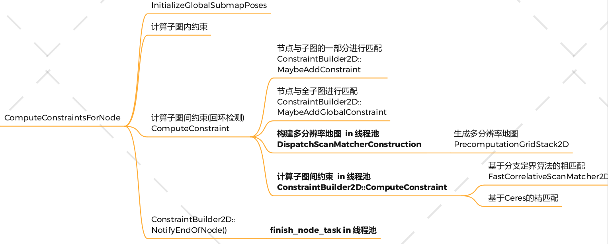

本文讲解如何生成多分辨率地图

# 函数调用处

位于`ConstraintBuilder2D::DispatchScanMatcherConstruction`函数中

```c++
  // 生成一个将初始化匹配器的任务, 初始化时会计算多分辨率地图, 比较耗时
  scan_matcher_task->SetWorkItem(
      [&submap_scan_matcher, &scan_matcher_options]() {
        // 进行匹配器的初始化, 与多分辨率地图的创建
        submap_scan_matcher.fast_correlative_scan_matcher =
            absl::make_unique<scan_matching::FastCorrelativeScanMatcher2D>(
                *submap_scan_matcher.grid, scan_matcher_options);
      });
```

submap_scan_matcher 是一个struct

他包含

- grid：地图信息
- FastCorrelativeScanMatcher2D： 什么什么匹配器
- creation_task_handle：一个Task

```c++
  struct SubmapScanMatcher {
    const Grid2D* grid = nullptr;
    std::unique_ptr<scan_matching::FastCorrelativeScanMatcher2D>
        fast_correlative_scan_matcher;
    std::weak_ptr<common::Task> creation_task_handle;
  };
```


在SetWorkItem里面就只是进行一个初始化，此初始化会创建多张地图


# fast_correlative_scan_matcher_2d 文件

此文件中包含三个类：

- PrecomputationGrid2D
- PrecomputationGridStack2D
- FastCorrelativeScanMatcher2D

很明显，PrecomputationGridStack2D是一个存储PrecomputationGrid2D的类，是一个集合。存储多分辨率存储

## FastCorrelativeScanMatcher2D构造函数

对三个成员变量进行初始化

```c++
// 构造函数
FastCorrelativeScanMatcher2D::FastCorrelativeScanMatcher2D(
    const Grid2D& grid,
    const proto::FastCorrelativeScanMatcherOptions2D& options)
    : options_(options),
      limits_(grid.limits()),
      // 多分辨率地图的构建
      precomputation_grid_stack_(
          absl::make_unique<PrecomputationGridStack2D>(grid, options)) {}
```

## PrecomputationGridStack2D构造函数

构建多分辨地图，保存了七个PrecomputationGrid2D对象在precomputation_grids_对象中。

```c++
// 构造多分辨率地图
PrecomputationGridStack2D::PrecomputationGridStack2D(
    const Grid2D& grid,
    const proto::FastCorrelativeScanMatcherOptions2D& options) {
  CHECK_GE(options.branch_and_bound_depth(), 1);

  // param: branch_and_bound_depth 默认为7, 确定 最大的分辨率, 也就是64个栅格合成一个格子
  const int max_width = 1 << (options.branch_and_bound_depth() - 1); // 64
  // precomputation_grids_ 用于保存地图，所以个数就是分支定界的深度
  precomputation_grids_.reserve(options.branch_and_bound_depth());
  
  // 保存地图值
  std::vector<float> reusable_intermediate_grid;
  const CellLimits limits = grid.limits().cell_limits();

  // 经过滑窗后产生的栅格地图会变宽, x方向最多会比原地图多max_width-1个格子
  reusable_intermediate_grid.reserve((limits.num_x_cells + max_width - 1) *
                                     limits.num_y_cells);

  // 分辨率逐渐变大, i=0时就是默认分辨率0.05, i=6时, width=64,也就是64个格子合成一个值
  for (int i = 0; i != options.branch_and_bound_depth(); ++i) {
    const int width = 1 << i;
    // 构造不同分辨率的地图 PrecomputationGrid2D
    // 保存到reusable_intermediate_grid
    precomputation_grids_.emplace_back(grid, limits, width,
                                       &reusable_intermediate_grid);
  }
}
```

## PrecomputationGrid2D构造函数

通过滑动窗口来生成不同分辨率的地图

代码大致分为，前面三个for，对地图进行横着滑动窗口:

- 滑动窗口还没有完全进入一行数据，intermediate一直进数据
- 刚好完全进入，intermediate右边进左边出
- intermediate刚好到一行数据的最末尾，然后左边只出

建立intermediate

接下来三个for，对地图进行竖着滑动窗口


该地图是通过width来控制，由多少个点来公共组成一个点，假设width=3、那么在窗口中最大值将会覆盖到三个点上，看起来分辨率就下降了

```c++
PrecomputationGrid2D::PrecomputationGrid2D(
    const Grid2D& grid, const CellLimits& limits, const int width,
    std::vector<float>* reusable_intermediate_grid)
    : offset_(-width + 1, -width + 1),
      wide_limits_(limits.num_x_cells + width - 1,
                   limits.num_y_cells + width - 1),
      min_score_(1.f - grid.GetMaxCorrespondenceCost()), // 0.1 min_score_
      max_score_(1.f - grid.GetMinCorrespondenceCost()), // 0.9 max_score_
      cells_(wide_limits_.num_x_cells * wide_limits_.num_y_cells) {
  CHECK_GE(width, 1);
  CHECK_GE(limits.num_x_cells, 1);
  CHECK_GE(limits.num_y_cells, 1);

  const int stride = wide_limits_.num_x_cells;
  // First we compute the maximum probability for each (x0, y) achieved in the
  // span defined by x0 <= x < x0 + width.
  std::vector<float>& intermediate = *reusable_intermediate_grid;
  intermediate.resize(wide_limits_.num_x_cells * limits.num_y_cells);
  
  // 对每一行从左到右横着做一次滑窗, 将滑窗后的地图放在intermediate(临时数据)中
  for (int y = 0; y != limits.num_y_cells; ++y) {
    SlidingWindowMaximum current_values;
    // 获取 grid 的x坐标的索引: 首先获取 (0, y)
    current_values.AddValue(
        1.f - std::abs(grid.GetCorrespondenceCost(Eigen::Array2i(0, y))));

    // Step: 1 滑动窗口在x方向开始划入地图, 所以只进行 填入值
    // intermediate的索引x + width - 1 + y * stride的范围是 [0, width-2] 再加上 y * stride
    // grid的索引 x + width 的坐标范围是 [1, width-1]
    for (int x = -width + 1; x != 0; ++x) {
      intermediate[x + width - 1 + y * stride] = current_values.GetMaximum();
      if (x + width < limits.num_x_cells) {
        current_values.AddValue(1.f - std::abs(grid.GetCorrespondenceCost(
                                          Eigen::Array2i(x + width, y))));
      }
    }

    // Step: 2 滑动窗口已经完全在地图里了, 滑窗进行一入一出的操作
    // x + width - 1 + y * stride 的范围是 [width-1, limits.num_x_cells-2] 再加上 y * stride
    // grid的索引 x + width 的坐标范围是 [width, limits.num_x_cells-width-1]
    for (int x = 0; x < limits.num_x_cells - width; ++x) {
      intermediate[x + width - 1 + y * stride] = current_values.GetMaximum();
      current_values.RemoveValue(
          1.f - std::abs(grid.GetCorrespondenceCost(Eigen::Array2i(x, y))));
      current_values.AddValue(1.f - std::abs(grid.GetCorrespondenceCost(
                                        Eigen::Array2i(x + width, y))));
    }

    // Step: 3 滑动窗口正在划出, 一次减少一个值, 所以intermediate的宽度比grid多 width-1
    // x + width - 1 + y * stride 的范围是 [limits.num_x_cells-1, limits.num_x_cells+width-1] 再加上 y * stride
    // grid 的索引 x的范围是 [limits.num_x_cells-width, limits.num_x_cells-1]
    for (int x = std::max(limits.num_x_cells - width, 0);
         x != limits.num_x_cells; ++x) {
      intermediate[x + width - 1 + y * stride] = current_values.GetMaximum();
      current_values.RemoveValue(
          1.f - std::abs(grid.GetCorrespondenceCost(Eigen::Array2i(x, y))));
    }
    // 理论上, 滑窗走完地图的一行之后应该是空的, 经过 只入, 一出一入, 只出, 3个步骤
    current_values.CheckIsEmpty();
  }

  // For each (x, y), we compute the maximum probability in the width x width
  // region starting at each (x, y) and precompute the resulting bound on the
  // score.

  // 根据intermediate的值, 对每一列从下到上竖着再做一次滑窗, 这个才是真正的地图cells_
  for (int x = 0; x != wide_limits_.num_x_cells; ++x) {
    SlidingWindowMaximum current_values;

    current_values.AddValue(intermediate[x]);
    for (int y = -width + 1; y != 0; ++y) {
      cells_[x + (y + width - 1) * stride] =
          ComputeCellValue(current_values.GetMaximum());
      if (y + width < limits.num_y_cells) {
        current_values.AddValue(intermediate[x + (y + width) * stride]);
      }
    }
    for (int y = 0; y < limits.num_y_cells - width; ++y) {
      cells_[x + (y + width - 1) * stride] =
          ComputeCellValue(current_values.GetMaximum());
      current_values.RemoveValue(intermediate[x + y * stride]);
      current_values.AddValue(intermediate[x + (y + width) * stride]);
    }
    for (int y = std::max(limits.num_y_cells - width, 0);
         y != limits.num_y_cells; ++y) {
      cells_[x + (y + width - 1) * stride] =
          ComputeCellValue(current_values.GetMaximum());
      current_values.RemoveValue(intermediate[x + y * stride]);
    }
    current_values.CheckIsEmpty();
  }
}
```

