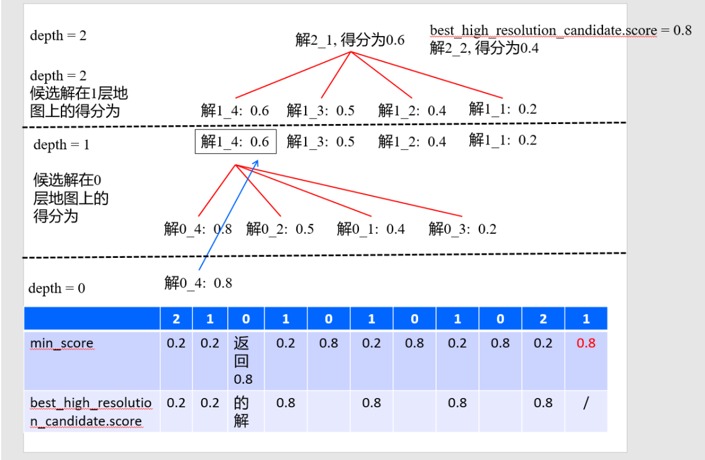

# 总览

cartographer中的分支定界用处：从多个候选解中选出一个最优解。位于函数`FastCorrelativeScanMatcher2D::MatchWithSearchParameters`

此解为从 initial_pose_estimate 到该点云匹配 的位姿差，假设求得的位姿差为`best_candidate`，则用法为

```c++
*pose_estimate = transform::Rigid2d(
        {initial_pose_estimate.translation().x() + best_candidate.x,
         initial_pose_estimate.translation().y() + best_candidate.y},
        initial_rotation * Eigen::Rotation2Dd(best_candidate.orientation));
```

调用处

```c++
  // Step: 进行基于分支定界算法的搜索, 获取最优解
  const Candidate2D best_candidate = BranchAndBound(
      discrete_scans, search_parameters, lowest_resolution_candidates,
      precomputation_grid_stack_->max_depth(), min_score); // param: max_depth
```


# 分支定界实现

函数传入的参数

- discrete_scans： 所有的点云平移后在地图上的索引
- search_parameters：
- lowest_resolution_candidates：最低分辨率的 所有候选解
- 分支的最大层数
- 最小分数

返回

- Candidate2D 最优解


 

看图说明，每一层的精度都会差四倍，即分支

```c++
    // Step: 分枝 对x、y偏移进行遍历, 求出candidate的四个子节点候选解
    for (int x_offset : {0, half_width}) { // 只能取0和half_width
      // 如果超过了界限, 就跳过
      if (candidate.x_index_offset + x_offset >
          search_parameters.linear_bounds[candidate.scan_index].max_x) {
        break;
      }
      for (int y_offset : {0, half_width}) {
        if (candidate.y_index_offset + y_offset >
            search_parameters.linear_bounds[candidate.scan_index].max_y) {
          break;
        }

        // 候选者依次推进来, 一共4个,可以看出, 分枝定界方法的分枝是向右下角的四个子节点进行分枝
        higher_resolution_candidates.emplace_back(
            candidate.scan_index, candidate.x_index_offset + x_offset,
            candidate.y_index_offset + y_offset, search_parameters);
      }
    }
```

对这四个候选解，求出最高的那个，

```c++
    // 对新生成的4个候选解进行打分与排序, 同一个点云, 不同地图
    ScoreCandidates(precomputation_grid_stack_->Get(candidate_depth - 1),
                    discrete_scans, search_parameters,
                    &higher_resolution_candidates);
```

把最高的分作为下一层的min_score 继续求解，即定界。每一次递归发现本层分数小于最小分数就退出，剪枝

```c++
    // Step: 定界 best_high_resolution_candidate.score
    // 以后通过递归调用发现了更优的解都将通过std::max函数来更新已知的最优解.
    best_high_resolution_candidate = std::max(
        best_high_resolution_candidate,
        BranchAndBound(discrete_scans, search_parameters,
                       higher_resolution_candidates, candidate_depth - 1,
                       best_high_resolution_candidate.score));
  }
```

返回最高分数higher_resolution_candidates


分支的那个参数branch_and_bound_depth，最小要是3，不然就是暴力匹配了
