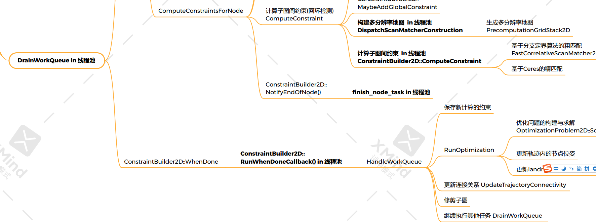

# DrainWorkQueue调用和定义




之前我们已经讲完了如何对一个节点，添加它对本submap的约束和其他所有submap的约束。即子图内约束和子图间的约束

现在看一下是如何执行whendone，都做了什么内容

在AddNode的时候，把计算约束的工作添加到了WorkItem中，位于文件`mapping/internal/2d/pose_graph_2d.cc`中

```c++
  // 把计算约束的工作放入workitem中等待执行
  AddWorkItem([=]() LOCKS_EXCLUDED(mutex_) {
    return ComputeConstraintsForNode(node_id, insertion_submaps,
                                     newly_finished_submap);
  });
```

这个WorkItem又是全部由函数DrainWorkQueue控制的。

DrainWorkQueue函数进入是一个for循环执行workItem，已知循环到一个返回一个需要优化的work_item ,跳出for循环，调用when_done

```c++
// 在调用线程上执行工作队列中的待处理任务, 直到队列为空或需要优化时退出循环
void PoseGraph2D::DrainWorkQueue() {
  bool process_work_queue = true;
  size_t work_queue_size;

  // 循环一直执行, 直到队列为空或需要优化时退出循环
  while (process_work_queue) {
    std::function<WorkItem::Result()> work_item;
    {
      absl::MutexLock locker(&work_queue_mutex_);
      // 退出条件1 如果任务队列空了, 就将work_queue_的指针删除
      if (work_queue_->empty()) {
        work_queue_.reset();
        return;
      }
      // 取出第一个任务
      work_item = work_queue_->front().task;
      // 将取出的任务从任务队列中删掉
      work_queue_->pop_front();
      work_queue_size = work_queue_->size();
      kWorkQueueSizeMetric->Set(work_queue_size);
    }
    // 执行任务
    // 退出条件2 执行任务后的结果是需要优化, process_work_queue为false退出循环
    process_work_queue = work_item() == WorkItem::Result::kDoNotRunOptimization;
  }
  
  LOG(INFO) << "Remaining work items in queue: " << work_queue_size;
  // We have to optimize again.
  // 退出循环后, 首先等待计算约束中的任务执行完, 再执行HandleWorkQueue,进行优化
  constraint_builder_.WhenDone(
      [this](const constraints::ConstraintBuilder2D::Result& result) {
        HandleWorkQueue(result);
      });
}
```

# ConstraintBuilder2D::WhenDone

回调函数赋值给when_done_

生成执行when_done_的任务，放入线程池等待调度、

对when_done_task_进行重新初始化

```c++
// 约束计算完成之后执行一下回调函数
void ConstraintBuilder2D::WhenDone(
    const std::function<void(const ConstraintBuilder2D::Result&)>& callback) {
  absl::MutexLock locker(&mutex_);
  CHECK(when_done_ == nullptr);

  // TODO(gaschler): Consider using just std::function, it can also be empty.
  // 将回调函数赋值给when_done_
  when_done_ = absl::make_unique<std::function<void(const Result&)>>(callback);
  CHECK(when_done_task_ != nullptr);

  // 生成 执行when_done_的任务
  when_done_task_->SetWorkItem([this] { RunWhenDoneCallback(); });
  // 将任务放入线程池中等待执行
  thread_pool_->Schedule(std::move(when_done_task_));

  // when_done_task_的重新初始化
  when_done_task_ = absl::make_unique<common::Task>();
}
```

## RunWhenDoneCallback

此函数为什么when_done_的任务的回调函数

  将计算完的约束进行保存，约束都保存在constraints_ 中，现在全部推到Result中，然后清空constraint_的内容

```c++
  Result result;
  std::unique_ptr<std::function<void(const Result&)>> callback;
  {
    absl::MutexLock locker(&mutex_);
    CHECK(when_done_ != nullptr);

    // 将计算完的约束进行保存
    for (const std::unique_ptr<Constraint>& constraint : constraints_) {
      if (constraint == nullptr) continue;
      result.push_back(*constraint);
    }
```

回调函数执行

```
  // 执行回调函数 HandleWorkQueue
  (*callback)(result);
```

这里的回调函数为HandleWorkQueue

# HandleWorkQueue

首先把传入的result, 即约束全部插入到data_.constraints向量的末尾处

```c++
// 将计算完的约束结果进行保存, 并执行优化
void PoseGraph2D::HandleWorkQueue(
    const constraints::ConstraintBuilder2D::Result& result) {
  {
    absl::MutexLock locker(&mutex_);
    // Step: 把新计算出的约束信息添加到data_.constraints向量的末尾处
    data_.constraints.insert(data_.constraints.end(), result.begin(),
                             result.end());
  }
```

## 执行优化

对这些约束执行优化

```
 RunOptimization();
```

下面是具体实现，看代码注释

```c++
void PoseGraph2D::RunOptimization() {
  // 如果submap为空直接退出
  if (optimization_problem_->submap_data().empty()) {
    return;
  }

  // No other thread is accessing the optimization_problem_,
  // data_.constraints, data_.frozen_trajectories and data_.landmark_nodes
  // when executing the Solve. Solve is time consuming, so not taking the mutex
  // before Solve to avoid blocking foreground processing.
  // Solve 比较耗时, 所以在执行 Solve 之前不要加互斥锁, 以免阻塞其他的任务处理
  // landmark直接参与优化问题，这里到底如何solve后续再说
  optimization_problem_->Solve(data_.constraints, GetTrajectoryStates(),
                               data_.landmark_nodes);

  absl::MutexLock locker(&mutex_);

  // 获取优化后的结果
  // submap_data的类型是 MapById<SubmapId, optimization::SubmapSpec2D> 
  const auto& submap_data = optimization_problem_->submap_data();

  // node_data的类型是 MapById<NodeId, NodeSpec2D>
  // node_data是优化后的所有节点的新位姿，只是更新了2d的位姿
  const auto& node_data = optimization_problem_->node_data();

  // 更新轨迹内的节点位置，更新3d的位姿
  for (const int trajectory_id : node_data.trajectory_ids()) {

    // Step: 根据优化后的结果对data_.trajectory_nodes的global_pose进行更新
    for (const auto& node : node_data.trajectory(trajectory_id)) {
      // node 是 IdDataReference 类型
      // mutable_trajectory_node是TrajectoryNode类型
      auto& mutable_trajectory_node = data_.trajectory_nodes.at(node.id);
      // 将优化后的二维节点位姿旋转到机器人的姿态上得到global_pose
      mutable_trajectory_node.global_pose =
          transform::Embed3D(node.data.global_pose_2d) * 
          transform::Rigid3d::Rotation(
              mutable_trajectory_node.constant_data->gravity_alignment);
    }

    // Extrapolate all point cloud poses that were not included in the
    // 'optimization_problem_' yet.
    // 推断尚未包含在“optimization_problem_”中的所有点云姿势，只是把他们应用在了刚刚计算出来的位姿，做一个简单的推测，并不准确

    // 根据submap_data最后一个被优化的位姿, 计算global坐标系指向local坐标系的坐标变换
    const auto local_to_new_global =
        ComputeLocalToGlobalTransform(submap_data, trajectory_id);
    // 优化前的 global坐标系指向local坐标系的坐标变换
    const auto local_to_old_global = ComputeLocalToGlobalTransform(
        data_.global_submap_poses_2d, trajectory_id);
    // 优化产生的改变量
    const transform::Rigid3d old_global_to_new_global =
        local_to_new_global * local_to_old_global.inverse();
    // 这一次优化的node的最后一个id
    const NodeId last_optimized_node_id =
        std::prev(node_data.EndOfTrajectory(trajectory_id))->id;
    // 指向下一个没有优化的节点
    auto node_it =
        std::next(data_.trajectory_nodes.find(last_optimized_node_id));

    // Step: 根据之前的位姿改变量, 对没有优化过的位姿进行校正
    for (; node_it != data_.trajectory_nodes.EndOfTrajectory(trajectory_id);
         ++node_it) {
      auto& mutable_trajectory_node = data_.trajectory_nodes.at(node_it->id);
      mutable_trajectory_node.global_pose =
          old_global_to_new_global * mutable_trajectory_node.global_pose;
    }

  } // end for trajectory_id

  // 更新data_.landmark_nodes
  for (const auto& landmark : optimization_problem_->landmark_data()) {
    data_.landmark_nodes[landmark.first].global_landmark_pose = landmark.second;
  }

  // 更新所有submap的位姿, 这里保存的就是全局的submap——pose
  data_.global_submap_poses_2d = submap_data;
}
```

## 删除轨迹

```
    // 根据轨迹状态删除轨迹
    DeleteTrajectoriesIfNeeded();
```

删除轨迹，通过trimming_handle 删除了轨迹，且将轨迹的ID更改为DELETED

```c++
// 根据轨迹状态删除轨迹
void PoseGraph2D::DeleteTrajectoriesIfNeeded() {
  TrimmingHandle trimming_handle(this);
  for (auto& it : data_.trajectories_state) {
    if (it.second.deletion_state ==
        InternalTrajectoryState::DeletionState::WAIT_FOR_DELETION) {
      // TODO(gaschler): Consider directly deleting from data_, which may be
      // more complete.
      auto submap_ids = trimming_handle.GetSubmapIds(it.first);
      for (auto& submap_id : submap_ids) {
        trimming_handle.TrimSubmap(submap_id);
      }
      it.second.state = TrajectoryState::DELETED;
      it.second.deletion_state = InternalTrajectoryState::DeletionState::NORMAL;
    }
  }
}
```

## 删除子图

这个的具体内容之后再看

```c++
    TrimmingHandle trimming_handle(this);
    // 进行子图的裁剪, 如果没有裁剪器就不裁剪
    for (auto& trimmer : trimmers_) {
      trimmer->Trim(&trimming_handle); // PureLocalizationTrimmer::Trim()
    }
    // 如果裁剪器处于完成状态, 就把裁剪器删除掉
    trimmers_.erase(
        // c++11: std::remove_if 如果回调函数函数返回真,则将当前所指向的参数移到尾部,返回值是被移动区域的首个元素
        std::remove_if(trimmers_.begin(), trimmers_.end(),
                       [](std::unique_ptr<PoseGraphTrimmer>& trimmer) {
                         return trimmer->IsFinished(); // 调用PureLocalizationTrimmer::IsFinished()
                       }),
        trimmers_.end());

```

## 设置已添加回环节点为0

这个变量可以控制什么时候进行优化，执行完优化之后就设置为0

```c++
    // 把这个变量置为0
    num_nodes_since_last_loop_closure_ = 0;
```


## 重新启动DrainWorkQueue

```
  DrainWorkQueue();
```

