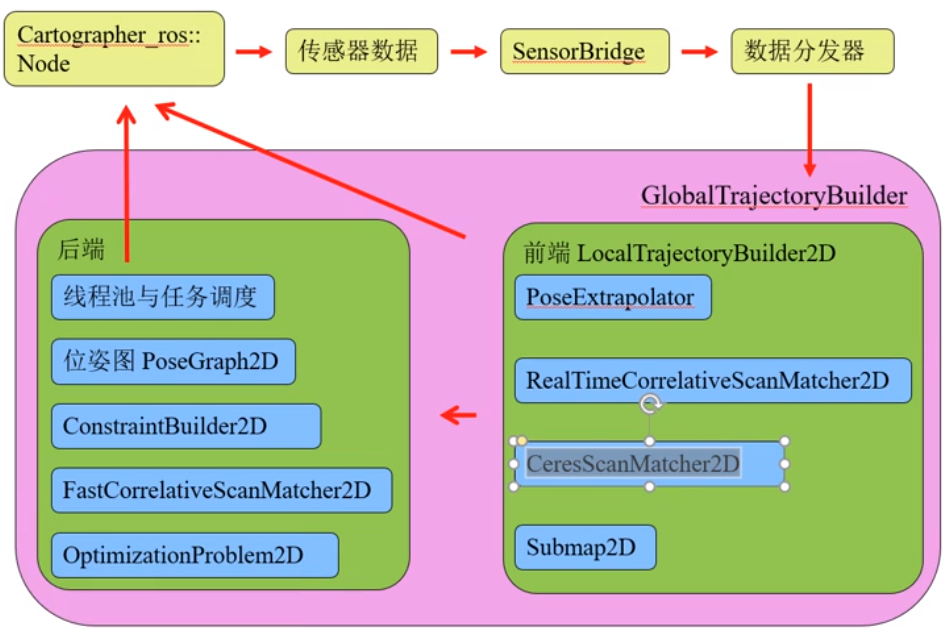

通过数据分发器，采用生产者-消费者模式，把cartographer算法和cartographer_ros进行分离

# Cartographer的优缺点分析
##  优点
代码架构十分优美
各个模块独立性很强, 可以很方便的进行修改, 或则是单独拿出来做其他应用
代码鲁棒性非常高, 很少出现莫名崩掉的情况, 错误提示很好
代码命名非常规范, 能够清楚的根据变量名与函数名判断其代表的含义
总之, cartographer的代码十分值得学习与借鉴.

## 缺点

**点云的预处理**
发生的拷贝次数太多
自适应体素滤波如果参数不好时计算量太大

**位姿推测器**

可能有问题的点

- 计算pose的线速度与角速度时, 是采用的数据队列开始和末尾的2个数据计算的
- 计算里程计的线速度与角速度时, 是采用的数据队列开始和末尾的2个数据计算的
- 使用里程计, 不使用imu时, 计算里程计的线速度方向和姿态的预测时, 用的是里程计数据队列开始和末尾的2个数据的平均角速度计算的, 时间长了就不准
- 不使用里程计, 不使用imu时, 用的是pose数据队列开始和末尾的2个数据的平均角速度计算的, 时间长了就不准
- 添加位姿时, 没有用pose的姿态对imu_tracker_进行校准, 也没有对整体位姿预测器进行校准, 只计算了pose的线速度与角速度
- 从代码上看, cartographer认为位姿推测器推测出来的位姿与姿态是准确的

可能的改进建议

- pose的距离越小, 匀速模型越能代替机器人的线速度与角速度, 计算pose的线速度与角速度时, 可以考虑使用最近的2个数据进行计算
- 里程计距离越短数据越准, 计算里程计的线速度与角速度时, 可以考虑使用最近的2个数据进
  行计算
- 使用里程计, 不使用imu时, 计算里程计的线速度方向时, 可以考虑使用里程计的角度进行计
  算
- 使用里程计, 不使用imu时, 进行姿态的预测时, 可以考虑使用里程计的角度进行预测
- 不使用里程计, 不使用imu时, 可以考虑用最近的2个pose计算线速度与角速度
- 使用pose对imu_tracker_的航向角进行校准

 **基于Ceres的扫描匹配**

可能有问题的点

- 平移和旋转的残差项是逼近于先验位姿的, 当先验位姿不准确时会产生问题

改进建议

- 先将地图的权重调大, 平移旋转的权重调小, 如 1000, 1, 1, 或者 100, 1, 1
- 调参没有作用的时候可以将平移和旋转的残差项注释掉

当雷达频率低的时候，推荐使用gmapping和karto，都是通过里程计的tf进行位姿的预测。因为tf会对里程计发布的数据进行插值，导致了最终的tf树是一个连续时间状态的。

粗匹配的方法推荐karto的扫描方法，他的计算量特别小，可以为ceres提供一个更好的先验位姿

**后端优化**

优化时的计算量太大, 可以根据自己需求调整参数, 或者增加计算前的过滤.

在计算子图间约束的时候, 目前cartographer是根据节点个数来做的, 定位时又根据时间来决定是否进行全子图的匹配, 这部分计算的判断可以根据自己的需求增加一些, 以减少计算量
