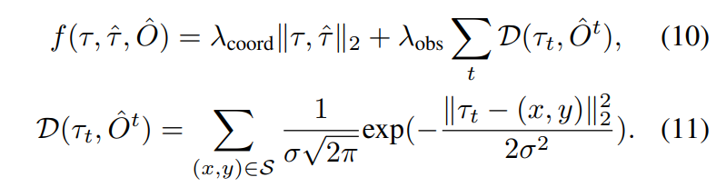

# 摘要

通常自动驾驶任务都是分模块，独立的部署和优化。这样的操作会带来俩问题

- 累积误差。
- 各个任务模块（例如感知、预测和规划）之间的协调不足，可能会导致系统性能下降。如果任务之间的协调不足，可能会导致信息丢失或误解，从而影响系统的整体性能

UniAD ，该框架将所有驾驶任务整合到一个网络中。让感知和预测都为规划做出贡献。该框架以利用每个模块的优点，并提供互补的特征抽象，以便从全局视角进行交互。任务通过统一的query接口进行通信，以便相互促进规划。

# 介绍

本文的三个主要贡献

- **规划导向的自动驾驶框架**：作者提出了一种新的自动驾驶系统设计理念，即以规划为目标，优化前置的感知和预测任务，使得各个任务能够协同合作，提高最终的规划性能和安全性。

- **统一的自动驾驶（UniAD）**：作者提出了一种综合性的自动驾驶算法框架，将全栈的驾驶任务（包括检测、跟踪、在线地图、运动预测、占据预测和规划）集成在一个网络中，利用query-based的设计连接各个模块，实现了端到端的优化和推理。
- **优异的实验结果**：作者在具有挑战性的nuScenes数据集上进行了广泛的实验，验证了UniAD在各个任务上的有效性和优越性。文章还进行了大量的消融实验，分析了各个组件的作用和贡献。文章展示了UniAD在复杂场景下的可视化结果，证明了其对规划导向的自动驾驶的潜力。

# 方法

## 总览

上图由四个transformer decoder-based 模块和 一个planner模块组成。 Query Q在整个流程中都起着关键作用，连接各个模块。

### Bev-feature

将一系列多摄像头图像输入到特征提取器中，然后将得到的透视视图特征通过BEVFormer中的BEV编码器转换为统一的鸟瞰视图（BEV）特征B。值得注意的是，UniAD并不局限于使用特定的BEV编码器，还可以使用其他替代方案来提取具有长期时间融合或多模态融合的更丰富的BEV表示。这种处理方式为自动驾驶系统提供了更全面和丰富的环境感知信息。

### TrackerFormer 

- TrackFormer模块中可学习的参数叫做track queries. 它从BEV特征图B中query信息，来做到agent的检测和跟踪。
- track queries是可学习的，代表agent及其状态。
- track queries关注B以提取信息，并随时间更新其嵌入

### MapFormer

MapFormer是一个用于地图全景分割的模块，它使用地图query作为道路元素（例如车道和分隔线）的语义抽象，并对地图进行分割和分类。它还利用agent query和地图query之间的交互来捕捉agent和道路之间的关系，从而为下游的运动预测提供有用的信息。

### MotionFormer

- MotionFormer模块捕获了agent和地图之间的交互，并预测每个agent的未来轨迹。
- 由于每个agent的行动可能会显著影响场景中的其他agent，因此该模块对所有考虑的agent进行联合预测。
- 同时，我们设计了一个自车query，以显式地模拟自车，并使其能够与场景中的其他agent进行交互

### OccFormer

OccFormer使用BEV特征B作为query，使用agent 的信息作为键和值，然后预测多步未来的占用情况，同时以agent为单位保留特征

这种设计使得系统能够在预测未来的占用情况时，考虑到每个智能体的特性和状态，从而提高了预测的准确性和可靠性

### Planner

规划器利用来自MotionFormer的自我车辆query来预测规划结果，并避开由OccFormer预测的已占用区域，以避免碰撞。

## Perception: Tracking and Mapping

- 本节介绍了两个感知模块：TrackFormer和MapFormer，分别用于跟踪动态物体和分割静态地图。
- TrackFormer使用检测query和跟踪query来检测和跟踪物体，同时引入一个自车query来显式地模拟自驾车。
- MapFormer使用地图query来稀疏地表示道路元素，如车道、分隔线和交叉口，并将其输出给MotionFormer进行物体-地图交互。

**TrackFormer**: 

它执行检测和多目标跟踪。除了传统的检测query，用于目标检测之外，还引入了跟踪query，用于跟踪跨帧的物体。

在每个时间步，初始化的检测query负责检测第一次被感知的新生物体，而跟踪query则保持对前一帧检测到的物体的建模，检测query和跟踪query都通过关注BEV特征B来捕捉物体的抽象信息。随着场景的不断演变，当前帧的跟踪query与之前记录的跟踪query在自注意力模块中进行交互，以聚合时间信息，直到相应的物体完全消失

TrackFormer包含N层，最终的输出状态$Q_A$为下游预测任务提供了Na个有效物体的知识。除了query编码周围的其他物体外，我们还在query集中引入了一个特定的自车query，以显式地模拟自驾车本身，这在规划中进一步使用。

**MapFormer**：

我们基于一个2D全景分割方法Panoptic SegFormer 设计了它。我们将道路元素稀疏地表示为地图query，以帮助下游的运动预测，编码了位置和结构知识。对于驾驶场景，我们将车道、分隔线和交叉口设置为物体，将可行驶区域设置为背景。MapFormer也有N个堆叠的层，每个层的输出结果都有监督，而只有最后一层的更新query$Q_M$被转发到MotionFormer，用于物体-地图交互。

## Prediction: Motion Forecasting

通过使用高度抽象的query来表示动态agent $Q_A$和静态地图$Q_M$，MotionFormer可以预测所有agent的多模态未来运动, 即可能的top-k条轨迹。同时，我们用来自TrackFormer的自车查询传递到MotionFormer，使自车能够与其他agent进行交互，考虑未来的动态。

**MotionFormer**:

它由N个层组成，每一个层都有三个交互类型：agent-agent， agent-map以及agent-goal point...

## Planning

如果没有高精地图或者预先处理好的导航线，planning一般都需要一个命令（左转，右转，前行）来告诉自车怎么走。因此，我们将原始的导航信号（即左转、右转和直行）转换为三个可学习的embedding,，称为命令embedding。由于来自MotionFormer的自车查询已经表达了其多模态的意图，我们将其配备命令embedding以形成一个“plan 查询”。我们让plan查询关注BEV特征B以使其了解周围环境，然后将其解码为未来的路径点$\tau$。

为了进一步避免碰撞，我们仅在推理中利用牛顿法来优化路点$\tau$,
$$
\tau^*=arg \min_\tau f(\tau,\hat{\tau},\hat{O}),
$$
其中，$\hat{\tau}$ 表示原始路点，τ是由多次射击生成的轨迹， $\tau^*$ 是通过最小化cost函数f优化方法后的路点轨迹。$\hat{O}$是一个经典的二进制占用地图，它是从OccFormer的instance级别占用预测中合并得到的。cost函数f如下所示

这里的两个 $\lambda$ 以及$\sigma$是三个超参，t 表示未来的timestep, $l2$ cost 将轨迹拉向原始预测的轨迹，而碰撞项D则将其从占据的网格中推开。考虑到限定在$S = {(x, y)|∥(x, y)−τ_t∥_2 < d, O^t_{ x,y} = 1}$的周围位置。其中，$\hat{O}^t_{ x,y} = 1$表示在时间t，位置(x, y)被占据

