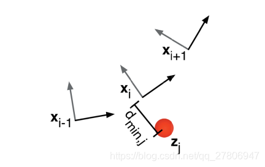

# 介绍

经典的planning算法被分为两大类，

- 传统算法: 图搜索算法（A*），基于采样的算法（RRT）， 插值曲线算法，reaction-based的算法（DWA）
- 基于machine learning的算法： SVM，deep Q-learning network（DQN），policy gradient RL (e.g., actor-critic algorithm)

# 全局规划算法 path planning

## A* 

A* 算法可以参考

https://zhuanlan.zhihu.com/p/348546110, 

Dijkstra算法： 把从起始点到下一步最小代价的点作为下一个点

best-first: 把目标点到下一步最小代价的点作为下一个点

A*: 结合两者
$$
C_i =c_{start,i}+min_j(d_{i,j}+d_{j, goal})
$$
其中， $C_i$表示经过结点$i$需要话费的最小代价。$d_{i,j}$表示结点i到结点j的距离

## RRT算法

参考下面动图

https://blog.csdn.net/feriman/article/details/113775084 

除此之外，RRT算法被用来考虑非完整约束，如车辆的最大转弯半径和动量。

在RRT（快速探索随机树）算法中，考虑转弯半径主要通过以下步骤实现：

1. 生成一个随机点x_rand
2. 在树上找到与x_rand最近的节点x_nearest
3. 连接x_rand与x_nearest
4. 以x_rand为中心，r_i为半径，在树上搜索节点

在这个过程中，"r_i为半径"的设定就是在考虑转弯半径。这个半径可以理解为机器人或车辆在实际运动中能够达到的最小转弯半径。在生成新的节点并尝试连接到树时，会检查新的路径是否满足这个转弯半径的限制。如果不满足，那么这个新的节点就不会被添加到树中。

这样，RRT算法就能在生成路径的同时，考虑到实际的运动约束，如车辆的最大转弯半径。这对于确保车辆在实际操作中的安全和有效性至关重要。这种方法使得RRT算法能够生成满足这些约束的路径，从而使车辆能够在环境中有效地导航。

# 曲线生成

## 回旋曲线（羊角螺旋线）

回旋曲线的曲率随着曲线长度线性改变。主要的应用场景是**直线与直线**，或**直线与圆弧曲线**的平滑连接，它可以保证连接点与圆弧曲线的曲率完全一致

他的推导可以参考[这一篇](https://zhuanlan.zhihu.com/p/646885831#:~:text=%E5%9B%9E%E6%97%8B%E6%9B%B2%E7%BA%BF%20%28Clothoid%29%20%E6%8B%94%E5%88%80%E6%96%8B,%E6%A6%82%E8%BF%B0%20%E5%9F%BA%E6%9C%AC%E6%A6%82%E5%BF%B5%E4%B8%8E%E7%94%A8%E9%80%94%20%E5%9F%BA%E6%9C%AC%E6%A6%82%E5%BF%B5%20%E5%9B%9E%E6%97%8B%E6%9B%B2%E7%BA%BF%E5%8F%88%E8%A2%AB%E7%A7%B0%E4%B8%BA%E6%AC%A7%E6%8B%89%E8%9E%BA%E7%BA%BF%E6%88%96%E7%BE%8A%E8%A7%92%E8%9E%BA%E7%BA%BF%EF%BC%8C%E5%85%B6%E7%89%B9%E5%BE%81%E6%98%AF%E6%9B%B2%E7%BA%BF%E4%B8%8A%E7%82%B9%E7%9A%84%E6%9B%B2%E7%8E%87%E4%B8%8E%E6%B2%BF%E6%9B%B2%E7%BA%BF%E7%A7%BB%E5%8A%A8%E7%9A%84%E8%B7%9D%E7%A6%BB%E6%88%90%E6%AD%A3%E6%AF%94%EF%BC%8C%E4%B9%9F%E5%B0%B1%E6%98%AF%E8%AF%B4%EF%BC%8C%E5%AE%83%E7%9A%84%E6%9B%B2%E7%8E%87%E9%9A%8F%E7%9D%80%E6%9B%B2%E7%BA%BF%E9%95%BF%E5%BA%A6%E7%BA%BF%E6%80%A7%E6%94%B9%E5%8F%98%E3%80%82)

总结而言: 如何给出羊角螺旋线即求解如下ODE，参考[这篇](https://medium.com/@alejandro.blumentals/computing-clothoid-curves-in-five-lines-of-python-3ea762debaa1#id_token=eyJhbGciOiJSUzI1NiIsImtpZCI6ImVkODA2ZjE4NDJiNTg4MDU0YjE4YjY2OWRkMWEwOWE0ZjM2N2FmYzQiLCJ0eXAiOiJKV1QifQ.eyJpc3MiOiJodHRwczovL2FjY291bnRzLmdvb2dsZS5jb20iLCJhenAiOiIyMTYyOTYwMzU4MzQtazFrNnFlMDYwczJ0cDJhMmphbTRsamRjbXMwMHN0dGcuYXBwcy5nb29nbGV1c2VyY29udGVudC5jb20iLCJhdWQiOiIyMTYyOTYwMzU4MzQtazFrNnFlMDYwczJ0cDJhMmphbTRsamRjbXMwMHN0dGcuYXBwcy5nb29nbGV1c2VyY29udGVudC5jb20iLCJzdWIiOiIxMDQwNzE4NTY0OTE5OTk3NjcwOTkiLCJlbWFpbCI6ImxrYmpoZ3dvYWlxeWxrYjFAZ21haWwuY29tIiwiZW1haWxfdmVyaWZpZWQiOnRydWUsIm5iZiI6MTcwNzkxMDA3NiwibmFtZSI6ImxpYW5ncWlhbiBLb25nIiwicGljdHVyZSI6Imh0dHBzOi8vbGgzLmdvb2dsZXVzZXJjb250ZW50LmNvbS9hL0FDZzhvY0pJUkdSQzNDNGVBdDNpU2pqRnF3Q2t5bW1WdFprWWpLSDRjSkpUOFJ3ZT1zOTYtYyIsImdpdmVuX25hbWUiOiJsaWFuZ3FpYW4iLCJmYW1pbHlfbmFtZSI6IktvbmciLCJsb2NhbGUiOiJ6aC1DTiIsImlhdCI6MTcwNzkxMDM3NiwiZXhwIjoxNzA3OTEzOTc2LCJqdGkiOiI5MDAwZGI1NjkzZTMyM2UyMTQ2MmE0MjBmNjE4OTk2NTExODQwNGUyIn0.FdsyI9hSWDWQdgdtd3xSHWlkxZ1kKsZCnPR19TFjW336WOvDe16lJfrsABgbWwa-Ri2Wjw-CgP8BIxkEKYFEUiATMlRCnreYgxreHRo_mhGyMzKF1kVpgINptjVXHpUg0fC7mC8nleFiqpyXbPCAR6MbMor5q3SCqsCK1pKGRmgnYQ2xldXrc7_uUqWsahmqL0pp5r3wfsCVcbSvwpskNc0NyBK2tVxjJJaRkLAMpxODwEci6mJhmWfgk_NRHLfBxSvnvZIFEx1bsLLd0nValugmzAGjb13SZCEfq3WqI-GQ1Mfmv_h1D5niceWwsbdTPpEci3nNFeanFikmA9U3NQ)，第三个DE定义的就是曲率随着长度线性改变。
$$
x'(s)=cos\theta(s)\\
y'(s)=sin\theta(s)\\
\theta'(s)=\kappa_0+\kappa_1s
$$
其中，$\kappa_0$和$\kappa_1$是自定义。

# 局部路径规划算法

## PFM(potential field method)

可以参考[这里](https://zhuanlan.zhihu.com/p/144816424)

势场法是一种经典的机器人路径规划算法。该算法将目标和障碍物分别看做对机器人有引力和斥力的物体，机器人沿引力与斥力的合力来进行运动。

### 缺点

- 势场算法的挑战之一就是是局部最小值陷阱问题，当所有人工势场(引力势场和斥力势场)相互抵消时，比如在障碍物正好处于机器人和目标位置之间就可能会发生这种情况。虽然这些局部极小值点梯度为零，但并不是我们想要的目标位置。
- 在高速的时候距离障碍物很近容易发生碰撞
- 不太可能经过比较小，比较窄的地方

### 改进方法

#### virtual force field (VFF)

参考Real-Time_Obstacle_Avoidance_for_Fast_Mobile_Robot

VFF能够处理不准确的传感器数据（如超声波传感器产生的数据）。通过回波对地图网格实时计数，有障碍物的地方会多次计数，由于不准确的随机扰动不多，不会再某一块上多次计数，从而通过感知和响应这些“排斥力”，从而有效地避开障碍物。

VFF增加稳定性（低通滤波）：
$$
\Omega_i=\frac{T\Omega'_{i-1}+(\tau-T)\Omega_{i-1}}{\tau}
$$
$\Omega_i$：在$i$时刻，经过滤波之后的值 

$\Omega_i'$：在$i$时刻，没有经过滤波之后的值

$\tau$： 时间间隔=0.4s, 表示当前时刻的指令会收到上一时刻的影响

T： 采样时间=0.1s

需要注意，这里虽然通过引入滤波平滑了输出，但是会引入一个$\tau$时刻的延迟，对现在下发的命令有一定的影响

VFF增加阻尼

由于稳定性（低通滤波）的增加，系统会有相当大的一个延迟，即便在接近障碍物的时候有一个很强的斥力，也可能会十分接近障碍物。当需要往目标方向走，接近障碍物的时候，这个时候其实也远离了很远，会出现震荡现象。为了解决这个震荡现象，提出阻尼。

阻尼的思想是在接近障碍物的时候增大斥力，当它沿着但该无走的时候减少斥力

我们可以把$F_r$当做是$F_r$和速度V的一个组合，
$$
F'_r=wF_r+(1-w)F_r(-cos\theta)
$$
其中$F_r'$是调整过后的斥力，$\theta$为合力和速度的一个夹角
$$
\cos\theta=\frac{V_xF_{rx}+V_yF_{ry}}{|V||F_r|}
$$
这里下标x和y都是对应坐标轴的分量。

当速度和排斥力完全同方向，$\cos\theta=-1$,  斥力直接拉满。当机器人转向沿着障碍物的边界移动时，排斥力会被0.75*cos的因子削弱，并在机器人平行于边界运行时达到最小值。

速度控制

如果没有障碍物，机器人仍然会以最大速度运行。然而，当有障碍物存在时，只有当机器人朝向障碍物（或远离它）时，速度才会减小，从而产生额外的阻尼效应。然而，如果机器人沿着障碍物的边界移动，其速度几乎不会减小，它会以最大速度移动，从而大大减少了总的行驶时间
$$
V=\left\{
\begin{matrix}
 V_{max} ,|F_r|=0\\
 V_{max}(1-\cos\theta), |F_r|>0
\end{matrix}
\right.
$$

VFF可以解决局部最小值问题，

通过检测是否进入局部最小值（合力=0 or 在局部地域来回震荡运动），启动wall following 算法

## VOM(velocity obstacle method)

## DWA

先出候选轨迹，后打分

## TEB

把初始轨迹进行进行优化。可以参考http://epsilonjohn.club/2021/07/19/TEB%E5%B1%80%E9%83%A8%E8%B7%AF%E5%BE%84%E8%A7%84%E5%88%92%E8%AE%BA%E6%96%87%E9%98%85%E8%AF%BB/

建立约束，转为优化问题直接求解. 求解出每一个位置的$(x,y,\theta)$。通过建立每一个变量的约束条件，将所有的约束条件组合起来建立最优化问题，求解所有的$x,y, \theta$.

## 约束目标函数

### 跟随路点

$$
f(x,x_r,\epsilon,S,n)=\left\{\begin{matrix} ((x-(x_r-\epsilon)/S)^n ,x>x_r-\epsilon\\ 0, otherwise\end{matrix}\right.
$$

这里，x表示当前位姿和路点的最小距离，$x_r$表示极限距离，S 是缩放参数，n是参数，表示多项式次数

若$x_r=0.4$, 表示当小车距离路点最小的距离大于极限距离0.4米的时候，根据路点的惩罚函数就要产生惩罚值。同理应对于障碍物距离。

### 速度和加速度约束

$$
v_i=\frac{||X_{i+1}-X_i||}{\Delta t}
$$

这里$X_i=(x_i,y_i)$表示当前的位置。同理对加速度

### 最快速度约束

$$
f=
$$

### 运动学约束

## VO(velocity obstacle)

在速度空间利用线性规划找到可行区间。参考[bilibili视频](https://www.bilibili.com/video/BV1qa4y117Yo/?spm_id_from=333.337.search-card.all.click&vd_source=1f944b2dae1f198067fc46d5b7c760b5)

