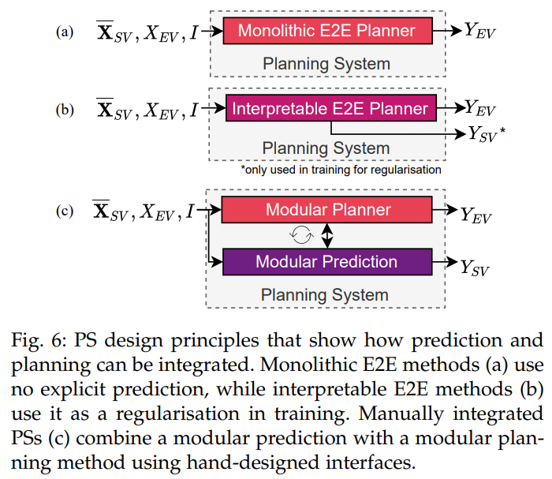
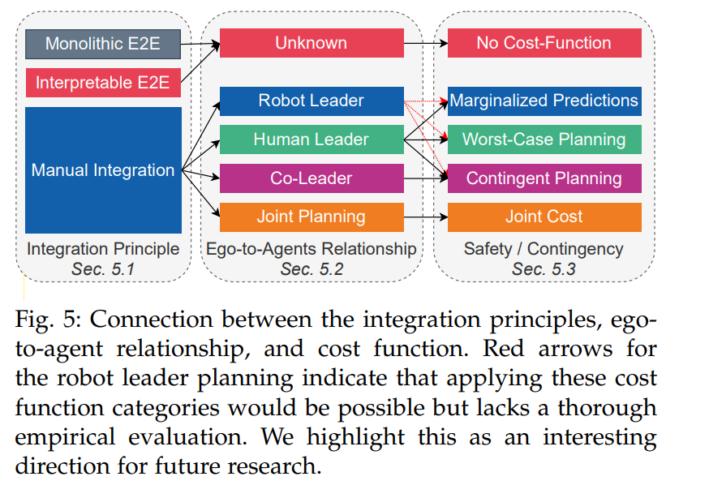

## 符号标记

$X_i=\{x_{t-t_{obs}},...,x_{t-1},x_t\}$: 障碍物$i$的历史状态特征，每一个$x$有多维特征，2D或者3D的位置信息，heading， speed等

$X_{EV}$: ego vehicle的历史特征

$X_{SV}$: Surrounding Vehicles的历史特征

$\overline{X}_{SV}=\{X_1,X_2,...,X_m\}$: 周围所有车的历史特征

$Y_i = {y_{t+1}, y_{t+2}, . . . , y_{t+tpred} }$: 障碍物$i$的未来信息，一般也称为未来轨迹

$I$: 除未来轨迹和历史特征，其他场景信息，包括语义信息，交通灯，交通标志等

$\overline{X}=\{\overline{X}_{SV}, X_{EV}\}$: 所有障碍物车的历史体特征

$N_s$: 未来可能的场景

$P (\overline{Y}^{(i)}_{SV} ), i = 1, .., N_s$: 描述了周围所有车的在每一个场景下的未来行为

# 正文

​         本文从整个轨迹规划系统（PS）的角度分析设计决策对交互场景中行为的影响。特别是，文本探讨了PS如何考虑周围车辆（SV）的预期行为，以及PS在SV未来行为不确定性下如何进行规划。此外，还分析了自驾车（EV）是否能特别影响SV的行为。

- **交互场景影响**：PS设计决策如何影响与其他车辆的交互。
- **考虑SV行为**：PS如何基于SV的预期行为进行轨迹规划。
- **不确定性规划**：PS在SV行为不确定时如何轨迹规划。
- **影响SV行为**：EV是否能够影响SV的行为。

# 整合原则

如图1所示，现在有三种不同的方式来实现planning模块.

## Monolithic E2E

该end to end系统仅仅只由单个的planner组成，周围车没有给出显式的预测轨迹线，然而人类驾驶的过程中，其实是有对周围车辆未来行驶情况的预测的，所以即使没有给出显式的预测线，这样的模仿学习依然会隐式的学习到预测情况。

该方法将所有关于潜在未来情况和自车（EV）与周围车辆（SVs）之间互动的推理都转移到了潜在空间（latent space），这几乎没有施加任何约束。因此，模型可以学习预测SV的行为，并使用这些信息来更好地复制专家的驾驶决策。由于这种PS设计代表了最小偏见的设计选择，因此需要大量的训练数据来抵消高模型方差。

这种方法的主要缺点是可解释性太差。

## Interpretable E2E

和Monolithic E2E不同，多了一个预测任务，和planning任务共享一个backbone。额外的学习目标可以作为一种正则化手段，得学习过程更加高效，并提高模型的泛化能力。然而，额外的学习目标会导致不同任务之间的权衡，通常需要通过经验来调整相应的损失函数的平衡系数。

与Monolithic E2E规划相比，显式预测增加了可解释性，并有助于内省。然而，这两种规划系统设计都依赖于潜在空间的隐式预测进行规划任务，因此无法提供安全保证。因此，我们将这种额外监督带来的驾驶性能提升（碰撞率降低）归因于其正则化效果。

## Manual integration

手动将规划器与预测模块集成意味着每个任务都使用一个单独的子系统。这两个任务的相互作用是基于领域知识手动设计的。

### 组合方式介绍

目前两个模块组合使用的方式有如下三种

- 先走预测，再走自车规划。但是这样无法看见自车规划对他车预测的影响
- 先做自车planning的候选轨迹，预测根据这些候选轨迹出预测线，自车再从候选轨迹中选择一根
- prediction和planning一起进行

下面，我们会针对不同方法给出一个综述，并且着重于整合方法详细介绍

**PRECOG**

PRECOG使用概率模型进行条件多智能体预测。PRECOG实现了自回归轨迹解码，用于联合预测自我驾驶车辆（EV）和周围车辆（SVs）。在每个时间步骤中，所有智能体的状态都会更新，并在下一个更新步骤中作为所有其他智能体的输入。不同于顺序使用prediction和planning，PRECOG是少数几个的Integrated Prediction and Planning（IPP）模型之一。

这意味着PRECOG不仅仅是对周围环境的反应，而且还考虑了未来的预测和规划。这使得PRECOG能够更好地适应复杂的驾驶环境，并做出更安全、更有效的决策。

**DSDNet**

DSDNetDSDNet结合了端到端和模块化的模型设计。每个顺序神经网络模块都可以额外访问感知主干的高维特征，这符合假设。对于每个检测到的车辆，都会预测一组可能的未来轨迹。

为了从采样的候选集中选择EV的plan，应用了一个手工制作的cost函数，该函数量化了EV候选轨迹和SVs预测轨迹的碰撞概率。

**P3，LookOut,MP3**

P3、LookOut和MP3这三种方法都使用成本函数来连接预测和规划。P3预测一个占用地图，LookOut使用预测的轨迹来评估不同的预定义的自车候选轨迹。MP3扩展了P3的方法，通过预测在线地图实现了无地图的方法。一个包含检测和预测的“动态状态地图”与预定的路线一起使用，以评估潜在的轨迹。这些方法的核心思想是，通过使用成本函数，将预测和规划两个步骤紧密地联系在一起，从而实现更有效的自动驾驶系统的设计和实现。

​       与其他集成原则相比，手动集成需要更多的工程努力，但通过结合先验知识，以有意义的方式限制了解决方案空间。通常，手动集成的预测系统（PSs）比端到端（E2E）系统提供更高的可解释性和更安全的计划。

# 自车和他车的关系

本节会从manual integration分类的不同角度中分析一下自车和他车的关系，一般来说，自车的决策需要基于他车的行为的预测来决定，但是我们也需要注意到，自车的决策同时也会影响到他车的行为。

在这种考虑自车和他车交互的场景行为：提出了四个类别，下面简单介绍一下（robot特指自车，human指的其他车辆）

- robot-leader-planning: 自车会先根据自己的状态给出规划线，他车的预测线会根据自车的规划线给出。比如过路口时，系统会更倾向于抢行的行为，因为我们会认为他车会躲避自车而采用刹车行为

- human-leader-planning: 该方法和上面的刚好相反，自车的规划线是基于他车的预测完成的。因为在过路口的时候，系统会倾向于更缓慢的驶过路口。

- joint planning: 在这种联合规划中，自车的规划是通过对所有参与者进行全局优化来获得的。因此，集成预测和规划（IPP）系统在假设存在最优结果的前提下，决定性地近似一个共同目标。然而，这种假设错误地认为用于周围车辆（SV）的行为模型是完全已知的，并且每个交通参与者都在优化这个相同的全局目标。

  例如，如果自车在接近路口之前加速进去（这个加速度可能是针对于他车也加速的假设下规划出来的一条最好的轨迹），这可能是对一个合理的全局目标来说是最优的。但是，没有保证周围车辆会相应地行动，因此，文献[5]展示了这种假设如何可能导致致命错误。
  
- co-leader planning: 这种规划中，自车的规划会考虑他车所有可能的运行结果，同时他车的预测也会根据自车可能的规划做调整。这和joint planning不同，这里不假设他车的行为是确定的。因此在这种情况下，自车需要根据他车不同的可能性给出合适的规划，这被称为 passive contingency。

  co-leader planning的要求不止这些， 他还要求他车根据自车可能的规划给出不同的行为预测，这被称为active contingency.

  在过路口时，自车可能会尝试缓慢行驶，以此来引发周围车辆（SV）的某种反应。这种反应可能是SV通过打转向灯或减速来表示它将要转弯，或者相反，通过加速来表示它将继续直行。如果SV显示出将要转弯的迹象，那么EV就可以自信地决定采取更快推进的计划。这里描述的是一种交互策略，其中EV通过自己的行为来试探和判断SV的意图，从而做出更合适的行驶决策。

目前还没有足够的实证数据来确定哪一种理论概念在实际应用中最有效，因此在系统架构的设计中如何选择和实施这些概念仍然是一个开放的问题

# 安全性和应急措施

上一节我们着重讨论了多种潜在未来情景对于安全和应急计划至关重要。在本节中，我们将讨论如何把他应用到cost函数$h$中，假设planning函数如下
$$
f = h(g(\overline{X}_{SV}, X_{EV}, I))\tag{1}
$$

这里g为轨迹生成器，h为cost函数。

自动驾驶系统中的集成预测和规划（IPP）系统的设计反映了对安全性和应急计划的考虑。文中提到了三种现有的方法：

- **规划与边缘化预测**：这种方法在规划过程中考虑了预测的不确定性$\overline{Y}_{SV}$，但不会显式的区别出未来多个不同的场景，直接给出其边缘概率求和形式
  $$
  \overline{Y}_{SV}=\Sigma_j^{N_s}\overline{Y}_{SV}^iP(\overline{Y}_{SV}^i)
  $$
  即直接给出一个组合后的表达，而不是每一种情况下的表达。

  在(1)中，h如下
  $$
  h = \arg\min_ic(\hat{Y}_{EV}^i,\overline{Y}_{SV})
  $$
  其实这和Monolithic E2E是类似的，因为Monolithic E2E中也不会考虑显式的表达出各个未来场景的可能性，而是给一个边缘预测。换句话说，集成预测和规划（IPP）系统假设所有可能的情景都将在同一时间内某种程度上发生。成本函数需要在不太可能但危险的情景（例如碰撞）与非常可能的低成本情景之间进行权衡

- **最坏情况规划**：这种方法假设最坏的预测情况将会发生，并据此制定规划，以确保在最坏情况下仍能保持安全。在这种情况下h应该如下
  $$
  h = \arg\min_i \max_jc(\hat{Y}_{EV}^i,\overline{Y}_{SV}^j)
  $$
  
- **应急规划**：这种方法在规划时会考虑到可能出现的紧急情况$\overline{Y}_{SV}^j$以及他们的概率$P(\overline{Y}_{SV}^j)$，并制定相应的应对措施，同时期望能够取得进展。这里的cost函数h应该是
  $$
  h=f_c(Y_{EV}^i,\overline{Y}_{SV}^j, P(\overline{Y}_{SV}^j))
  $$
  这里$f_c$是一个应急规划的选择函数（cost）.

  举一个例子，在过路口时， 我们可以在短期内保证安全性，同时在长期规划中也是达到期望的
  $$
  h=\arg\min_i \left(\max_j c_s(Y_{EV}^i,\overline{Y}_{SV}^j)+E_j(c_l(Y_{EV}^i,\overline{Y}_{SV}^j)\right)
  $$
  $c_s$和$c_l$分别是$Y_{EV}^i$的短期和长期的部分。

这些方法在文中的图7中有简要的概述。这些分类反映了在自动驾驶系统的规划中，如何处理预测的不确定性和潜在的风险，以及如何确保在不确定条件下的安全性。这是自动驾驶技术中一个重要的研究领域，关系到系统的可靠性和实用性。

# 可能的组合方式

这一节我们讨论之前讨论内容的可能的组合方式。

这些分类描述了 IPP 方法在不同层面上的差异。整合原则关注的是高层次的系统架构，而自我与其他交通参与者的关系主要基于该架构应展示的交互行为。安全性和应变考虑则基于成本函数，即提案选择的特定设计选择。作者强调，接下来的分类是基于架构而非结果行为。模型在评估过程中可能表现出多个分类的属性。因此，必须在交互场景中进行基准测试，以确定模型是否确实显示了预期的行为

在E2E中，没有任何部分可以显示出交互行为，因此在ego-to-agent中标记为unknown。同样的情况也在cost函数中。

相反，在模块化系统中推断自车和他车的关系是可能的。因此，可以进一步将手动集成的架构划分为机器人领导者（robot-leader）、人类领导者（human-leader）、联合规划（joint planning）和共同领导者规划（co-leader planning）。许多手动集成方法遵循人类领导者范式。通过遵循传统的预测和规划顺序方案，一些工作如DSDNet、P3、MP3、UniAD等，并没有模拟自我规划对周围车辆（SVs）的影响。**这可以与三种安全和应急类别中的任何一种结合使用**。如何确保在不确定条件下的安全性。这是自动驾驶技术中一个重要的研究领域，关系到系统的可靠性和实用性

尽管理论上可以应用最坏情况成本函数，但大多数能够区分多个未来情景的工作都旨在制定应急计划。文中提出，机器人领导者范式可以与三种成本函数结合使用。例如，一个简单的机器人领导者模型首先确定潜在的自我车辆（EV）计划，然后根据每个计划预测周围车辆（SVs）的未来行为。**EV的最终计划选择可以基于属于这三个类别中的任何一个的成本函数**。然而，现有的工作使用的是专门的成本函数，这些函数并不遵循第5.3节中概述的结构。文中强调，**系统地将机器人领导者架构与相应的成本函数结合起来**，可能是未来研究的一个有前景的方向。特别是，应急或最坏情况成本函数可能会减轻与机器人领导者规划相关的固有问题。

共同领导规划范式（co-leader planning）所产生的主动应变结果意味着，自动驾驶车辆（EV）在制定应变计划时，意识到周围车辆（SV）可能会依赖它的行为。因此，它自然会采用一种支持应变计划的成本函数（contingency plans）。

最后，joint planning范式依赖于为场景中所有交通参与者优化一个共同的成本函数。这意味着，在这种范式下，不会应用任何安全和应急概念，因此这样的成本函数被称为joint cost。简而言之，联合规划范式试图通过考虑所有交通参与者的行为和互动来找到最佳的行驶路径，而不是单独考虑每个车辆的安全和应急措施。这种方法的目的是实现整体的交通流畅和效率，但可能会牺牲个别车辆的特定安全需求。

