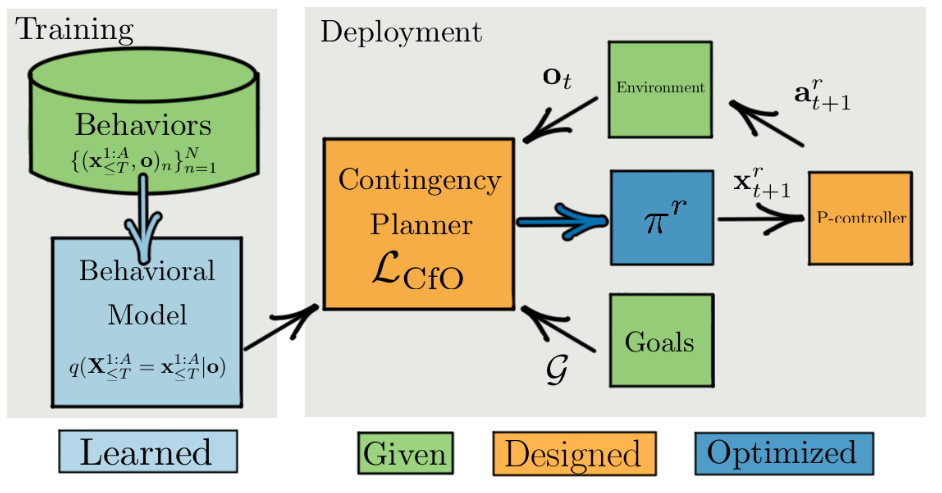

# 介绍

正常开车的过程，人类是高智能体感觉没有这么困难，但是AI会比较困难，需要做好AI的控车需要具备以下三点特点

- 推测其他车辆是如何行驶的
- 驾驶员反应的预测模型
- 在自车周围做路径规划，以及解决其他驾驶员意图的不确定性的能力。比如他车在路口加速，我们需要减速，我们如果超车，他车可能会减速并给出变道的空间等

目前基于learning方法的e2e方法一般不具备第三条，因为他们不对其他agents进行行为建模

frozen-robot-problem：如果忽略了其他智能体对机器人行动的反应以及机器人未来行动应如何根据其他智能体的行动而有所不同。这可能导致过度谨慎的行为。

因此，在许多现实情况下，将prediction和planning任务解耦是一个糟糕的建模假设。通过Contingency Planning可以实现解决这个问题的方法，它能够自适应的根据agents或者环境未来可能的变化给出合适的轨迹。

该文章是同时提出的方法既有contingency，又使用完全学习的行为模型，不像之前的工作那样，要么学习了行为模型，要么是主动contingency的，但从来没有两者都有。

# Deep contingency planning

## Depolyment

该部分的循环由如下步骤进行

1）contingency planner接收model的输出，goal，以及embedding后的传感器输入。输出多步的规划的策略

2）策略执行一步

3）控制器追踪一步

4）控制器完成一步，把新观察到的环境信息更新

## Model design And Training

