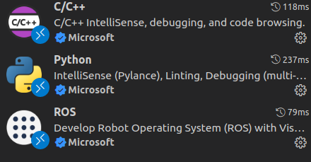

# 插件安装

搜索插件ROS，c++，并安装




# 配置launch.json文件

点击运行和调试，点击create a launch json file, 选择c++

进入launch.json，点击右下角的添加配置

选择ros launch，确定。配置好自己的target，为自己的launch的绝对路径

```json
{
    // 使用 IntelliSense 了解相关属性。 
    // 悬停以查看现有属性的描述。
    // 欲了解更多信息，请访问: https://go.microsoft.com/fwlink/?linkid=830387
    "version": "0.2.0",
    "configurations": [
        {
            "name": "ROS: Launch",
            "type": "ros",
            "request": "launch",
            "target": "/root/catkin_ws/src/A-LOAM/launch/aloam_velodyne_HDL_32.launch"
        },
    ]
}
```

然后打好点，点击运行和调试中的开始调试，即可


这是，vscode 可以帮助我们启动roslaunch文件，但是还不可以帮助我们编译

# 配置task.json

他是一个帮助编译的文件，需要的时候再搞

# CMakeLists.txt修改

添加一条

SET(CMAKE_BUILD_TYPE Debug)

