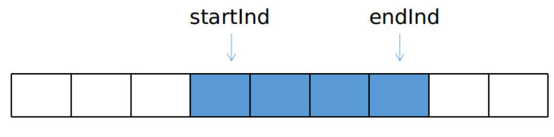

# 框架介绍

LeGo-LOAM 是 Tixiao Shan 提出的一种基于 LOAM 的改进版本，其主要是为了实现小车在多变地形下的定位和建图，其针对前端和后端都做了一系列的改进，具体来说

## 数据处理过程

1. 对地面点进行分类和提取，避免一些一场边缘点的提取
2. 应用了一个简单的点云聚类算法，剔除了一些可能的 outlier
3. 两步迭代求解前端帧间里程记，不影响精度的情况下减轻计算负载，保障了嵌入式平台的实时性

注意：一般情况下实际应用中没人会这么做的，可以用其他的传感器，精度更高


各模块topic 的发布和订阅关系


# 两步优化的帧间里程记

和原始 LOAM （或者 A-LOAM ）一样，通过前后两帧点云来估计两帧之间的运动，从而累加得到前端里程记的输出，和上述方法使用线面约束同时优化六自由度帧间位姿不同， LeGO-LOAM 的前端分成两个步骤，每个步骤估计三自由度的变量

## 第一步 利用地面点优化

地面点更符合面特征的性质，因此，地面点的优化问题就使用点到面的约束来构建，同时我们注意到，地面点之间的约束对 x ， y 和 yaw 这三个自由度是不能观的。换句话说，当这三个自由度的值发生变化时，点到面的残差不会发生显著变化，所以，地面点之间的优化只会对 pitch ， roll 以及 z 进行约束和优化

## 第二步 利用角点优化

第一部优化完 pitch 、 roll 以及 z 之后，我们仍需对另外三个自由度的变量进行估计，此时，我们选用提取的角点进行优化，由于多线激光雷达提取的角点通常是垂直的边缘特征，因此，这些特征对 x 、 y 以及yaw 有着比较好的能观性，通过角点的优化结合上地面点的结果可以得到六自由度的帧间优化结果。


# 代码介绍

## imageProjection

订阅话题

```c++
extern const string pointCloudTopic = "/velodyne_points";

subLaserCloud = nh.subscribe<sensor_msgs::PointCloud2>(pointCloudTopic, 1, &ImageProjection::cloudHandler, this);
```


### 消息类型转换

```c++
    void copyPointCloud(const sensor_msgs::PointCloud2ConstPtr& laserCloudMsg){

        cloudHeader = laserCloudMsg->header;
        // cloudHeader.stamp = ros::Time::now(); // Ouster lidar users may need to uncomment this line
        pcl::fromROSMsg(*laserCloudMsg, *laserCloudIn);
        // Remove Nan points
        std::vector<int> indices;
        pcl::removeNaNFromPointCloud(*laserCloudIn, *laserCloudIn, indices);
        // have "ring" channel in the cloud
        if (useCloudRing == true){
            pcl::fromROSMsg(*laserCloudMsg, *laserCloudInRing);
            if (laserCloudInRing->is_dense == false) {
                ROS_ERROR("Point cloud is not in dense format, please remove NaN points first!");
                ros::shutdown();
            }  
        }
    }
```


### 寻找开始结束角度

### 点云投影

问：LOAM中如何保存的点云。LOAM中直接转换为PCL的点云了

### 地面移除

LeGO-LOAM中前端改进中很重要的一点就是充分利用了地面点，那首先自然是提取对地面点的提取


如上图，相邻的两个扫描线束的同一列打在地面上如 AB 点所示，他们的垂直高度差$h=|z_0-z_1|$，水平距离$d=\sqrt{(x_0-x_1)^2+(y_0-y_1)^2}$，计算水平和高度的差，$\theta=atan2(h,d)$，如果是地面的话，角度为0。但是考虑到安装还有地面不会绝对的水平，因此可以先设置为10度，即10度以内的都是地面。

#### 找出地面点，标记标志位

```c++
    void groundRemoval(){
        size_t lowerInd, upperInd;
        float diffX, diffY, diffZ, angle;
        // groundMat
        // -1, no valid info to check if ground of not
        //  0, initial value, after validation, means not ground
        //  1, ground
        for (size_t j = 0; j < Horizon_SCAN;/*1800*/ ++j){
            for (size_t i = 0; i < groundScanInd;/*7 因为雷达是水平安装，地面点可能在天上*/ ++i){ 

                lowerInd = j + ( i )*Horizon_SCAN;
                upperInd = j + (i+1)*Horizon_SCAN;

                if (fullCloud->points[lowerInd].intensity == -1 ||
                    fullCloud->points[upperInd].intensity == -1){
                    // no info to check, invalid points
                    groundMat.at<int8_t>(i,j) = -1;
                    continue;
                }
                    
                diffX = fullCloud->points[upperInd].x - fullCloud->points[lowerInd].x;
                diffY = fullCloud->points[upperInd].y - fullCloud->points[lowerInd].y;
                diffZ = fullCloud->points[upperInd].z - fullCloud->points[lowerInd].z;

                angle = atan2(diffZ, sqrt(diffX*diffX + diffY*diffY) ) * 180 / M_PI;
				// 赋值标记到矩阵中
                if (abs(angle - sensorMountAngle) <= 10){
                    groundMat.at<int8_t>(i,j) = 1;
                    groundMat.at<int8_t>(i+1,j) = 1;
                }
            }
        }
```

groundMat 如果是1 ，则认为是一个地面点

#### 记录不参与特征计算的点

如果labelMat = -1，不参与后面的特征操作

```c++
		// extract ground cloud (groundMat == 1)
        // mark entry that doesn't need to label (ground and invalid point) for segmentation
        // note that ground remove is from 0~N_SCAN-1, need rangeMat for mark label matrix for the 16th scan
        for (size_t i = 0; i < N_SCAN; ++i){
            for (size_t j = 0; j < Horizon_SCAN; ++j){
                if (groundMat.at<int8_t>(i,j) == 1 || rangeMat.at<float>(i,j) == FLT_MAX){
                    labelMat.at<int>(i,j) = -1;
                }
            }
        }
```

#### ground_cloud发布:地面点数据 

如果订阅地面的topic不为0的话，就把地面点的数据添加到待发布的点云中

```c++
		if (pubGroundCloud.getNumSubscribers() != 0){
            for (size_t i = 0; i <= groundScanInd; ++i){
                for (size_t j = 0; j < Horizon_SCAN; ++j){
                    if (groundMat.at<int8_t>(i,j) == 1)
                        groundCloud->push_back(fullCloud->points[j + i*Horizon_SCAN]);
                }
            }
        }
    }
```


### 点云分割

velodyne16雷达点云是被投影到一个平面图上的，

BFS 算法适用于图数据结构，为了把单帧 lidar 点云运用上 BFS 算法，首先需要将其建模成一个图模型，一个很简单有效的办法就是将其投影到一个平面图上，以 velodyne-16 为例，我们将其投影到一个16×1800 大小的图上（这里 16 是一共有 16 根线束， 1800 是因为水平分辨率是 0.2 度，一个扫描周期有1800 个点）如图


对于任何一个珊格点，其上下左右四个相邻点视为图结构中的邻接节点，这里要注意的是，左右边界的点和边界另一侧也构成邻接，因为水平方向是同一个扫描周期，具有物理意义上的连续性。我们可以以任意一个点开始执行 BFS 搜索，直到遍历完这部分近邻点，聚类点数过少的就认为是 outlier，可以被剔除

**具体实现：**

1. 遍历每个点，如果该点已经被处理过了就不再处理

2. 如果没有被处理就说明这是一个新的聚类，然后执行 BFS 的步骤

   1. 将队列里的首元素弹出，然后将该元素近邻塞入队列末尾（这里没有使用 std::queue ，使用的普通数组，所以就使用双指针来替代）

      

      

      这里的近邻就是上下左右

      

      
   
   2. 分别判断近邻和自身距离是否足够近
   
      
      
      
      
      越大则认为两点越可能是同一个聚类物体上的点，则打上同样的 label
      
   3. 如此循环

### 发布点云

### 参数重置

