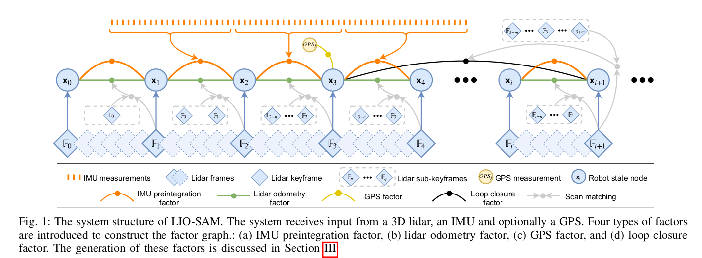
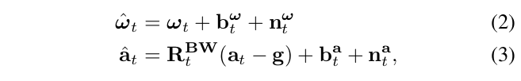
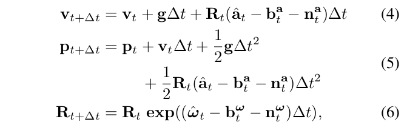
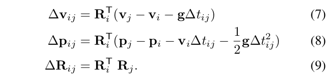
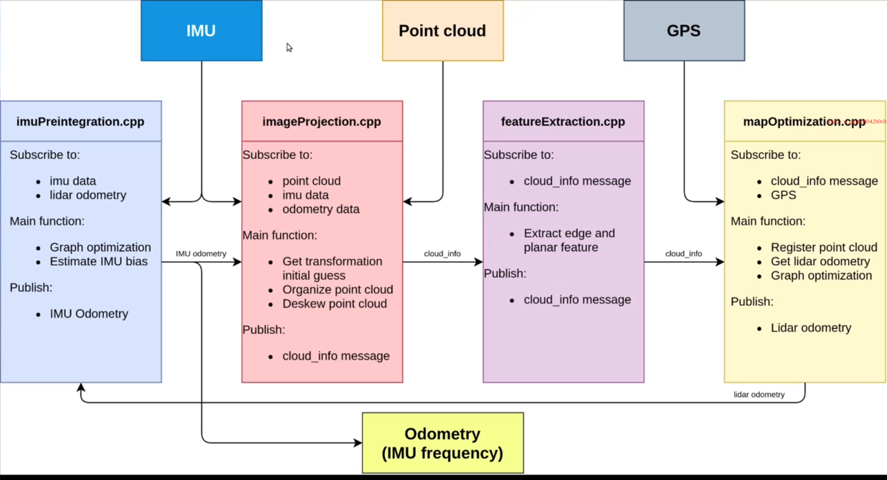

LIOSAM相对于LOAM和Lego-LOAm的代码可读性比较好，功能也比较全。可以方便的去拓展

# 摘要

我们提出了一个基于GTSAM优化库的 紧耦合的雷达惯性里程计。它是一个高精度，实时的轨迹估计和地图构建。LIOSAM有多个传感器，他基于因子图，把我们相对观测（两帧之间的观测）和绝对观测（GPS），包括回环的结果，都作为一个因子，统一到框架中去。

IMU可以做运动补偿（点云畸变），也可以为雷达odometry提供一个比较好的初值。获得的雷达里程计反过来会估计IMU的零偏，这就是紧耦合的表现。、

为了保证实时的同时保证好的表现，在后端优化中，我们没有拿当前帧和整个地图匹配，而是边缘化了老的帧。这样的Scan匹配（没有和全局的匹配而是和部分的匹配）很好的提升了实时的性能。

作者在船上（大场景），手持（小场景）和小车上（中场景）都得到了不错的效果

# 介绍

LOAM的局限性：它的地图保存为全局体素地图，难以实现闭环检测并且难以和其他的绝对观测（例如GPS）配合。 大场景下会有一些累积漂移

本文提出的可以很好的解决上述的问题。 

步骤

- 利用IMU的数据做了点云的运动补偿
- 运动补偿后，估计的运动可以提供一个比较好的初值
- 得到的里程计反过来校准imu的零偏
- 在全局的因子图中，有效的实现了传感器融合，利用雷达和IMU的数据，还可以使用GPS和指南针的朝向
- 从不同的传感器之间的因子，放入因子图，实现一个联合的优化，得到一个最佳的估计状态
- 滑窗思想：巴拉巴拉

重要的贡献

- 提供了紧耦合的惯性里程计的优化
- 局部滑窗的思想，保证雷达的配准，保证实时性和性能
- 此框架是有广泛的验证的，不同的场景下，不同的平台和环境下都做了大量的实验，都比较优秀

EKF是一个松耦合融合方法 

纯滤波的方式不好加入回环

LIO-Mapping： 实时性不好，跑的有点慢

# 算法介绍

## 总览

$W:$世界坐标系

$B$：机器人坐标系，以及IMU坐标系。这样的做法（他俩都是B坐标系）在紧耦合里面是比较常见的

机器人的状态由下面经典的15个状态量来表示
$$
x = [R^T,	p^T,v^T,b^T]^T \tag{1}
$$
其中，R是旋转矩阵$SO(3)$，p表示位置，v表示速度，b是IMU零漂。变换from B to W 可以表示为$T=[R;p]$

下面的总览图表示算法的总体过程。系统接受的数据有

- 3D雷达

- IMU

- 可选gps

使用传感器的观测来估计当前机器人的位姿，可以容易的建模为最大后验的问题。我们利用因子图对其建模，效果好于贝叶斯网络，这里有一个假设，所有的传感器的噪声都是符合高斯分布的。然后就可以把他作为一个最小二乘法来计算

我们引入了四种不同类型的因子，同时还有一个待优化的变量。这里就是机器人的状态量$(1)$，包括速度和位置等。这四个factor为

- IMU preintegration factors
- lidar odometry factors
- GPS factors
- loop closure factors

注意不是所有的观测都是关键帧，只有是关键帧的时候才会被加入到因子图中，因此当 当前帧被判定为一个关键帧的时候，它就会作为一个新的状态量$x$加入到因子图中。一旦因子图发生了变化，我们就可以使用增量的ISAM2的一个方式去优化，具体是通过GTSAM来优化的

## IMU 预积分因子

IMU可以测量的两个量，加速度和角速度分别是由如下式子计算出来的

其中  $b_t^w$和 $b_t^a$是零偏， $n_t^a$和$n_t^w$表示噪声。$R_t^{BW}$表示从W到B的变换，即把world的加速度转移到自己的身上。下面我们用上面的结果可以对运动做出估计

在$t+\Delta t$时刻，它的三个状态量为

 下面使用IMU预积分方法来获得相对的运动，相对的状态量结果为

IMU预积分会提供两帧之间的运动关系

## Lidar Odometry 因子

和LOAM类似

## GPS

GPS不是频繁添加的，只有置信度的时候，才会加入

## 回环检测

回环检测 用于 高度累积的漂移是很不错的。 GPS的高度信息不太好，实际只用x和y

对比LOAM，清晰度更高

