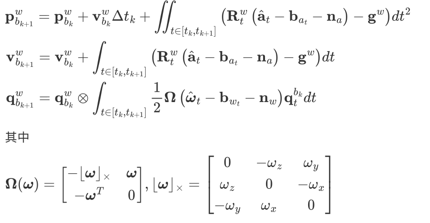
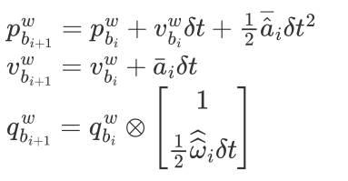
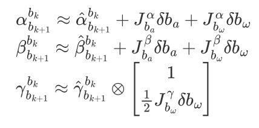
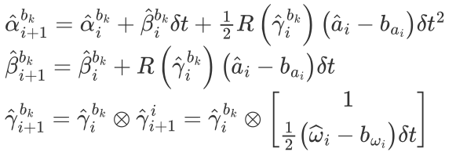
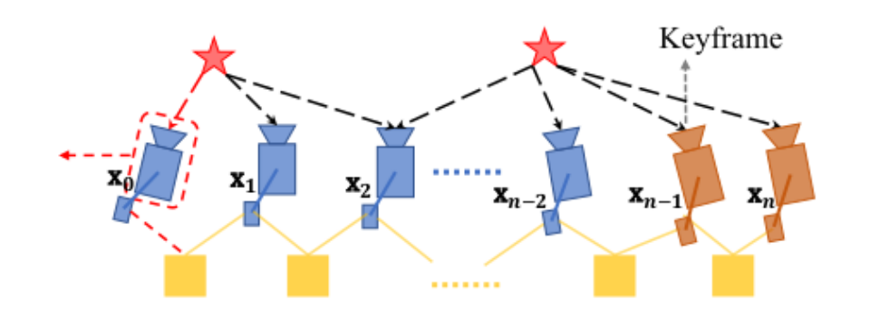

# IMU 器件介绍及选型建议

IMU是惯性测量单元，包括一个三轴的加速度计以及一个三轴的陀螺仪，分别测量出物体的加速度和角速度，不受周围环境结构，光照等外界因素影响 ; 同时，通常 IMU 的输出频率在 100-1000hz 之间，远高于相机或者激光雷达的输出频率，一方面可以提高整体系统的输出频率，另一方面，可以在视觉或者激光短期失效的时候提供一段时间的位姿推算。

在大多数的LIO（雷达惯性里程计）或者VIO（视觉惯性里程计）中，关于IMU输出的建模方式为
$$
a=R_{bw}(a_t-g)+b_a+n_a\\
w=w_t+b_w+n_w
$$

$a,w$的读数都是在imu坐标系下，$a_t-g$是在世界坐标系下，需要转下

即输出的加速度计和陀螺仪的数据受零偏以及高斯白噪声的影响，因此，紧耦合的 LIO 或者 VIO 都会实时估计 IMU 的零偏，以实现 IMU 数据的最大利用率。

然而，实际的 IMU 数据并没有这么理想，除了零偏和高斯白噪声，还有可能受到刻度误差，尺度因子轴向偏差等影响，然而，如果把这些因素都通过建模的方式考虑进来，就显得过于复杂，因此，通常的做法是在 IMU 选型的时候就最大化避免上述误差的影响。也就是说，我们选择 IMU 型号时除了关注价格（当然价格很多时候也是非常重要甚至是决定性的因素），还需要关心其出厂标定情况，是否做过温度补偿之类）

关于更多 IMU 相关的内容可以参考秦永元的《惯性导航》

一个带IMU的紧耦合的框架，肯定少不了预积分，预积分的处理是少不了，它就是一个积分而已。但是他对于积分的这个过程，和正常的积分也不太一样。他积分的结果对连续两帧之间的状态没有关系。在这里是使用的GTSAM的接口，VISMONO是自己手写的，可以去查看一下

# IMU 状态转移方程

IMU可以获得当前时刻的角速度和加速度值，通过该值可以对系统状态（位置，速度，姿态）进行推算连续时间两个关键帧 $b_k,b_{k+1}$ 之间的状态传递公式如下

这里的P是世界坐标系下的

考虑到我们接受的传感器数据都是离散形式的，因此，我们实际应用时是使用离散形式进行状态传播的

每当收到一帧新的 imu 数据后，系统状态变化为：

最后这个q乘的是一个四元数，第一个实部已经是1了，下面的因为$\delta t$是非常小的，接近于0了。因此他的模长接近于1.

# IMU 预积分

## 为什么需要预积分

从第二节可以发现，当 k 时刻的状态发生变化时，则通过 imu 积分得到的 k+1 时刻的状态也会发生相应的变化，而在基于滑窗的后端优化或者因子图的优化中，对一些状态量进行调整是必然发生的，此时，如果每次状态发生调整时imu的积分过程都会重新执行一遍，则实时性必然无法得到保证，因此，预积分理论就是为解决这个问题而提出的，其核心思想就是对 IMU 积分的结果和上一时刻系统的状态无关，这样，当系统状态在优化过程中发生调整的时候，就不需要对下一时刻的系统状态重新积分。

## 如何进行预积分

参考上一节连续时间 IMU 积分的公式，等号两边同时乘上$R^{b_k}_w$即可，即                                                                                                                                                        

上面三个变量即预积分量，我们可以发现这三个预积分量都和 k 时刻或 k+1 时刻状态无关，因此当 k 时刻状态发生变化时，我们不需要将 IMU 的数据重新积分。

第一个式子，我们有k时刻的姿态$R_w^{b_k}$, k+1时刻的位置，包括k时刻的速度等等状态量，所以第一个式子中的预积分量会对相邻两帧之间造成一定的约束。

假如
$$
R_w^{b_k}p_{b_{k+1}}^w-R_w^{b_k}(p_{b_{k}}^w+ v_{b_k}^w-g^w\Delta t_k^2)
$$
和预积分量$\alpha^{b_k}_{b_{k+1}}$相差太远，则应该做出相应的调整，使得两边的值差不多，这就是预积分量对其产生的约束 

## 关于零偏的建模

通常来说， IMU 的零偏会随着时间的变化而偏移，因此为了系统的准确性，零偏也是系统的优化变量之一，此时我们注意到预积分量虽然和两帧的具体位姿和速度等状态量无关，但是和零偏相关，因此，当零偏作为优化变量被优化后，预积分量也会发生相应的变化，那么此时我们是否需要重新积分呢？如果重新积分，预积分的意义不就失去了吗？

为了避免零偏的变化导致预积分量重新积分，考虑到通常零偏的变化在短时间（ 100ms ）非常小，因此，我们可以使用一阶泰勒展开来进行近似，具体为

这里预积分量关于零偏的雅克比矩阵会在预积分计算的时候一并计算，因此，当零偏被优化调整之后，只需要根据事先计算好的雅克比矩阵对预积分量进行更新即可。

## 离散时间的预积分更新

同样，实际系统是离散的 IMU 数据，我们的目的是得到两个关键帧（视觉 or lidar ）之间的预积分结果，而我们获得的 IMU 数据是离散的，因此，常见的做法就是每收到一帧新的 IMU 数据更新一次预积分量，同样，这是一个求和而非连续积分的过程

当收到新的 IMU 数据后，预积分量更新公式如下

更新方程同样遵循基本的经典物理运动学公式

该公式从imu坐标系转换到b_k坐标系

# 预积分在优化问题中的建模

由前面几节内容可知，预积分量约束相邻两帧的状态量（位置、速度、姿态），同时考虑到 IMU 的零偏的性质，即短时间内变换速率比较缓慢，**因此可以认为两帧之间的零偏不变，不能差太远**。这个也就是约束两帧的零偏变化

同时，在 slam 问题中， IMU 预积分约束通常会和其他传感器的约束一起构建一个优化问题

只有一个IMU约束的话肯定是不够的，虽然他对帧间来说还是靠谱的，但是对于全局来说只有他一个是不够的，IMu累积积分的结果肯定会漂掉、所以要和其他的传感器进行融合

## 视觉 VIO 中预积分和视觉的优化建模

这里黄色代表 IMU 预积分，可以看到其只对相邻帧发生约束，五角星代表视觉地图点，同一 个地图点可以通过重投影误差对多个关键帧的位姿形成约束

## LIO-SAM中预积分和 lidar 位姿的优化建模

如图，蓝色圆圈代表关键帧位姿，蓝色矩形代表关键帧速度和零偏，橙色矩形代表 IMU 预积分约束，可以看到，它可以约束相邻帧的位姿、速度和零偏，绿色矩形代表 lidar 里程记的帧间约束，其约束相邻两帧的位置和姿态。

- IMU约束：速度和零偏
- 雷达约束：姿态

这里涉及到论文中所提及的 lidar odom 因子和预积分因子，也就是预积分节点因子图的优化模型。

