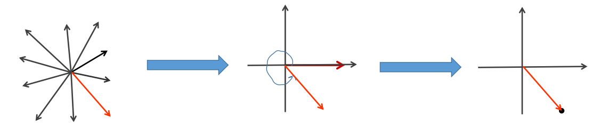

# 数据格式

在ROS中，单线激光雷达的数据格式为`sensor_msgs/LaserScan`，具体如下

```
std_msgs/Header header
  uint32 seq
  time stamp
  string frame_id
float32 angle_min
float32 angle_max
float32 angle_increment
float32 time_increment
float32 scan_time
float32 range_min
float32 range_max
float32[] ranges
float32[] intensities
```

注意，这里只有ranges，即激光点距离自身的距离信息，我们的目的是要将其转为点云，即$(x,y,z)$

# 计算图解

一般而言，激光的范围都是一圈的，从ranges的第一个激光点，角度为angle_min，到 ranges的最后一个激光点，角度为angle_max。


假设上图左边即为激光点打出的形式，右边是点云的一个形式。为了清晰起见，图中的激光点很稀疏，angle_increment非常大。

我们选取ranges中的第一个点，对应的角度为angle_min，即为如下红色的激光点，为了将其转为点云，我们做如下处理

- 第一步，取同等长度的激光点，放到x轴处,，记录坐标点为（ranges[0], 0）
- 第二步，逆时针旋转angle = angle_min度（angle记录的就是逆时针旋转度数），即可得到对应点坐标


- 第三步，更新angle = angle + angle_increment，获取下一个激光点的角度

- 重复前三步，直至全部转换完成

下图完成了第二个点的转换




一直重复即可完成转换

