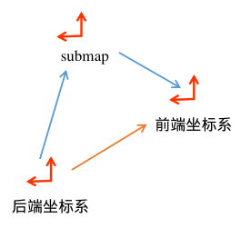

- 消息回调接受数据

- 经过sample过滤

- 转换为点云，形式
  $$
  \begin{bmatrix}
  TimedPointCloud  \\ 
  std::vector<float>  
  \end{bmatrix}
  =
  \begin{bmatrix}
  [x_0,y_0,z_0,t_0] &[x_1,y_1,z_1,t_1]&...&[x_n,y_n,z_n,0]  \\ 
  intensity[0] & intensity[1] &...&intensity[n]  
  \end{bmatrix}
  $$
  点云最后一个点的时间为0，以此往前是负数，每一个点云还配有一个time。用于记录最后一个点的时间戳
  
- 将雷达转换为几段，处理每一段雷达的时间，要求最后一个点的时间为0，并且存好相应的时间。通常为1段

- 把点云坐标转换到tracking_frame下, 并记录在tracking下，原来的点云位置，作为原点，记录点云

  ```c++
  struct TimedPointCloudData {
    common::Time time;        // 点云最后一个点的时间
    Eigen::Vector3f origin;   // 以tracking_frame_到雷达坐标系的坐标变换为原点
    TimedPointCloud ranges;   // 数据点的集合, 每个数据点包含xyz与time, time是负的
    // 'intensities' has to be same size as 'ranges', or empty.
    std::vector<float> intensities; // 空的
  };
  ```

- 加入数据分发器中，准备数据分发

- 数据分发：找到时间time最早的队列中的数据，pop数据。传入各个回调函数

- 传入函数CollatedTrajectoryBuilder::HandleCollatedSensorData，即就是回调函数

- 进入全局轨迹建立器，globaltrajectoryBuilder，往里面添加数据并处理

- 多雷达点云同步，根据start和end点，重新生成一个点云，新点云的数据格式

  合并步骤:

  1. 把点云添加到时间同步的map中
  2. 找start, end=min(最近雷达1数据，最近雷达2数据)
  3. 合并start到end的雷达数据，生成新点云，注意按照时间排序，返回
  4. 第二次处理数据，若时间同步的map中有之前相应key数据没有处理完，首先处理。start=end,end=点云最后一个点的时间戳

```c++
struct TimedPointCloudOriginData {
  struct RangeMeasurement {
    TimedRangefinderPoint point_time;   // 带时间戳的单个数据点的坐标 xyz
    float intensity;                    // 强度值
    size_t origin_index;                // 属于第几个origins的点
  };
  common::Time time;                    // 点云的时间
  std::vector<Eigen::Vector3f> origins; // 点云是由几个点云组成, 每个点云的原点
  std::vector<RangeMeasurement> ranges; // 数据点的集合
};
```

- 点云的运动畸变去除，根据位姿估计器估计每一个点的位姿，把每一个点从tracking frame变换到local slam坐标系下，并将转换成功的点云放入accumulated_range_data_中，它的数据结构为

  ```c++
  struct RangeData {
    Eigen::Vector3f origin;
    PointCloud returns;
    PointCloud misses; // 都是local坐标系下的坐标
  };
  ```

  

- 点云坐标转换到local坐标系下，并且做体素滤波，and裁剪z轴data_

- 扫描匹配

  - time时刻位姿预测

  - 粗匹配，相关性扫描匹配

  - ceres 进行精匹配，把在栅格上的像素精度提升到物理精度上

  - 把该位姿下的点云插入子图中

  - 返回数据，数据格式内容

    ```c++
    insertion_submaps  struct InsertionResult {
        std::shared_ptr<const TrajectoryNode::Data> constant_data;
        std::vector<std::shared_ptr<const Submap2D>> insertion_submaps; // 最多只有2个子图的指针
      };
    ```

    其中,constant_data的数据内容为 时间戳，重力对齐方向的变换，体素滤波过后的点云和local slam下的位姿

    ```c++
    struct Data {
        common::Time time;
    
        // Transform to approximately gravity align the tracking frame as
        // determined by local SLAM.
        Eigen::Quaterniond gravity_alignment;
    
        // Used for loop closure in 2D: voxel filtered returns in the
        // 'gravity_alignment' frame.
        sensor::PointCloud filtered_gravity_aligned_point_cloud;
    
        // Used for loop closure in 3D.
        sensor::PointCloud high_resolution_point_cloud;
        sensor::PointCloud low_resolution_point_cloud;
        Eigen::VectorXf rotational_scan_matcher_histogram;
    
        // The node pose in the local SLAM frame.
        transform::Rigid3d local_pose;
      };
    ```

  - 最后返回MatchResult, 额外包含一项匹配后的点云

    ```c++
      return absl::make_unique<MatchingResult>(
          MatchingResult{time, pose_estimate, std::move(range_data_in_local),
                         std::move(insertion_result)});
    ```

- LocalTrajectoryBuilder扫描匹配完毕, 然后将扫描匹配的结果当做节点插入到后端的位姿图中

  - GetLocalToGlobalTransform：第一次进入。返回0变换。

    之后通过如下图计算相对变换。

    - submap在后端的变换在：data_.global_submap_pose_2d
    - submap在前端的变换在：data_.submap_data.at(submapid).submap

    

    

- 添加后端节点以及添加后端的子图，计算约束
  - 把插入的子图的global pose加入到优化问题（optimization_problem_）中
  - 把节点加入到优化问题中
  - 计算子图内约束
    - 子图内约束
    - 子图间约束

- 构建残差
  - 五种残差


后端：

所有的submap数据都保存在data_.submap中

所有的node数据也保存在data_.node中


总结的问题：

- submap只有在前端生成，后端是不会对其更改的。万一机器人走太快了，submap生成的墙有两条线，ceres又不会优化
- 位姿估计器的不太准，ceres优化还当做优化变量，所以不好


