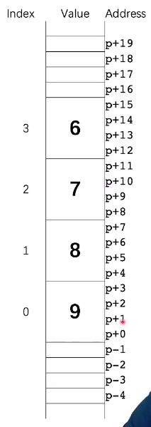
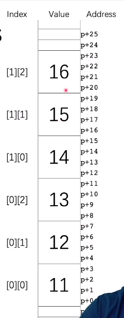
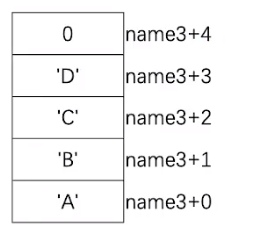
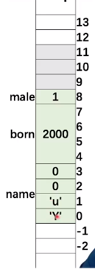
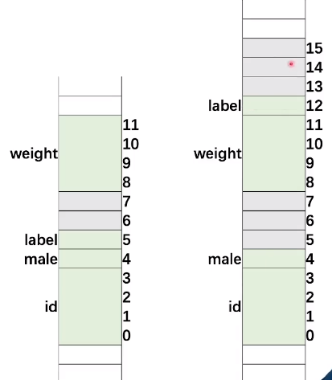

# Array

数组长度，下面的情况，数组长度只有在程序运行的 时候才可以确定，在编译的时候是不确定的

```c++
int len = 1;
while (len < 10)
{
	int num[len];
	len ++;
}
```

注意，边长的数组是不可以初始化的


## 数组赋值

```c++
int array1[4] = {9，8，7，6};
int array2[4];
array2 = array1; //错误
```

在声明的时候array2的地址已经确定了，数组的等号赋值就是首地址的赋值，数组的地址是不允许更改的

下边是数组的存储方式，每一个小格子就是一个字节，9 8 7 6分别占了连续的四个字节




**注意**：

- 在数组的操作中，是不会有越界检查的，如果越界了没有警告没有错误
- 数组在这里不是一个对象，他就是一块连续的内存。大小是不知道的
  - 读写效果高，都不检查边界了
  - 缺点是容易出错

## 二维数组

未知长度二维数组传参，要带上列的长度

```
void init_2d_array(float mat[][], size_t rows, size_t cols) //错误
void init_2d_array(float mat[][3], size_t rows, size_t cols) //正确
```

虽然是二维数组，他还是要保存到一维内存上，下面图片对应此mat

```c++
int mat[2][3] = {{11,12,13}, {14,15,16}};
```

!(Screenshot from 2022-04-01 11-22-01.png)



如果不告诉一列有多少个元素，那么他就不知道，第几个元素开始是第二行

所以传递`float mat[][3]`的时候需要告诉一个3，它才知道第二行从哪儿开始

# 字符串

## array-style 字符串

数组的元素类型是char， 个数是16个。这16个元素的数组初始化为下面五个字符，后面的都被会置0.

```
char rabbit[16] = {'P', 'e', 't', 't', 'r'};
```

下面是一个不好的字符串, 字符串需要以\0结束. '\0'的就是0. 该标志符表示字符串到此结束，否则打印该字符串会一直打印下去

```
char bad_pig[4] = {'a', 'b', 'd', 'd'};
// cout << bad_pig  // 会出现无限个字符的打印，相当于越界了，因为找不到\0
strlen(bad_pig) // 可能程序会崩溃掉
```

一个好的是需要加一个\0,

```
char bad_pig[5] = {'a', 'b', 'd', 'd', '\0'};
```


上面这种定义字符串的方式很恶心，太麻烦了

## 常量字符串

这种定义就方便多了

```c++
char rabbit[] = "Peter";
char name3[] = 'ABCD';
```

下面是name3的地址分布




## 字符串拷贝

### strcpy

```c++
char* strcpy(char* dest, const char* src)
```

表示拷贝src到dest中，但是如果dest的长度不够，小于src的，他依然会进行拷贝，会向后溢出字符，是很危险的

### strncpy

```c++
char* strncpy(char* dest, const char* src, size_t count);
```

一般，count会设置为两个字符串的最小值，就不会出现这种问题

### strcat

```c++
char* strcat(char* dest, const char* src)
```

把src接到dest的后面，同样也有strcpy的问题。所以也有一个strncat

### strncat

### strcmp

```c++
int strcmp (const char *lhs, const char *rhs);
```

相同返回0， 会把lhs的第一个值减去rhs的第一个值作为返回值

## string对象

std::string使用起来更方便，无须使用strcat，只需要+ 号就行

```c++
std::string str1 = "Hello";
std::string str2 = "world";
std::string str3 = str1 + "," + str2;

cout << (str1 < str2) << endl;
cout << str1.length() << endl
```

# 结构体

```c++
struct Student{
	char name[4];
	int born;
    bool male;
};
struct Student stu;
stu.age = 2000;
strcpy(stu.name, "yu");
stu.male = true;

struct Student stu = {"yu", 2000, ture} // 第二种初始化方式，注意C的语法结构就需要额外加一个struct

struct Student stus[100];//初始化一个数组，类型为student
stus[50].born = 2002; //第五十个的出生日期


```




## 结构体内存对齐

结构体在内存中存在数据对齐，方便寄存器的读写

下面看一个例子

```c++
struct Stu1{
	int id;
	bool male;
	char label;
	float weight;
}
```

```c++
struct Stu2{
	int id;
	bool male;
	float weight;
	char label;
}
```

上面两个结构体的sizeof(Stu1)和sizeof(Stu2)分别是12个字节和16个字节

因为需要对齐0，4，8，12，让寄存器的速写更快，所以weight会在第八位进行对齐，Stu2中的label放在12位，后面三位继续补齐




在c++中，结构体和类几乎是一样的，除了public和private可以定位除外

# 联合体Union

定义方式和结构体一样，所有的成员享有相同的内存，长度可以不同。Union返回的sizeof大小为最大的那个成员

# enum

enum的声明和上面的一样。他提供了一个可以替代const的不可变符号。

```c++
enum color {WHITE, BLACK, RED, GREEN, BLUE, YELLOW, NUM_COLORS};
enum datatype {TYPE_INT8=1, TYPE_INT16=2, TYPE_INT32=4, TYPE_INT64=8};
```

# enum, union, struct 举例

下面的例子，把enum和Union定义在一个结构体中，把不同类型的数据放入Union省下了空间

计算l1范数的时候会根据传入的数据结构类型计算范数

```c++
#include <iostream>
using namespace std;

enum color {WHITE, BLACK, RED, GREEN, BLUE, YELLOW, NUM_COLORS};
enum datatype {TYPE_INT8=1, TYPE_INT16=2, TYPE_INT32=4, TYPE_INT64=8};

struct Point{
    enum datatype type;
    union {
        std::int8_t data8[3];
        std::int16_t data16[3];
        std::int32_t data32[3];
        std::int64_t data64[3];
    };
};

size_t datawidth(struct Point pt)
{
    return size_t(pt.type) * 3;
}

int64_t l1norm(struct Point pt)
{
    int64_t result = 0;
    switch(pt.type)
    {
        case (TYPE_INT8): 
            result = abs(pt.data8[0]) + abs(pt.data8[1]) + abs(pt.data8[2]);
            break;
        case (TYPE_INT16): 
            result = abs(pt.data16[0]) + abs(pt.data16[1]) + abs(pt.data16[2]);
            break;
        case (TYPE_INT32): 
            result = abs(pt.data32[0]) + abs(pt.data32[1]) + abs(pt.data32[2]);
            break;
        case (TYPE_INT64): 
            result = abs(pt.data64[0]) + abs(pt.data64[1]) + abs(pt.data64[2]);
            break;
    }
    return result;
}

int main()
{
    enum color pen_color = RED;
    pen_color = color(3); //convert int to enum
    cout << "We have " << NUM_COLORS << " pens." << endl;
    //pen_color += 1; //error!
    int color_index = pen_color;
    color_index += 1;
    cout << "color_index = " << color_index << endl;

    //declaration and initialization
    struct Point point1 = {.type=TYPE_INT8, .data8={-2,3,4}};
    struct Point point2 = {.type=TYPE_INT32, .data32={1,-2,3}};
    
    cout << "Data width = " << datawidth(point1) << endl; // 3
    cout << "Data width = " << datawidth(point2) << endl; // 12

    cout << "L1 norm = " << l1norm(point1) << endl;
    cout << "L1 norm = " << l1norm(point2) << endl;


    return 0;
}
```

