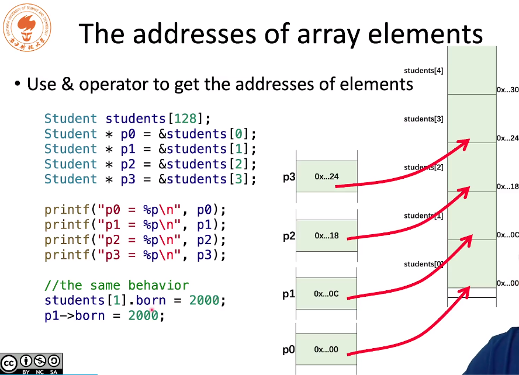
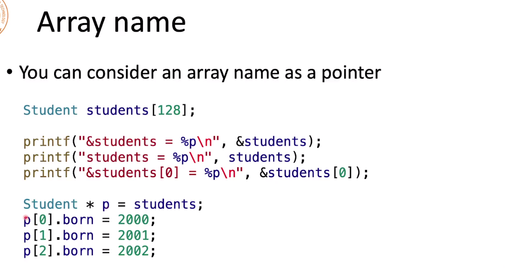
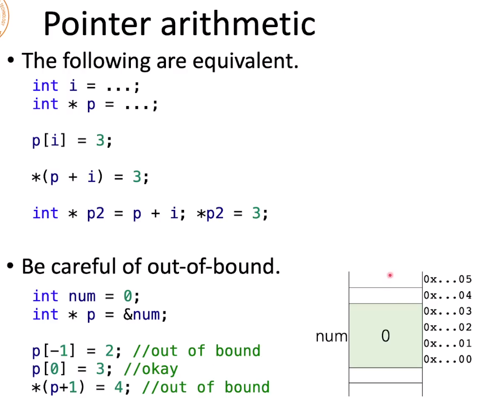

# 数组元素地址




因为Student 的sizeof 为12个字节，所以每一个数组之间的地址偏移量都是12。

# 指针当做数组使用

下面三个printf 输出的均为students的首地址。

把一个数组赋值给指针后，指针可以跟数组一样的操作




# 指针的代数操作

当p是一个在指针，`p+1`代表的是偏移一个元素

```c++
int numbers[4] = {0, 1, 2, 3};
int *p = number + 1;
```

这表示的是p指针指向1这个元素，在这里是偏移了四个字节。

下面的p[0] 表示了num这个位置，但是p[-1]就表示是num的前面四个字节，是无法估计的。虽然他没有编译出错，但是内存上已经有问题了。

当用一个指针p指向一个内存，我们就可以使用p[0]来代表该内存上的值

\



# 数组和指针的不同

- 数组是一个常量指针，数组的内存是不可以修改的
- sizeof 的结果不同
  - sizeof(数组) 返回整个数组所占的内存
  - sizeof(p) 返回4 or 8。 64位操作系统返回8

