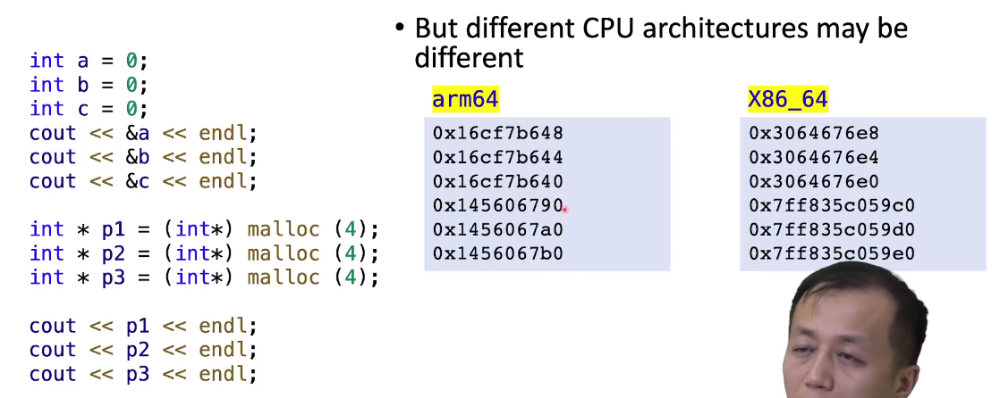
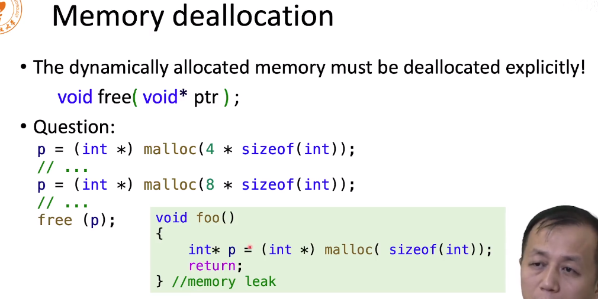
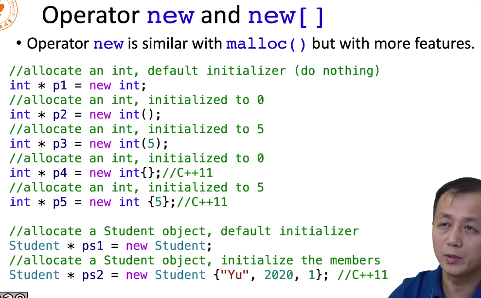
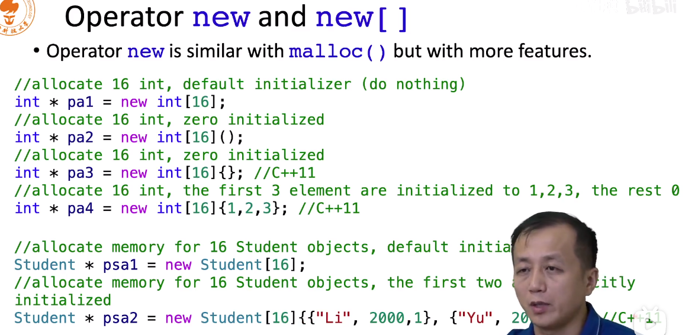
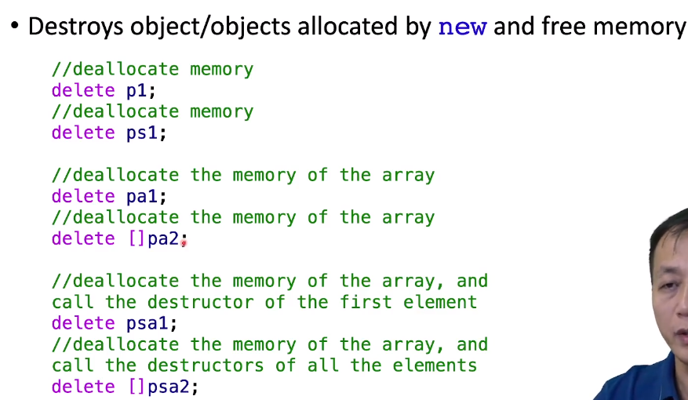

# C语言内存申请和释放

如果指针飞了，不知道去哪了，刚好指到 二进制的可执行代码部分，那么程序就会被立马杀死

一般堆和栈是相向申请，stack的内存地址越申请越小，堆的内存地址越申请越大。不同的系统不同，这只是一个示意图


比如下面，abc的值地址在arm上是越来越小的，堆上的地址越来越上，但是申请了16位，多的十位用于对其地址.

但是在x86_64上的地址不同了，栈上的地址特别小，堆上的地址特别大。




## 内存申请

对堆上申请内存，可以使用

```c++
void *malloc(size_t size);
```

size代表的是字节数，malloc申请到的内存，是不知道里面有什么，可能是以前程序用过的东西。

返回的内容是void*，他不知道是什么类型的指针，所以需要做一个类型转换。

```c++
int *p1 = (int*) malloc(4);
```

这里我们申请四个字节的内存，转为int*, 然后赋值给int * 类型的指针


注意！

```c++
int *p1 = (int*) malloc(3);
```

这一段代码申请了三个字节，转成了int，不会报错。我们也可以使用后面的内存，这是因为在堆上申请会给16个字节，所以第三个字节后面的内容不会被其他的变量所占用，虽然不会报错，但是上面的写法相当不好！

## 内存释放

申请的内容必须手动释放

```c++
void free(void *ptr)；
```

**注意内存泄露，即内存浪费了，也回收不掉**




在哪里申请就要在哪里释放，foo 这里可以return 这个指针，到外边去释放

# C++ 内存申请和释放

## 申请

在C语言中，malloc他只申请一块内存给你使用，也不初始化啥的，c++的new则不同，下面是一些举例




申请数组的方式




pa4 是16个int类型的数组，前面三个是123，后面全部置为0

## 释放





