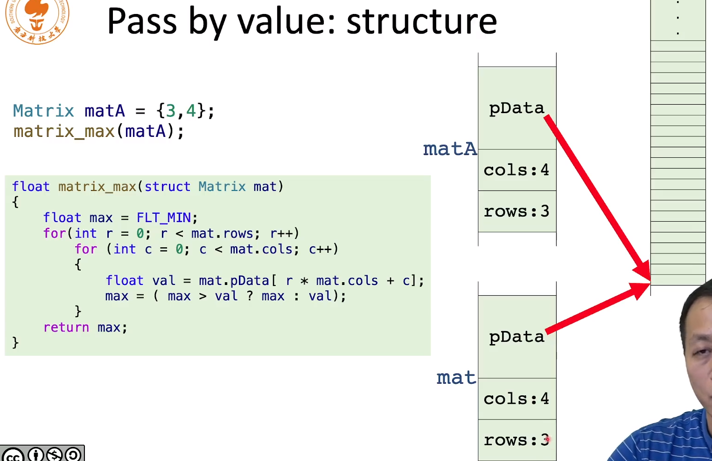
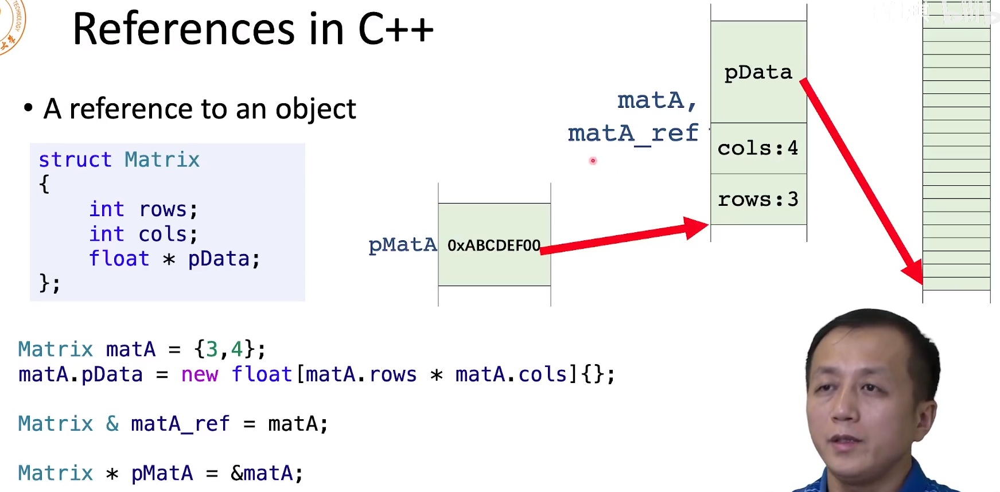

函数传参有两种形式

- 传值
- 传引用

# 传递值

参数传入，进行了一次拷贝，拷贝到了x里面，然后+10，最后返回，返回的过程也是对x的一次拷贝，所以一共俩次拷贝

所以对num1不会有任何的影响

```c++
int foo(int x) {
    x += 10
    return x
}

int main() {
    int num1 = 10;
    int num2 = foo(num1);
}
```


## 传地址

这里foo的形参是一个指针，他是一个地址，本质和第一个例子是一样的，也是传递了值，不过这个时候的值是地址，拷贝的内容是地址

```c++
int foo(int *p) {
    (*p) += 10
    return *p
}

int main() {
    int num1 = 10;
    int *p = &num1;
    int num2 = foo(p);
}
```


## 传struct

传递struct也是一样，被copy了一份到mat中，在原始的matA中，pData保存的是地址，因此对mat修改地址所指的值也会影响matA

但是修改了mat的cols和rows，对matA明显是无效的




# 传递引用

引用是一个变量的别名，指针是新建一个地址，保存指向内容的地址。

引用matA_ref和变量matA，在一起。为同一个地址

指针pmatA 新建一个内存，保存matA地址





注意：引用声明的时候必须初始化，引用更安全

**这个传递引用，他就不会发生拷贝，而是传递的一个别名，因此速度特别快**

