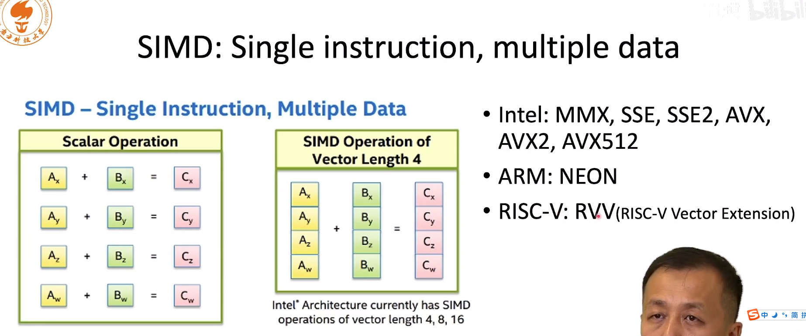
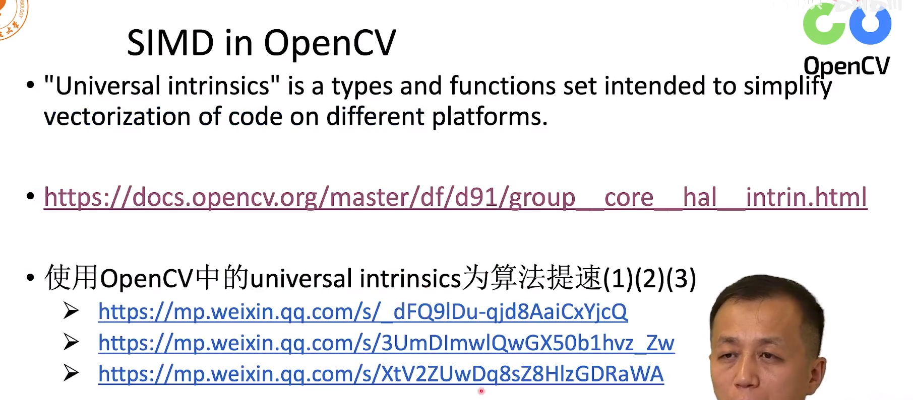

越简洁越好。

- 优化代码一定要考虑到内存，如果程序有大量的内存读写，可能内存读写影响了效率

  如果内存读写地址都是连续的，就比较方便。

- 避免内存拷贝，随之代码会变得较为复杂

- 循环中尽可能不要打印

- 查表法，比如三角函数，在低端cpu上，计算三角函数是比较慢的，只要精度不高，我们就可以搞一个哈希表

- SIMD指令和OPENMP

# SIMD

一个指令可以处理多个数据

上述不同的CPU有不同的指令，可以完成上述的SIMD操作，因此跨平台就比较麻烦，不同的平台都要重新写一遍，所以维护起来比较麻烦

OpenCV实现了一套 Universal intrinsics，可以针对不同的平台采取不同的指令集，下面图片中三链接是老师写的如何使用OpenCV的指令

# OpenMP

SIMD在运行的时候都是在一个CPU内核上运行，现在的CPU基本上都是多核的

所以当我们跑起来的时候会发现，其中一个核是100%的，但是其他核却是空闲的，此时CPU的计算能力就没有被利用充分

OpenMD可以任务分配给其他的核。假设我们有一个for循环，循环1000次。执行一下以下操作就可以加速

注意，不是只写一个progma就可以了，我们把任务拆到其他核的时候是有代价的，是需要花时间的。

如果拆开后，任务很简单，仅仅就是一个加法的话，提速不明显，比如两个for循环的时候，我们应该把prama放到外面，这样的任务比较重。

第二个注意，循环体里面不能有相互依赖，在写的时候是有冲突的。因此需要先破除依赖才可以执行

