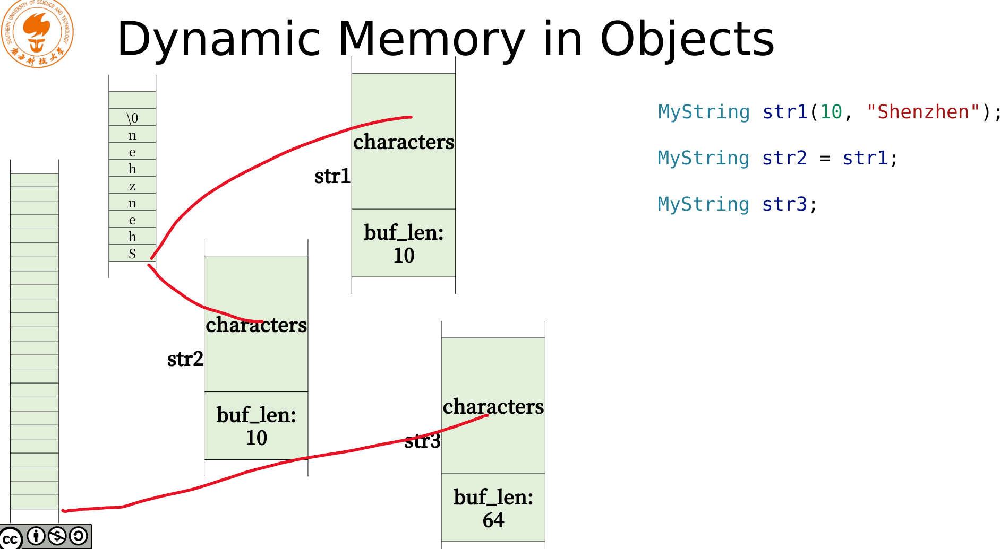
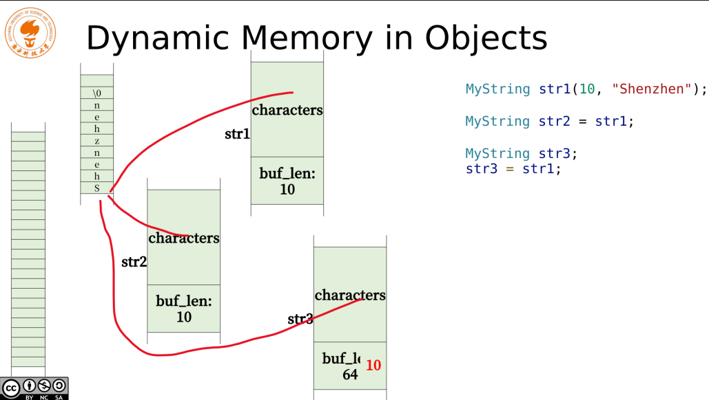

在创建类的时候，c++编译器会帮助做一些事情，包括

- 默认构造函数
- 拷贝构造函数
- 自动构建析构函数
- 默认的赋值操作符

在我们使用这些默认函数的时候，一定要知道他们都做了什么，会造成怎么样的危害。


# 默认函数的危险性举例

## 类定义

下面一段代码新建一个类MyString, 其包含

- 构造函数
  - 会申请一个长度为buf_len的内存
- 析构函数
  - 会删除这个申请的内存

```c++
class MyString
{
    int buf_len;
    char * characters;
  public:
    MyString(int buf_len = 64, const char * data = NULL)
    {
        this->buf_len = 0;
        this->characters = NULL;
        create(buf_len, data);
    }
    ~MyString()
    {
        delete []this->characters;
    }
    ...
};
```

## 类使用

第一行调用自定义的构造函数，第二行调用了默认拷贝构造函数，第三行调用了默认的构造函数

因为是默认拷贝构造函数，他会把str1中存的内容完全拷贝一份出来，因此指针的地址也会被拷贝一份出来，所以str2和str1的中的数据都指向同一块内存




现在添加一行，赋值str1给str3，调用了默认的赋值函数。这样str3的指针就指向了str1.

此时，原来64个字节的内存没有指针指向它，造成了内存泄露。同时当str3释放后，str2和str1释放的时候均会报错




# 危险解决

## 内存重新申请

因为每一个对象指向的都是同一个地址，才造成了上述的情况发生，因此，我们不能使用默认的拷贝构造函数了，需要自己写一个，然后重新调用一个create函数，去申请对应大小的内存。

在默认赋值函数，首先内存释放，然后重新申请一个内存，不要和之前的冲突即可

## 软拷贝

参考引用计数。申请内存的时候再额外申请四个字节，作为计数使用，一个变量指向这一块内存的时候，计数就+1

当引用计数为0的时候，内存自动释放


# 默认delete 避免上述问题

```c++
MyString(const MyString&) = delete;
MyString &operator=(const MyString) = delete;
```

这就告诉编译器，我不需要这个默认生成的拷贝构造函数和默认赋值，来防止发生上述的为问题 

