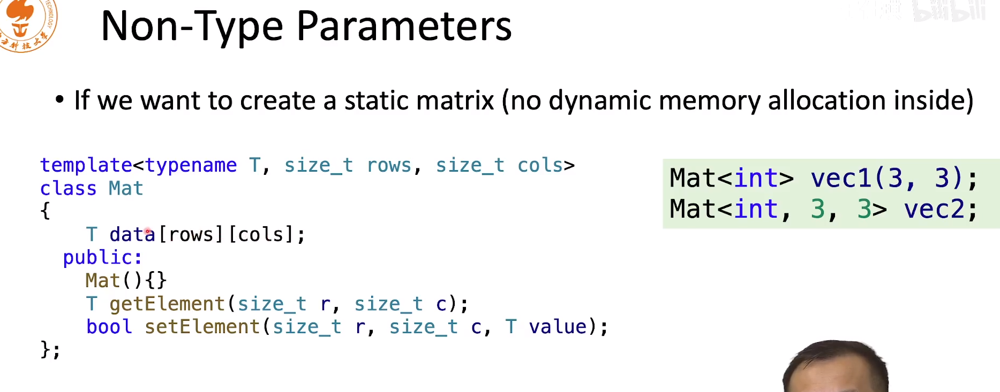

新建一个指针的时候，如果没有决定好指向什么位置，一定要赋予初始0或者null.

否则在释放的时候，无法确定该指针是不是随机产生出来的。

# 类构造

## 类的构造函数

执行顺序

- 父类的构造函数
- 自己的构造函数

析构函数和上述是返的

如何控制类访问的成员 ，默认我们不标注，他是不是public，那么默认就是private。结构体内的成员默认都是public的

## protected

他介于private和public之间，

当有一个子类继承一个类后，该类中的protected不能在子类中使用obj.attr调用，只能通过this->attr调用

如果有一个函数，和两个函数是没有关系的，直接使用子类对象.attr和负类对象.attr

在子类中虽然可以使用，但是在类的外部是不可以使用的

## protected继承方式

父类中的public和protected在子类中都会变成protected

## private继承方式

父类中的public和protected在子类中都会变成private，这样孙子辈的类是访问不到的

# 模板

## 模板类型参数

- 类型模板参数，如int 可以作为T
- 模板模板参数 ，也就是说模板本身就可以作为参数作为T
- 非类型模板参数： 如`vec<int, 16>`中的这个16。16他只是一个数，他不是一个type

那么应该如何实现呢，下面这个rows和cols定义在了模板参数列表中

这意味着，在编译的时候，就已经确定了这个对象的大小了，不再是通过参数进行动态申请了。所有的内容都是静态的内存，这样也就不需要释放了

