## 1 预测的作用

假如自动驾驶中缺少预测模块，整个车的灵活性就会变的较差，牺牲灵活性来保证安全性

预测的作用：保证安全性的同时，增加灵活性和驾驶体验

## 2 预测的几个方面

如何在输入表征中表示动态的物体和静态的场景，怎么样在输出表征可以表示精确可行的预测结果。下面从主流的learning-based的处理方式来介绍。最后给出宋博提出的基于learning-based和model-based的预测框架设计

### 2.1 输入表征

如何在输入表征中表示动态的物体和静态的场景

每一个个体的运动，都会有交互信息的影响，交互包括如下两方面

- 个体与场景的交互，交通场景通常包括车道线，车道边界，交通灯这样的语义信息
- 个体和个体的交互，每一个机动车和非机动车的交互

如何用输入信息把这些东西进行建模

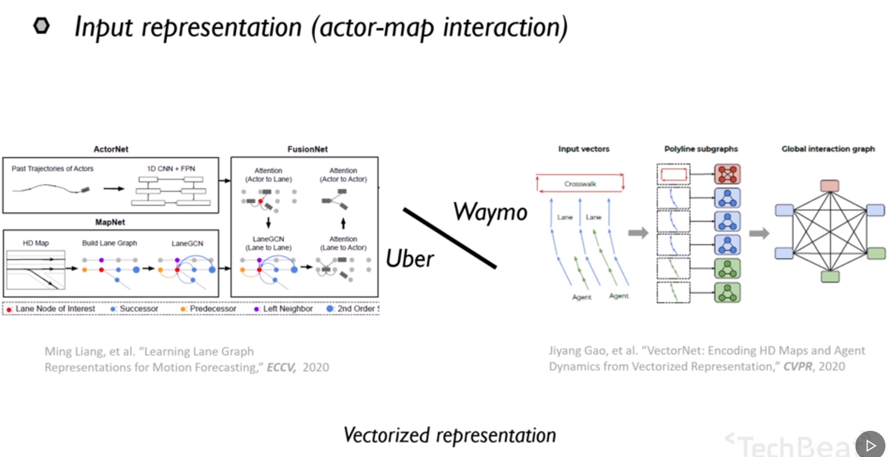

VectorNet，把道路信息向量化

### 2.2 输出表征

怎么样在输出表征可以表示精确可行的预测结果. S

输出表征决定每一个预测轨迹是如何生成的，现有的大部分工作都聚焦于如何产生未来轨迹的多峰分布上。多峰指相同的车即使在相同的历史轨迹状态下，也有产生不同的行为。我们希望在输出中能给出不同行为层面下的轨迹预测，并且给出不同轨迹的一个预测概率

左边是利用神经网络直接给出回归一个未来的轨迹；

右边是先利用锚点轨迹进行分类，然后在分类的基础上进行一个偏移量的回归

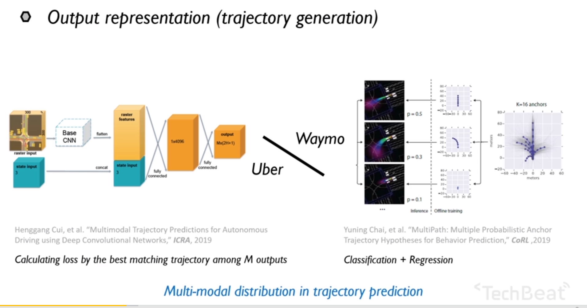

在最近的一些工作中，为了提高输出结果的可行性

像coverNet直接在固定的轨迹集合上面进行分类，使得预测轨迹对于车辆而言大概率是可行的。或者像是TNT，把预测任务拆解成了多阶段的任务

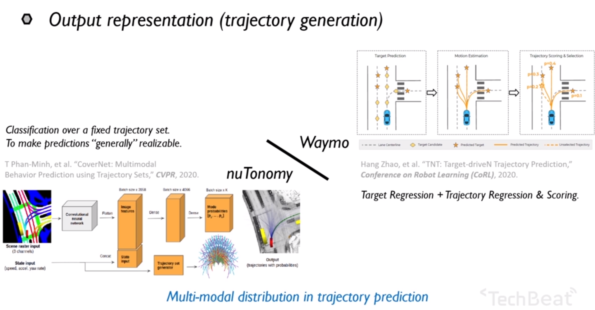

### 2.3 问题分析

以上基本上都是考虑了三点要素：个体，环境和交互。然后把他们放在神经网络里以一定的方式做信息融合，最终输出

通过位置点回归或者在预先定义的轨迹集上面做分类，来输出最终的预测轨迹

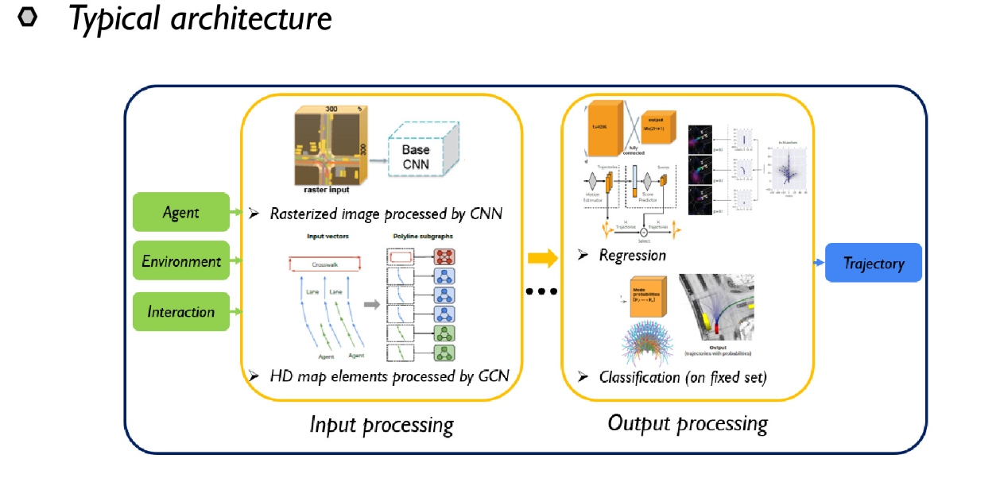

红车会和其他的车辆做隐含的交互，还有一些限制会对未来轨迹筛选，比如卡车的转弯半径就大于小汽车，在环境层面上，受到限速和驾驶区域，交通灯影响等

系统层面上，我们希望有如下效果

- 我们希望预测模块可以处理潜在的不完善跟踪的情况，在多个预测车中，可能有一个预测的观测时间不足或者中间出现遮挡的情况，我们希望在不完善的跟踪下依然有一个相对稳定的预测输出结果
- 有的预测轨迹会有运动学的限制的，很多轨迹是不可能出现的，并且他们的出现会对下游产生额外的负担
- 训练数据中会不可避免的出现数据不平衡的问题，如U型转弯，在数据集中可能只有很少的一部分，我们希望在需要U型转弯的时候，依然可以产生这样的轨迹

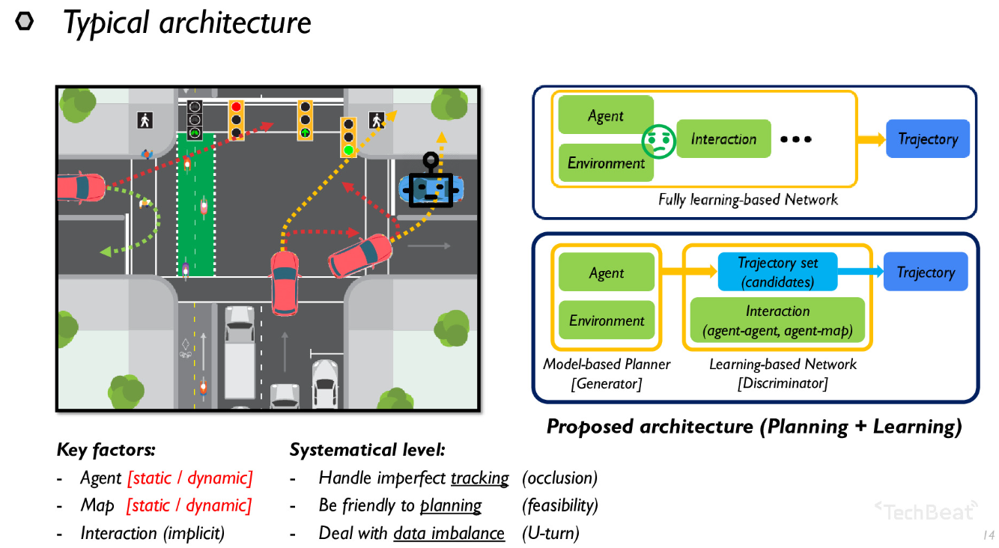

对于右上角这样的基于learning-based的网络，是很难施加由环境和行人等的约束的。因此提出一个新的架构模型

基于model-based的方法生成一个轨迹生成器，这样的生成器可以在施加约束的情况下，提供轨迹目标可能的轨迹集合，然后把这样的基于经验的，interaction的部分交给learning -base部分来完成。

这样我们即利用了数据驱动的交互式训练，也同时基于模型的规划部分添加了运行学和环境的硬性约束

## 3. PRIME

左边是一个基于model-based的轨迹生成器，后边是对各个轨迹进行打分，并且从中选择一个轨迹子集作为我们的一个预测结果

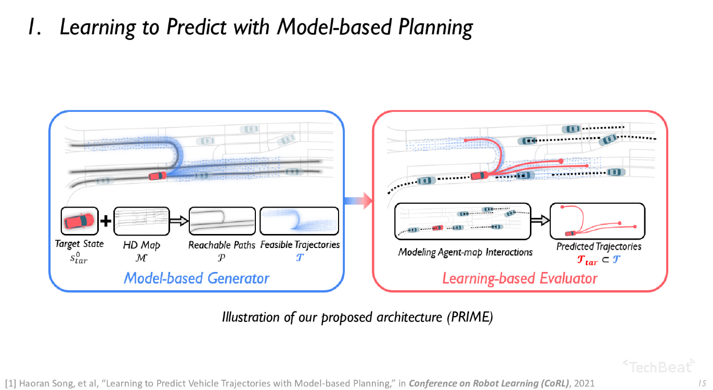

### 3.1 框架流程

蓝色框表示整个基于模型的部分，在这里，假设有高精地图和历史跟踪序列。通过在高精地图中，通过目标车辆的未来路径进行一个简单的深度优先搜索，并且对搜索结果做一些剪枝策略，我们就得到了预测目标可能抵达的路径集合P，然后利用轨迹生成器基于路径搜索结果作为参考线，来对目标车辆的可行轨迹进行采样，可行性指的是运动可行性和环境可行性

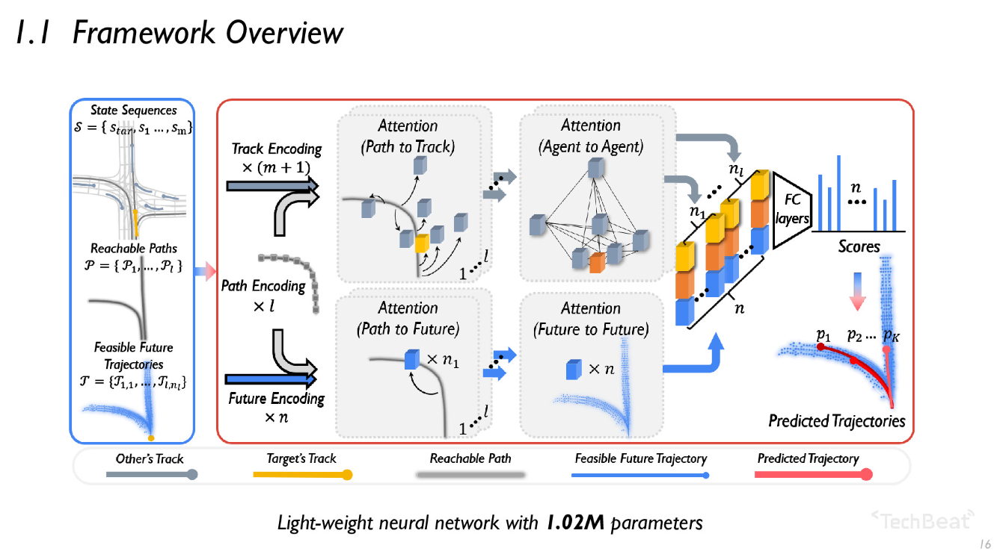

现在我们有历史序列S，可达路径P和可行路径T这三个集合就作为场景上下文的基础描述，传入神经网络进行一个独立的编码。之后利用基于Attention的模块，来对环境和个体之间的交互进行建模，最后，把每一个未来的轨迹，他对应的特征向量连接到一起，传入到全连接层里面进行打分。最终根据分数输出，还有他对应的概率。

我们网络从常见预测方法中的生成轨迹，退为了从可行轨迹中挑选预测结果，所以这是轻量级的网络。这样的预测轨迹不可行度为0%。

### 3.2 PRIME 优点

- 精确，可解释性强（（暂未体现？），我们知道每一条蓝色轨迹是如何生成的 

  

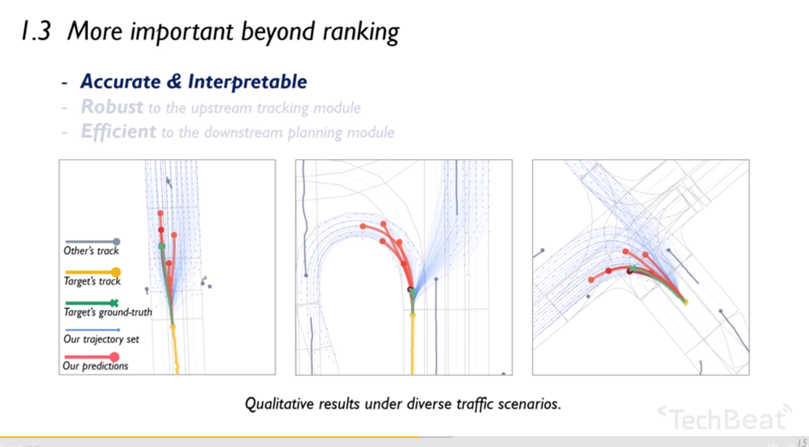

- 更为鲁棒，在实际场景中不可避免的会遇到观测目标时间不足问题，中间出现遮挡的情况。通过数据增强的方法重新训练了两个对比模型，
- 具备可行性保证的预测结果，对于下游的规划是更有意义的，会有助于自车规划的灵活性和安全性保证 

## 4. 预测模块的系统设计

下面先说一下他车预测和自车规划的关联

为了达到实时的驾驶表现，很多车辆的运动规划期都采用了基于采样的方法。在自车规划的过程中，预测模块涉及到的作用是传入周边各个物体的未来预测，以便于更精确的做 最优规划轨迹的选择，这样传统的预测方式，只是基于上游的追踪信息，和下游的自车规划是相互解耦的，仅有历史来预测轨迹的方式，这像是一个从静态的观察者给出的解决方式

然而我们的自动驾驶汽车，也是作为动态参与者，它的运动情况也会影响其他车辆的未来轨迹，从而造成不同的未来状态

\

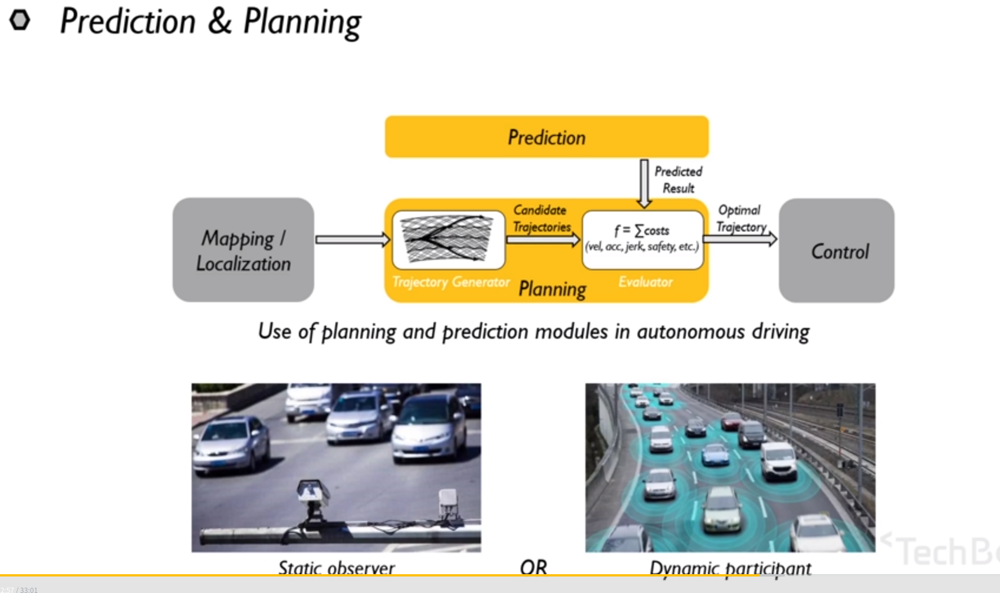

预测和规划应该是耦合的，而不是分开的

通过将自身的规划过程合并如预测框架，探索一个预测规划耦合的系统实现。

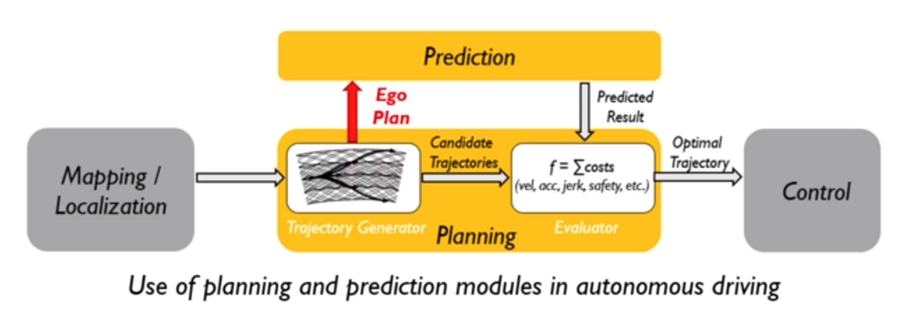

我们需要知道，当自车做出了这样的行为后，他车如何和我们做出交互

自车的规划过程，也可以启发他车的预测，提高灵活性

### 4.1 以规划启发的预测 PiP: Planning-informed Prediction

红色车要变道，需要预测其他蓝色车的未来轨迹，预测过程的产生是独立于红色车辆的规划过程，使得在当前状况下无法找到一个安全的自车规划路径，又右图中提出的PIp，是一个规划预测耦合的过程，他产生了不同预测结果，就产生了一个可执行的轨迹

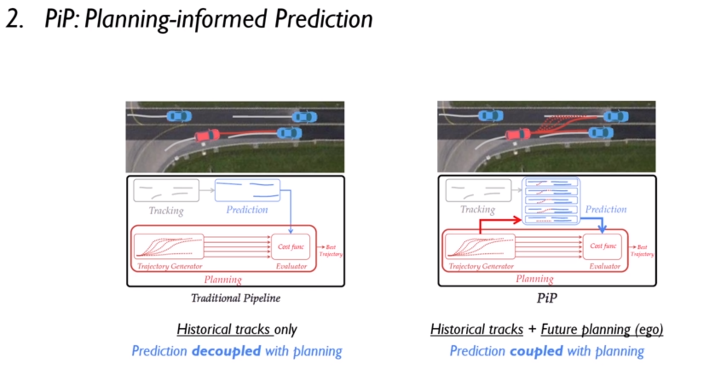

这就考虑到了当自车采用了某种轨迹，他车在未来会和我们做怎么样的交互。这是一种更累的过程，这样的方式比较合适于更密集的情况	

### 4.2 架构

这是我们对于这篇文章在网络层面上的一个实现，这是针对于高速的场景，没有复杂的场景建模。重心更多的放在了历史和未来的两个时间域的处理上.

以红色的自车为中心， 目标是预测红色车范围内的蓝色车辆。中间为规划耦合模块，是框架的核心

规划耦合模块，两个分支

- 上面的分支，处理的是对自车候选轨迹的编码
- 下面的分支，融合了所有车辆历史跟踪轨迹的编码

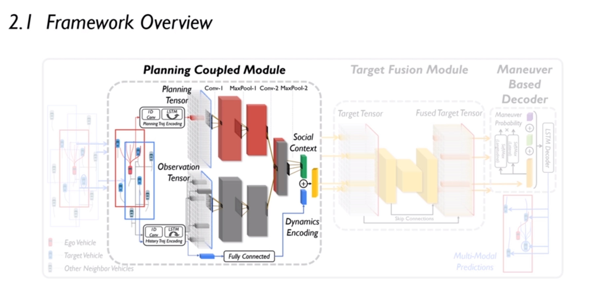

我们把这两个编码信息融合到一起，传入到下一个部分的目标融合模块，这个模块是对于解耦合的多个预测目标的特征进行编码和解码。最终把这样的特征向量传入到基于行为的轨迹解码器中，会输出每一个预测目标的行为概率以及在不同行为下对应的轨迹。	

通过所有目标车辆未来轨迹的后验概率对轨迹进行优化

### 4.3 prediction-planning耦合框架

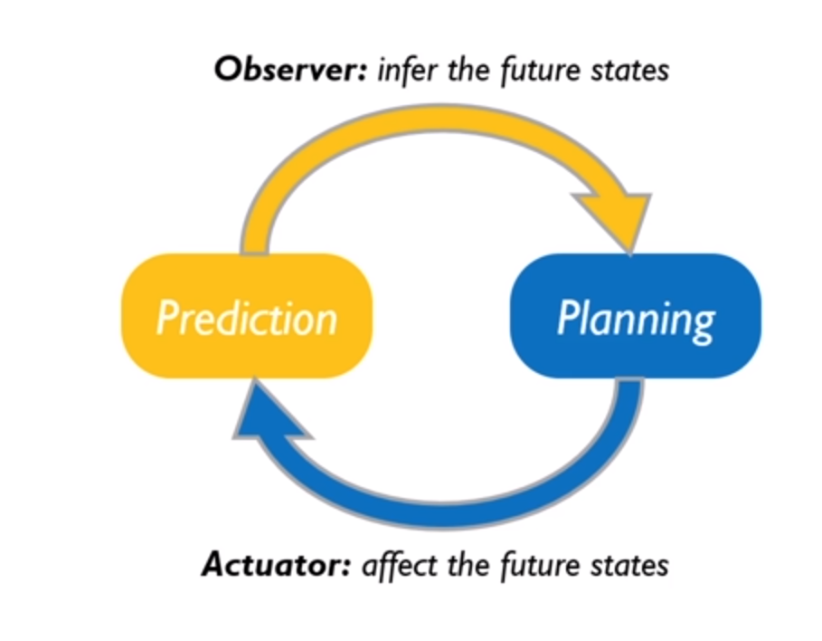