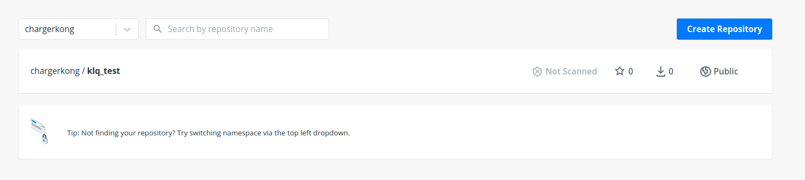

## 安装与卸载

### 安装

```
curl -sSL https://get.daocloud.io/docker | sh
```

### 测试

```
$ sudo docker run hello-world

Unable to find image 'hello-world:latest' locally
latest: Pulling from library/hello-world
1b930d010525: Pull complete                                                                                                                                  Digest: sha256:c3b4ada4687bbaa170745b3e4dd8ac3f194ca95b2d0518b417fb47e5879d9b5f
Status: Downloaded newer image for hello-world:latest


Hello from Docker!
This message shows that your installation appears to be working correctly.


To generate this message, Docker took the following steps:
 1. The Docker client contacted the Docker daemon.
 2. The Docker daemon pulled the "hello-world" image from the Docker Hub.
    (amd64)
 3. The Docker daemon created a new container from that image which runs the
    executable that produces the output you are currently reading.
 4. The Docker daemon streamed that output to the Docker client, which sent it
    to your terminal.


To try something more ambitious, you can run an Ubuntu container with:
 $ docker run -it ubuntu bash


Share images, automate workflows, and more with a free Docker ID:
 https://hub.docker.com/


For more examples and ideas, visit:
 https://docs.docker.com/get-started/
```

### 卸载

删除安装包：

```
sudo apt-get purge docker-ce
```

删除镜像、容器、配置文件等内容：

```
sudo rm -rf /var/lib/docker
```

```
docker pull chargerkong/klq_test:v1.0
```

## Hello world

```
docker run ubuntu:15.10 /bin/echo "Hello world"
Hello world
```

各个参数解析：

- **docker:** Docker 的二进制执行文件。
- **run:** 与前面的 docker 组合来运行一个容器。
- **ubuntu:15.10** 指定要运行的镜像，Docker 首先从本地主机上查找镜像是否存在，如果不存在，Docker 就会从镜像仓库 Docker Hub 下载公共镜像。
- **/bin/echo "Hello world":** 在启动的容器里执行的命令

以上命令完整的意思可以解释为：Docker 以 ubuntu15.10 镜像创建一个新容器，然后在容器里执行 bin/echo "Hello world"，然后输出结果。

## 运行交互式的容器

```
docker run -i -t ubuntu:15.10 /bin/bash
root@0123ce188bd8:/#
```

进入一个新的shell窗口

各个参数解析：

- **-t:** 在新容器内指定一个伪终端或终端。
- **-i:** 允许你对容器内的标准输入 (STDIN) 进行交互。

注意第二行 **root@0123ce188bd8:/#**，此时我们已进入一个 ubuntu15.10 系统的容器，容器ID为`0123ce188bd8`

## Docker 镜像使用

当运行容器时，使用的镜像如果在本地中不存在，docker 就会自动从 docker 镜像仓库中下载，默认是从 Docker Hub 公共镜像源下载。

**镜像就是一个操作系统，我们每一次`docker run`都会建立一个容器**

下面介绍如何发布以及下载docker镜像

### 建立一个repositories

在[Docker Hub](https://hub.docker.com/repositories)中建立仓库，比如名字为`klq_test`，描述随意写，点击创建




### 建立自己的镜像

在[Docker Hub](https://hub.docker.com/search?q=&type=image)上有镜像仓库，我们可以基于这些仓库进行继续环境搭建，譬如下载一个ubuntu

```
docker pull ubuntu:15.10
```

```
Unable to find image 'ubuntu:15.10' locally
15.10: Pulling from library/ubuntu
7dcf5a444392: Pull complete 
759aa75f3cee: Pull complete 
3fa871dc8a2b: Pull complete 
224c42ae46e7: Pull complete 
Digest: sha256:02521a2d079595241c6793b2044f02eecf294034f31d6e235ac4b2b54ffc41f3
Status: Downloaded newer image for ubuntu:15.10
```

### 镜像查看

```
root@kong-KLV-WX9:# docker images
REPOSITORY    TAG       IMAGE ID       CREATED        SIZE
hello-world   latest    d1165f221234   2 months ago   13.3kB
ubuntu        15.10     9b9cb95443b5   4 years ago    137MB
```

这里会显示两个镜像，可以打开任何一个镜像建立容器

### 更改镜像名字

```
docker tag ubuntu:15.10 chargerkong/klq_test:v1.0
```

此时再一次查看镜像，会发现多了一个镜像

```
root@kong-KLV-WX9:/home/kong# docker images
REPOSITORY             TAG       IMAGE ID       CREATED        SIZE
hello-world            latest    d1165f221234   2 months ago   13.3kB
chargerkong/klq_test   v1.0      9b9cb95443b5   4 years ago    137MB
ubuntu                 15.10     9b9cb95443b5   4 years ago    137MB
```

### 修改镜像内容

首先进入交互环境

```
docker run -t -i chargerkong/klq_test:v1.0 /bin/bash
```

譬如在`/root`目录下新建一个文件夹或者文件

```
touch klq
mkdir klq_1
```

Ctrl + D 退出。

**注意：**此时容器已经关闭，还可以被启动，可以通过`docker ps -a`进行查看。<font color='red'>因此如果再一次使用`run`命令只会基于镜像再重新开一个容器</font>

#### 查看停止容器

```
root@kong-KLV-WX9:# docker ps -a
CONTAINER ID   IMAGE                       COMMAND       CREATED          STATUS                       PORTS     NAMES
b58790faeae8   chargerkong/klq_test:v1.0   "/bin/bash"   5 minutes ago    Exited (0) 4 minutes ago               thirsty_austin
d9b85d5b2966   hello-world                 "/hello"      49 minutes ago   Exited (0) 49 minutes ago              optimistic_clarke
```

#### 启动容器

```
root@kong-KLV-WX9:# docker start b58790faeae8
```

b58790faeae8为容器ID

#### 查看已启动容器

```
root@kong-KLV-WX9:# docker ps
CONTAINER ID   IMAGE                       COMMAND       CREATED         STATUS          PORTS     NAMES
b58790faeae8   chargerkong/klq_test:v1.0   "/bin/bash"   7 minutes ago   Up 10 seconds             thirsty_austin
```

#### 进入容器

在使用 **-d** 参数时，容器启动后会进入后台。此时想要进入容器，可以通过以下指令进入：

- **docker attach**
- **docker exec**：推荐大家使用 docker exec 命令，因为退出容器终端，不会导致容器的停止。

```
root@kong-KLV-WX9:# docker exec -it b58790faeae8 /bin/bash
root@b58790faeae8:/# ls
```

这样才可以看见我们之前创建的文件和文件夹

#### 删除容器

```
docker rm -f 1e560fca3906
```

后面的是容器的ID

### 提交一个容器更改

```
docker commit -m="add file" -a="klq" b58790faeae8 chargerkong/klq_test:v2.0
```

在这里`-m`是注释，`-a`是作者，`b58790faeae8`是容器ID，`chargerkong/klq_test:v2.0`为镜像建立的名字和tag

此时再一次查看镜像，会发现又多了一个镜像名字TAG为v2.0

```
root@kong-KLV-WX9:/home/kong# docker images
REPOSITORY             TAG       IMAGE ID       CREATED         SIZE
chargerkong/klq_test   v2.0      dc83476cd104   6 seconds ago   137MB
hello-world            latest    d1165f221234   2 months ago    13.3kB
chargerkong/klq_test   v1.0      9b9cb95443b5   4 years ago     137MB
ubuntu                 15.10     9b9cb95443b5   4 years ago     137MB
```

**docker登录**

```
docker login
```

开始推送一个镜像

```
docker push chargerkong/klq_test:v2.0
```

此时，在Docker Hub上对应的库中就会有对应的记录

### 镜像拉取

在任意一个安装有docker的机器上对镜像进行拉取

```
docker pull chargerkong/klq_test:v2.0
```

就可以获得最新的镜像内容

### 镜像删除

```
docker rmi hello-world
```