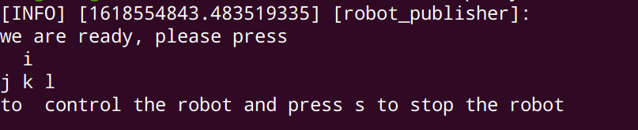

到目前位置，我们通过sdf、xacro以及gazebo的用户界面完成了一个机器人的模型在gazebo中的显示，距离真正的机器人还缺少的就是如何驱动它。下面我们开始添加传动装置

## 传动装置

传动系统可以把机器人的关节指令转换乘执行器的控制信号，让机器人真正的动起来。因此对于机器人每一个需要运动的关节都需要有一个传动系统。这就是机器人运动的动力来源

我们在设定两个驱动轮的宏中，需要添加

```xml
<transmission name="${prefix}_wheel_joint_trans">
    <type>transmission_interface/SimpleTransmission</type>
    <joint name="${prefix}_wheel_joint" >
    	<hardwareInterface>hardware_interface/VelocityJointInterface</hardwareInterface>
    </joint>
    <actuator name="${prefix}_wheel_joint_motor">
        <hardwareInterface>hardware_interface/VelocityJointInterface</hardwareInterface>
        <mechanicalReduction>1</mechanicalReduction>
    </actuator>
</transmission>
```

如此我们就对每一个驱动轮添加了传动装置，`<transmission>`标签用来链接`joint`到执行器进行运动，它需要表明如下属性

- `<type>`: 传动装置的类型。
- `<joint name="">` ：这里的name必须要对应我们文件中的joint。表示运动的关节
- `<transmission_interface/SimpleTransmission>`：在标签joint和actuator的里面，这表示告诉gazebo_ros_control插件，需要加载哪些硬件接口，在这里我们使用的速度控制接口


## 添加插件

到现在位置，他还只是一个gazebo的模型，没有ros的信息绑定，我们可以通过Gazeb插件将他和ROS的消息进行绑定，以此来和ROS进行信息的交互，例如传感器的仿真传输和对电机的控制等

我们的机器人是两轮驱动的，在Gazebo中有一个差速控制插件`libgazebo_ros_diff_drive.so`，可以很好的解决机器人在转弯过程中两个轮子的速度控制，同时也还有非常重要的一点，它可以订阅发布速度指令的topic，类型为：`geometry_msgs/msg/Twist`。以及`libgazebo_ros_joint_state_publisher.so`用于发布joint的state

```xml
<gazebo>
    <plugin name="differential_drive_controller" 
            filename="libgazebo_ros_diff_drive.so">
        <ros>
            <!-- Set namespace -->
            <namespace>/</namespace>
            <!-- Remap default topics -->
            <argument>--ros-args --remap cmd_vel:=cmd_vel</argument>
            <argument>--ros-args --remap odom:=odom</argument>
            <update_rate>10.0</update_rate>
        </ros>
        <left_joint>left_wheel_joint</left_joint>
        <right_joint>right_wheel_joint</right_joint>

        <update_rate>100.0</update_rate>                                                                                                                                     
        <!-- 表示两个驱动轮的距离, 单位为米 -->
        <wheel_separation>${wheel_joint_y*2}</wheel_separation>
        <!-- 表示轮子的直径, 单位为米 -->
        <wheel_diameter>${2*wheel_radius}</wheel_diameter>
        <!-- 最大的转矩 -->
        <max_wheel_torque>30</max_wheel_torque>
        <max_wheel_acceleration>1.8</max_wheel_acceleration>
		<!-- 设置fixed frame -->
        <odometry_frame>odom</odometry_frame>
        <publish_odom>true</publish_odom>
        <!-- 发布odom和其他link的tf变换 -->
        <publish_odom_tf>true</publish_odom_tf>
        <!-- 设置从哪儿计算里程计 -->
        <robot_base_frame>base_footprint</robot_base_frame>
    </plugin>

    <plugin name="gazebo_ros_joint_state_publisher"
      filename="libgazebo_ros_joint_state_publisher.so">
        <ros>
          <namespace>/</namespace>
          <argument>--ros-args --remap joint_states:=joint_states</argument>
        </ros>
        <update_rate>100</update_rate>
            <joint_name>left_wheel_joint</joint_name>
            <joint_name>right_wheel_joint</joint_name>
            <joint_name>front_caster_joint</joint_name>
            <joint_name>back_caster_joint</joint_name>        
    </plugin>
</gazebo> 
```
这里，通过`<plugin>`标签来导入gazebo的插件，这些插件位于`~/dev_ws/install/gazebo_plugins/lib`或者`~/dev_ws/install/gazebo_ros/lib`之下

配置`libgazebo_ros_diff_drive.so`插件需要较多的参数，主要的参数为

- `<ros><namespace>`：表示机器人的命名空间，这里我们没有命名
- `<ros><argument>`：表示需要重映射的topic名字，这里其实我们只是作为示例也并没有修改
- `left_joint`：表示驱动的左轮子
- `right_joint`： 表示驱动的右轮子
- `<max_wheel_acceleration>` ：表示机器人转动的加速度
- `<odometry_frame>`：表示里程计数据的参考坐标系，一般命名都为odom
- `<publish_odom_tf>`：表示发布odom和其他link的tf变换

在`gazebo_ros_joint_state_publisher`中，我们发布了四个joint的状态，即他们的tf变换，这个信息将会在rviz中的显示里面用到。


此时，我们再一次启动

```
ros2 run robot_description gazebo_empty_world.launch.py
```


可以看见，`differential_drive_controller`已经开始订阅了`\cmd_vel`topic，可以通过如下方式查看此topic的数据结构

```
ros2 topic list -t
```

返回的内容应该包含如下一条

```
/cmd_vel [geometry_msgs/msg/Twist]
```

`[..]`里面的内容表示传输在cmd_vel话题中的数据结构

通过如下操作可以看见此数据结构的字段定义

```
ros2 interface show geometry_msgs/msg/Twist
```

应该返回

```
Vector3  linear
	float64 x
	float64 y
	float64 z
Vector3  angular
	float64 x
	float64 y
	float64 z
```

表面，`cmd_vel`话题发布的两个内容，一个是线速度，一个是角速度。要了解其他的话题内容，也可以通过一样的形式进行查看

`gazebo_ros_joint_state_publisher`也发布了左右轮的两个joint。接下来我们就要去写一个ros节点，用于发布`cmd_vel`话题。

## 话题发布

发布话题我们可以直接使用终端发布一个简单的话题，先测试一下在gazebo中的机器人是否能正常移动。然后在编写一个包，来满足键盘控制机器人控制的需求

### 终端发布话题

首先是用终端进行发布一个topic的内容

打开另外一个终端

```
ros2 topic pub --rate 1 /cmd_vel geometry_msgs/msg/Twist "{linear: {x: 2.0, y: 0.0, z: 0.0}, angular: {x: 0.0, y: 0.0, z: 1.8}}"
```

应该可以看见，在gazebo中的机器人已经开始移动了。这说明之前的配置已经成功

### 编写一个publisher

在os2官方的例子基础之上，我们可以做适当的修改即可

#### 创建包

```
cd ~/dev_ws/src
ros2 pkg create --build-type ament_python teleop_key_control
```

#### 创建执行文件

进入`teleop_key_control`包，在`teleop_key_control`文件夹中建立执行文件

```
cd ~/dev_ws/src/teleop_key_control
vi teleop_key_control/teleop_key_control.py
```

在文件中，输入以下内容

```python
import sys                                                                                                                                                                      
import rclpy
from rclpy.node import Node
from geometry_msgs.msg import Twist
import tty, termios

class RobotPublisher(Node):

    def __init__(self):
        super().__init__('robot_publisher')
        self.publisher_ = self.create_publisher(Twist, 'cmd_vel', 10)
        self.key_map = {
            "i": (-1.0, 0.0),
            "k": (1.0, 0.0),
            "j": (0.0, -1.0),
            "l": (0.0, 1.0),
            "s": (0.0, 0.0)
        }
        self._logger.info("""
we are ready, please press 
  i
j k l
to  control the robot and press s to stop the robot
                          """)
        self.pub_vel_from_keyboard()

    def pub_vel_from_keyboard(self):
        msg = Twist()
        try:
            while True:
                fd = sys.stdin.fileno()
                old_settings = termios.tcgetattr(fd)
                tty.setraw(fd)
                ch = sys.stdin.read(1)
                termios.tcsetattr(fd, termios.TCSADRAIN, old_settings)
                if ch in self.key_map.keys():
                    msg.linear.x, msg.angular.z = self.key_map[ch]
                    self.publisher_.publish(msg)
                    self._logger.info("publish x:{}， z:{}".format(msg.linear.x, msg.angular.z))
                elif ord(ch) == 0x3:
                    break
        except e:
            print(e)
        msg = Twist()
        msg.angular.x = 0.0
        msg.angular.y = 0.0
        msg.angular.z = 0.0
        msg.linear.x = 0.0
        msg.linear.y = 0.0
        msg.linear.z = 0.0
        self.publisher_.publish(msg)
        
def main(args=None):
    rclpy.init(args=args)

    minimal_publisher = RobotPublisher()

    rclpy.spin(minimal_publisher)

    # Destroy the node explicitly
    # (optional - otherwise it will be done automatically
    # when the garbage collector destroys the node object)
    minimal_publisher.destroy_node()
    rclpy.shutdown()


if __name__ == '__main__':
    main()          
```

#### 代码审查

```python
mport sys                                                                                                                                                                      
import rclpy
from rclpy.node import Node
from geometry_msgs.msg import Twist
import tty, termios

class RobotPublisher(Node):

    def __init__(self):
        super().__init__('robot_publisher')
        self.publisher_ = self.create_publisher(Twist, 'cmd_vel', 10)
        self.key_map = {
            "i": (-1.0, 0.0),
            "k": (1.0, 0.0),
            "j": (0.0, -1.0),
            "l": (0.0, 1.0),
            "s": (0.0, 0.0)
        }
        self._logger.info("""
we are ready, please press 
  i
j k l
to  control the robot and key s to stop the robot
                          """)
        self.pub_vel_from_keyboard()
```

再此。我们创立了一个publisher，其数据结构为`Twist`，发布的topic名字为`cmd_vel`，队列长度为10.

此队列大小是必须的一个设置，如果订阅者接收队列消息的速度不够快，它将限制队列消息的数量

此外，我们定义了可以操作的按键`key_map`，其键为按下的键名，值为一个元祖，分别表示x方向上的线速度，和z方向上的角速度，即绕着z轴旋转。

```python
    def pub_vel_from_keyboard(self):
        msg = Twist()
        try:
            while True:
                fd = sys.stdin.fileno()
                old_settings = termios.tcgetattr(fd)
                tty.setraw(fd)
                ch = sys.stdin.read(1)
                termios.tcsetattr(fd, termios.TCSADRAIN, old_settings)
                if ch in self.key_map.keys():
                    msg.linear.x, msg.angular.z = self.key_map[ch]
                    self.publisher_.publish(msg)
                    self._logger.info("publish x:{}， z:{}".format(msg.linear.x, msg.angular.z))
                elif ord(ch) == 0x3:
                    break
        except e:
            print(e)
        msg = Twist()
        msg.angular.x = 0.0
        msg.angular.y = 0.0
        msg.angular.z = 0.0
        msg.linear.x = 0.0
        msg.linear.y = 0.0
        msg.linear.z = 0.0
        self.publisher_.publish(msg)
```

在`pub_vel_from_keyboard`函数中，我们重复不断的获取按键信息，只要他在我们的`key_map`中，就修改`msg`的信息，并发布到topic中，并打印相应的线速度和角速度。当程序按下组合键`ctrl-c`，重新发布一个速度为0的topic给机器人

 下面是main函数

```python
def main(args=None):
    rclpy.init(args=args)

    minimal_publisher = RobotPublisher()

    rclpy.spin(minimal_publisher)

    # Destroy the node explicitly
    # (optional - otherwise it will be done automatically
    # when the garbage collector destroys the node object)
    minimal_publisher.destroy_node()
    rclpy.shutdown()


if __name__ == '__main__':
    main()         
```

#### 编译

```
cd ~/dev_ws
colcon build --packages-select teleop_key_control --symlink-install
```

这里选择单独编译这个包，`--symlink-install`表示在之后改变代码的时候，无需再一次编译

### 运行节点

```
ros2 run teleop_key_control teleop_key_control
```

出现如下信息则说明，程序已经准备完毕



此时按下`i,j,k.l`，在终端会返回

```
[INFO] [1618554843.483519335] [robot_publisher]: 
we are ready, please press 
  i
j k l
to  control the robot and press s to stop the robot
                          
[INFO] [1618554948.329805806] [robot_publisher]: publish x:0.0， z:-1.0
[INFO] [1618554948.736472114] [robot_publisher]: publish x:1.0， z:0.0
[INFO] [1618554949.951230725] [robot_publisher]: publish x:0.0， z:1.0
[INFO] [1618554950.393064298] [robot_publisher]: publish x:1.0， z:0.0
[INFO] [1618554950.823001403] [robot_publisher]: publish x:0.0， z:1.0
[INFO] [1618554952.271946683] [robot_publisher]: publish x:0.0， z:-1.0
[INFO] [1618554952.609704862] [robot_publisher]: publish x:0.0， z:1.0
[INFO] [1618554952.957432100] [robot_publisher]: publish x:-1.0， z:0.0
[INFO] [1618554957.612637394] [robot_publisher]: publish x:0.0， z:0.0
```

同时在gazebo中，机器人也会有移动的效果


