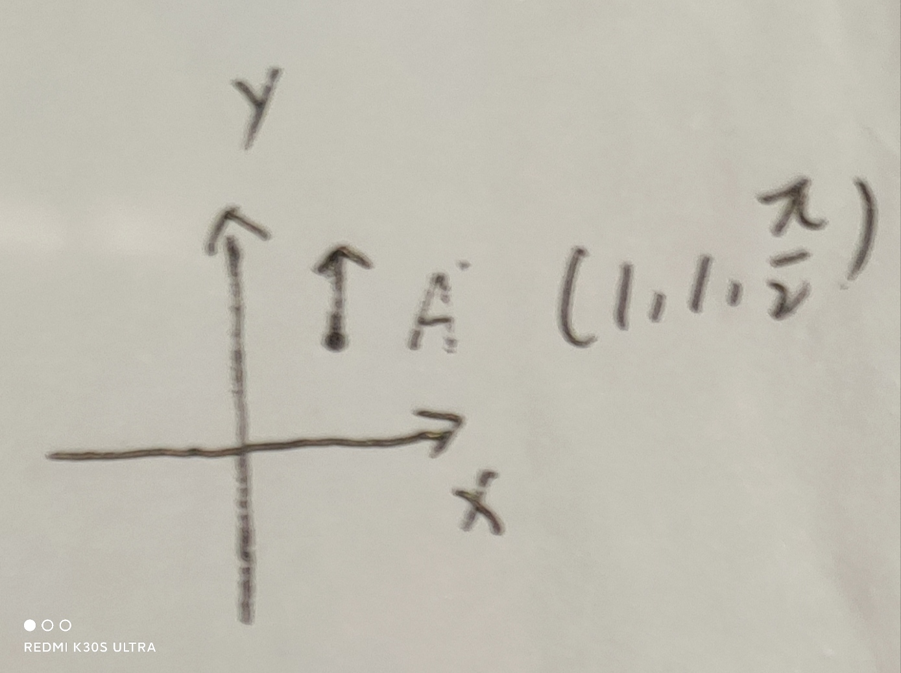
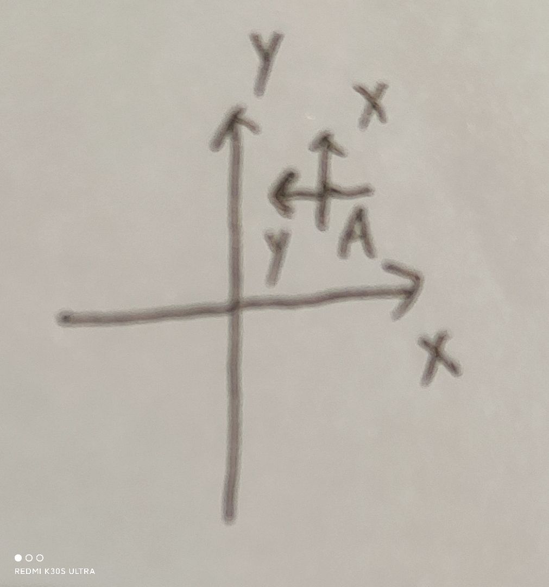

# 二维位姿变换

若坐标系B在坐标系W中的坐标为
$$
(x,y,\theta)\tag{1}
$$
则坐标系B到坐标系W的转换矩阵为
$$
\begin{bmatrix}
\cos\theta & -\sin\theta &x\\
\sin\theta & \cos\theta &y \\
0&0&1
\end{bmatrix}\tag{2}
$$

## 举例

切记：

A在local坐标系下的pose为A_local，图示为local -> A

A在global坐标系下的pose为A_global

T_localToGlobal = A_global * A_local.inverse()  图示为global -> local

假设有一个B，在local下的坐标系为B_local，则

B_global = T_localToGlobal * B_local


> 即B 在 global下的坐标  $T_{ref}^{tar}=T^B_{g}$，箭头指向global->B， 也称为B to global的变换
> $$
> T_{g}^B=T^A_g * T^L_A* T^B_L
> $$
> 或者
> $$
> T_{g}^B=T^B_L*T^L_A*T^A_g
> $$
> 第一种用的比较普遍

上面暂时不看，是和下边反着的，自己弄清除就好


念法：

lidar到imu的变换， $T^{lidar}_{imu}$，该lidar到imu的变换 乘以 点在lidar下的坐标为点在imu下的坐标
$$
T^{lidar}_{imu}*T_{lidar}^{p}=T_{imu}^P
$$
ROS 调用：

lookupTransform(imu,  lidar)


**例一**

假设没有旋转，只考虑平移。B在W中的坐标为$(1,1)$，即上述的(1)为
$$
(1,1,0)
$$
假设有一个点P在B上的坐标为$(-1， 0)$， P在W上的坐标明显为$(0, 1)$。可以通过如下式子转换
$$
\begin{bmatrix}
0\\
1 \\
1
\end{bmatrix}
=
\begin{bmatrix}
\cos0& -\sin0&1 \\
\sin0& \cos0&1\\
0&0&1
\end{bmatrix}
\begin{bmatrix}
-1\\
0\\
1
\end{bmatrix}\tag{3}
$$
即就是：$T^p_w=T_b^pT_w^b$

**注意$T_w^b$称为从B到W的转换矩阵， B到P的转换阵 乘以 B上的点= P上的点**


上述式（3）通过的是一个在B 上的点通过变换  变换到了W坐标系上，虽然是B到W的变换，但是变换的x和y却是B相对于W的。


**例二**

现在需要做两次变换，第一次平移$(1,1)$，再旋转90度到点A。第二次再平移$(1,1)$，不旋转到点B。

注意，点B在原来坐标系下的结果应该为$(0,2)$，旋转90度


即：第一次转换$p_a=(1,1,1.57)$，第二次转换$p_b=(1,1,0)$

首先，定义$x$轴为0度，那么，毫无疑问，A点应该是如下图所示





注意，这里A是点是旋转了90度的，因此，针对于点A来说，他的坐标系应该是如下图所示



因此，按照这个坐标系再移动$(1,1)$，就会得到原来坐标系下的$(0,2,1.57)$


如果做两次变换，则只需要简单的计算
$$
r2v(v2r(p_a)*v2r(p_b))
$$
需要注意这里的乘法顺序，后操作的乘在后边！！

注意这里是矩阵的乘法，就可以得到$(0,2,1.57)$


# tf中的坐标变换

```c++
buffer_->lookupTransform(tracking_frame_, frame_id, ::ros::Time(0.),
                              timeout)
```

假设tracking_frame是imu_frame, frame_id是odom，那么这样得到的变换是imu->odom, 即tracking_frame_到frame_id的坐标变换

即odom在imu frame下的坐标，或者称为变换


```
buffer_->lookupTransform(target, source, ::ros::Time(0.),
                              timeout)
```

出来的结果为$T_{target}^{source} $，即target指向source的


# 规则

$T_{target}^{source}$ 箭头指向 target->source， 念为source到target的变换，也是source在target下的坐标

若一个点p通过旋转加平移得到点B，则这个旋转平移的变换为$T_p^B$。

